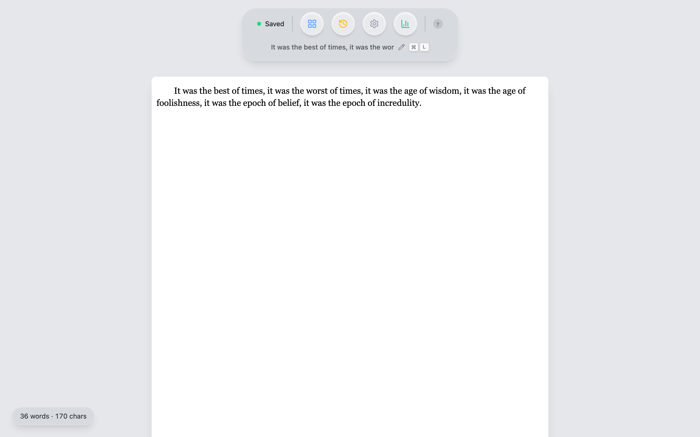
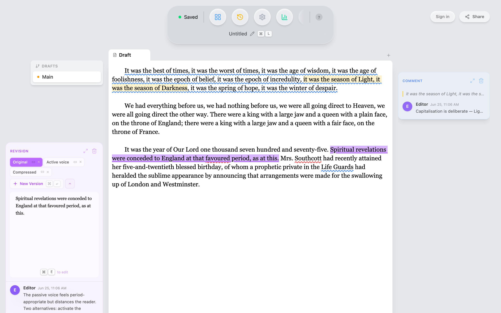

# Quillium

[](https://codecov.io/gh/ThatXliner/Quillium)

Quillium is a writing app for exploring alternatives without losing earlier
wording. Keep several versions of a passage, switch between them, and edit
revisions inside revisions. Comments and suggestions stay attached to the prose.

The desktop app stores writing locally in SQLite. Optional AI tools offer
feedback and proposed edits. Omni adds read-only Web Previews and live editing
sessions with other writers.





[More screenshots](SCREENSHOTS.md) · [Why Quillium exists](MANIFESTO.md)

## Develop Quillium

Start with the [quickstart](docs/quickstart.md) for prerequisites, local
configuration, and a first editing exercise. Once the prerequisites and local
environment are configured, run these commands from the repository root:

```bash
bun install
bun run desktop:tauri:dev
```

Then follow the [developer guide](docs/README.md). The
[architecture walkthrough](docs/architecture-overview.md) traces an edit through
CodeMirror, Svelte, and persistence; the [code map](docs/file-structure.md) points
to the implementations. Contribution and verification rules live in
[CONTRIBUTING.md](CONTRIBUTING.md).

## Repository layout

| Package | Responsibility |
|---|---|
| [desktop](packages/desktop/) | SvelteKit editor and Tauri/Rust backend |
| [share](packages/share/) | Shared annotation state, rendering, UI, and wire contracts |
| [landing](packages/landing/README.md) | Public website and hosted Web Preview pages |
| [relay](packages/relay/README.md) | Omni WebSocket service |
| [e2e](packages/e2e/README.md) | Tests spanning packages and services |

The root owns the Bun workspace, lockfile, and `supabase/` migrations. See the
[monorepo guide](docs/monorepo.md) for dependency and deployment boundaries.

## Project direction

Use [GitHub Issues](https://github.com/ThatXliner/Quillium/issues) for planned
work and bug reports. [DESIGN.md](DESIGN.md) describes the intended editing
experience, and the [architecture decisions](docs/adr/README.md) explain the
technical choices behind it.

## License

Proprietary. Copyright © 2024–2026 [ThatXliner](https://github.com/ThatXliner).
All rights reserved.
