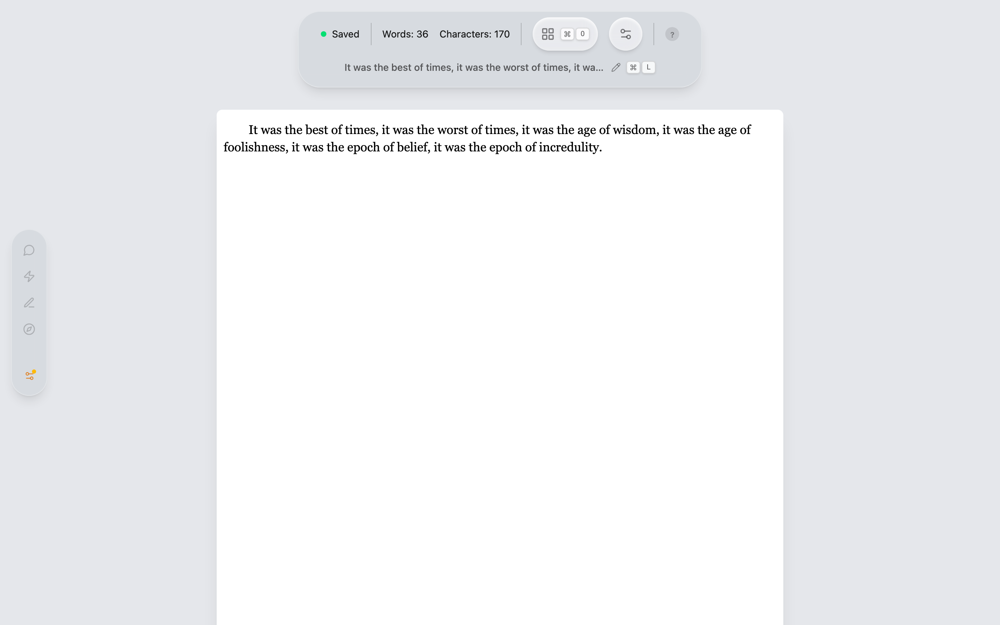
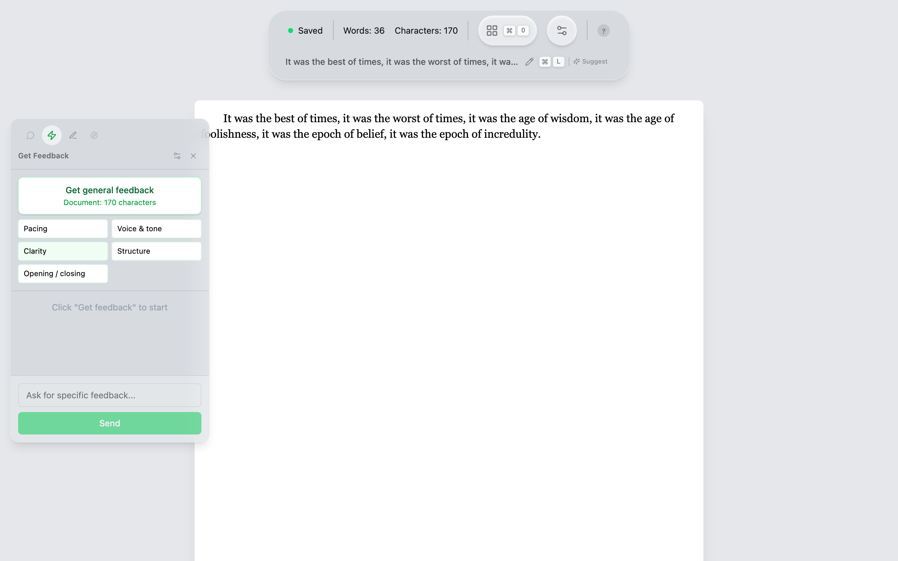
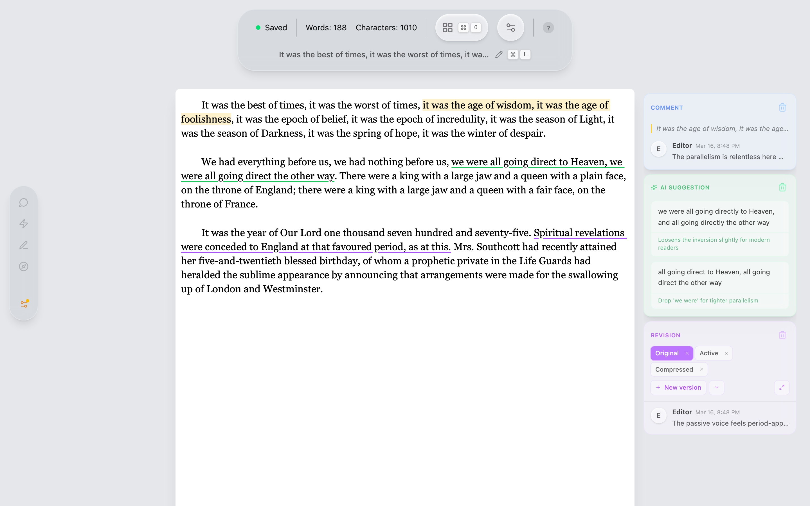
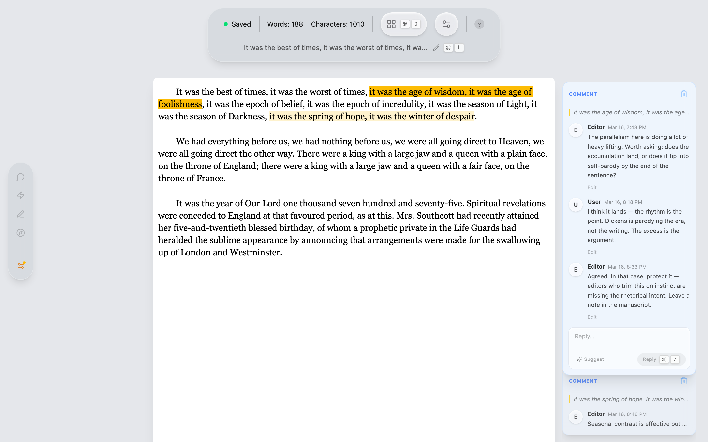
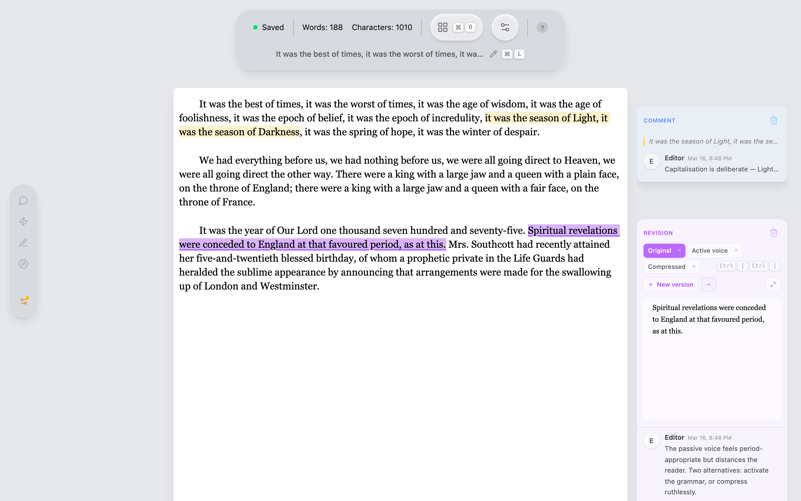
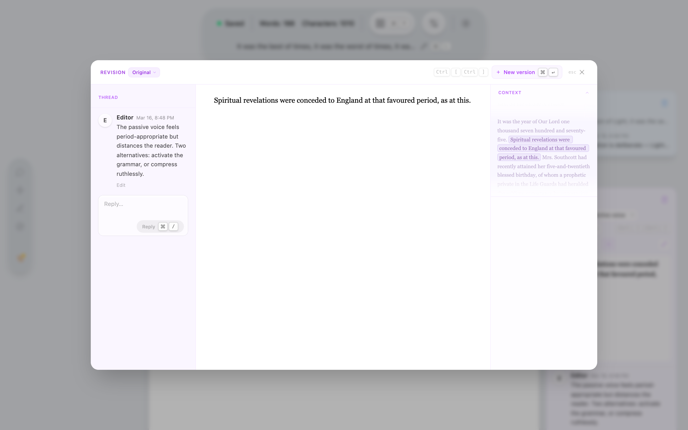
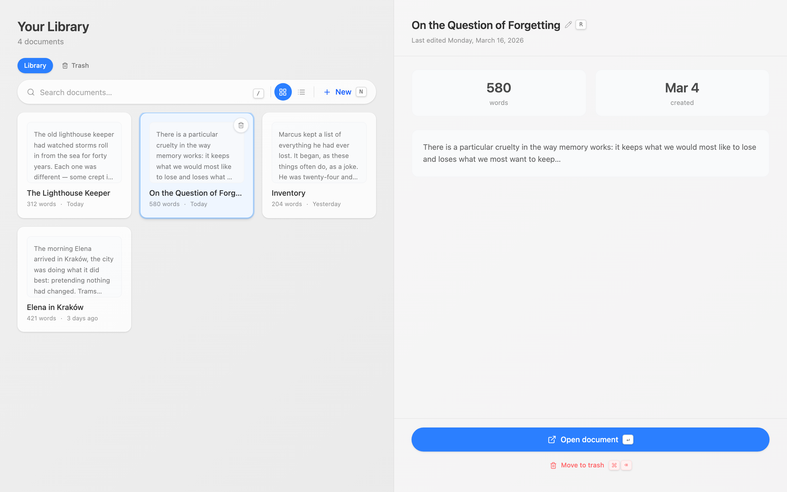
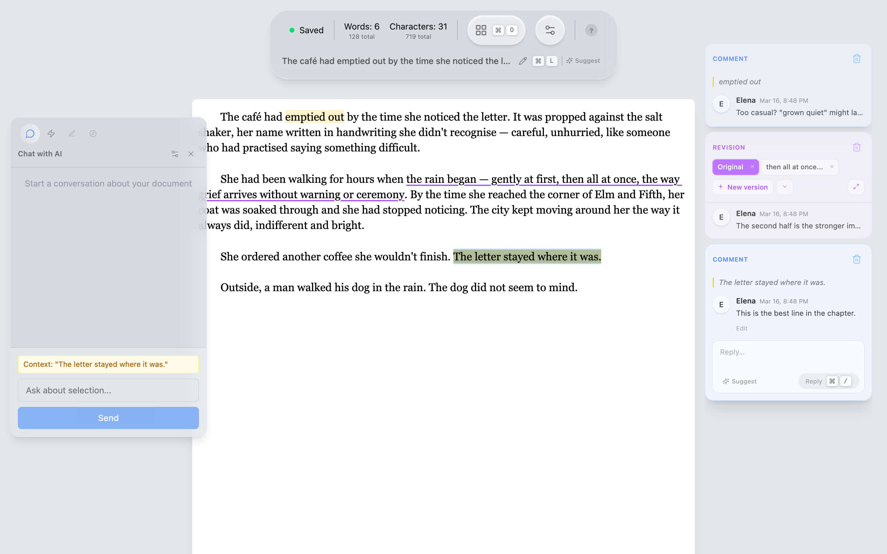

# Quillium — Screenshot Gallery

> Screenshots are auto-updated on every push to `main`.

## Editor

*The focused writing environment: document card, status bar, and the collapsed AI sidebar pill.*

## AI Feedback

*The Feedback panel open with quick-action chips for grammar, clarity, conciseness, and tone.*

## Annotations

*Comments, suggestions, and revisions floating beside the text in their resting state.*

## Comment Thread

*An active comment card with a full back-and-forth thread and reply input. The yellow highlight marks the annotated text.*

## Revision — Inline Editor

*A revision card with version pills and the inline nested CodeMirror editor open. The purple highlight marks the range.*

## Revision — Modal Editor

*The full-screen revision modal for editing alternative text without distraction.*

## Document Library

*The document library: grid view with document cards and the preview panel.*

## Full UI — Hero

*All three annotation types beside a short prose passage, with the AI Chat sidebar open showing a context snippet and an active comment thread.*
