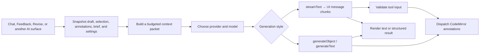

# AI Features and Request Pipeline

Quillium's AI features run in the desktop client using the writer's selected
provider and credentials. There is no Quillium inference server in the request
path: prompts are assembled locally and sent directly to the selected provider,
ChatGPT connection, or OpenAI-compatible endpoint.

The AI sidebar is the main entry point, but the same provider, context, and
cancellation infrastructure also powers AutoAI, document-context generation,
the dictionary assistant, annotation-thread suggestions, title suggestions, and
the writing characterizer.

## End-to-End Pipeline

For sidebar conversations, `createAiChat()` creates an AI SDK `Chat` with a
custom transport. At send time the transport snapshots the current document,
draft, selection and range, open annotations, active annotation, writer brief,
and provider settings. `editorialPolicy.ts` compiles the shared author-first
policy, task recipe, and allowed action types. `clientStreams.ts` prepends the
context packet as a user message and calls `streamText()`.

Text chunks update the panel through `@ai-sdk/svelte`. Tool calls are validated
with Zod, checked against the turn's permissions and captured document, draft,
and selection, then routed by `chatFactory.ts` to the annotation commands. A
stale, out-of-scope, forbidden, or missing target is skipped with a warning.

### Core Files

| File | Purpose |
|------|---------|
| `AISidebar.svelte` | Panel navigation, resize behavior, context summary, global stop button |
| `AISettings.svelte` | Connection, provider, model, and API-key UI |
| `settings.svelte.ts` | Shared settings, lazy key loading, task tracking, and cancellation |
| `provider.ts` | Converts the selected provider and model ID into an AI SDK `LanguageModel` |
| `openaiOAuth.ts` | Beta ChatGPT PKCE sign-in, token refresh, model discovery, and keychain session storage |
| `context.ts` | Context budgeting, source metadata, selection focus, and context-aware actions |
| `annotationContext.ts` | Converts open CodeMirror annotations into ranked AI context |
| `editorialPolicy.ts` | Shared editorial constitution, task recipes, and action permissions |
| `editorialTarget.ts` | Request-scoped document, draft, and selection validation |
| `chatFactory.ts` | Svelte Chat transport, send-time snapshot, persona fan-out, and tool dispatch |
| `clientStreams.ts` | Policy-driven tools, streaming, context generation, and characterization |

## Sidebar Tabs

| Tab | Key | Component | Purpose |
|-----|-----|-----------|---------|
| Chat | 1 | `Chat.svelte` | General writing conversation |
| Feedback | 2 | `Feedback.svelte` | Big-picture editorial feedback and passage annotations |
| Revise | 3 | `Revise.svelte` | Line-level suggestions and comments |
| Context | 4 | `DocumentContext.svelte` | Writer-provided brief sent with AI requests |
| Readers | 5 | `Readers.svelte` | Reader-persona configuration |
| Settings | 6 | `AISettings.svelte` | Provider, connection, model, and credential configuration |

### Chat

- Conversational writing help with session-local message history. The history is
  cleared when the current document or draft changes.
- Uses the shared context packet before the writer's latest prompt.
- Shows a context lens for selection, nearby text, draft, annotations, and brief.
- Offers context-aware action cards based on selection, draft length, brief, and
  open annotations.
- Does not expose annotation-creation tools; its response is conversational text.

### Feedback

- Focuses on structure, voice, argument, scope, pacing, and style.
- Uses `createComment` for a small number of high-impact passage observations.
- Does not create rewrites during broad review. The writer can move to Revise or
  ask for a targeted rewrite afterward.
- Tool use is optional, and a strong draft may receive no annotations.
- Includes user-defined Feedback quick actions from general app settings.
- Can fan out through enabled reader personas when Feedback's persona toggle is on.

### Revise

- Works on a writer-requested passage while preserving intent and voice.
- Uses `createSuggestion` for local replacements, `createRevision` for coherent
  passage alternatives, and `createComment` when diagnosis or a question should
  precede rewriting.
- Does not require a minimum number of changes. With a selection, every target
  must remain inside that captured selection.
- Includes user-defined Revise quick actions from general app settings.
- Can fan out through enabled reader personas when Revise's persona toggle is on.

### Context

- Stores one freeform writer brief in localStorage.
- Can generate a brief from a prompt with a non-streaming `generateText()` call.
- Uses the `context-generation-format` feature flag to choose freeform or
  structured output.
- The brief is shown separately in the context lens and serialized as writer
  guidance in the user-role context packet. It is never appended to the system
  policy.

### Readers

See [Reader Personas](./reader-personas.md) for persona configuration, parallel
execution, attribution, and cost behavior.

## Context Packets

AI calls do not send an unbounded raw document. `buildAiContextPacket()` creates
a deterministic, mode-specific packet with these possible sources:

| Source | Behavior |
|--------|----------|
| Selection | Included verbatim when text is selected |
| Nearby passage | Paragraph-aware context around a selection; falls back to a character window |
| Draft | Full text up to the mode budget, otherwise a head/tail excerpt with an omission marker |
| Annotations | Up to six relevant open comments, suggestions, or revisions within a separate character budget |
| Brief | Writer-provided context, kept logically separate from draft text |

Open annotations include their target, nearby context, recent thread messages,
and a limited number of suggestion replacements or revision versions. They are
ranked with the active annotation first, then by distance from the selection,
then by recency. The prompt tells the model to treat them as existing editorial
state and avoid duplicating the same concern.

Document character budgets are currently:

| Mode | Maximum draft characters |
|------|--------------------------|
| Chat | 18,000 |
| Feedback | 24,000 |
| Revise | 16,000 |
| Dictionary | 0 |
| AutoAI | 26,000 |

When a selection is active, the draft portion is capped at 9,000 characters.
Annotation context is separately capped at six items and approximately 4,800
characters. These are character budgets, not provider token limits.

The context message is inserted before the conversation messages, leaving the
writer's latest prompt as the most recent instruction. Drafts, selections,
annotations, and briefs are JSON-serialized and labeled as untrusted reference
material. The context lens uses the same packet metadata, so its source list
reflects what the request builder sees.

## Providers, Connections, and Models

`createModel()` is the only layer that imports provider SDKs. The rest of the AI
pipeline consumes a provider-agnostic `LanguageModel`.

### OpenAI Connections

The OpenAI tab has three connection methods:

| Connection | Implementation |
|------------|----------------|
| API key | Direct OpenAI API through `@ai-sdk/openai`; key stored in the OS keychain |
| Local | User-provided OpenAI-compatible base URL and model ID; API key is optional and held only in memory |
| ChatGPT | Beta PKCE OAuth flow through `@openai-oauth`; session stored in the OS keychain |

ChatGPT sign-in opens the browser, validates the callback state, refreshes
expiring tokens, and loads the model IDs available to that account. Requests use
Tauri's native HTTP plugin because the Codex endpoints reject browser/WebView
origins. The OAuth provider instance is reused across turns so its in-memory
response replay state remains available for multi-turn chats. Disconnecting
clears both the keychain session and that cached provider.

The ChatGPT connection is explicitly beta and uses an unofficial integration;
the settings UI tells users to review OpenAI's terms and privacy policy.

### Curated API-Key Models

| Provider | Curated models |
|----------|----------------|
| OpenAI | `gpt-5.6-sol`, `gpt-5.6-luna`, `gpt-5.6-terra` |
| Anthropic | `claude-opus-4-6`, `claude-sonnet-4-6`, `claude-haiku-4-5-20251001` |
| Google | `gemini-3.5-flash`, `gemini-3.1-pro-preview`, `gemini-3-flash-preview` |
| DeepSeek | `deepseek-v4-pro`, `deepseek-v4-flash` |

Quillium deliberately curates for writing behavior rather than always selecting
the newest benchmark leader. Current recommendations are Claude Opus 4.6 for
prose, DeepSeek V4 Flash for value, and OpenAI GPT-5.6 Sol or Luna depending on
whether quality or economy matters more. The model guide in AI Settings explains
this policy.

Every API-key provider also offers **Use a custom model ID**. Quillium passes
that string directly to the selected provider SDK. OpenAI-compatible endpoints
always use a freeform model ID. Existing custom IDs are preserved when settings
reload.

## Credentials and Privacy

- Provider API keys are stored by `keychain.rs` in macOS Keychain, Windows
  Credential Manager, or Linux Secret Service.
- Keys are lazy-loaded on first AI use so the macOS permission prompt does not
  appear at ordinary app startup.
- localStorage contains only presence flags and non-secret preferences, not
  provider API keys or OAuth tokens.
- ChatGPT OAuth sessions are serialized in the OS keychain under the
  `openai-oauth` provider name.
- A local/custom endpoint's optional key is held in memory and is not persisted.
- Writing and prompts are sent directly to the selected third party. Users are
  shown a provider-specific privacy notice in AI Settings.

## Tools and Annotation Dispatch

| Tool | Used by | Result |
|------|---------|--------|
| `createComment` | Feedback, Revise | Comment thread anchored to exact text |
| `createRevision` | Revise | Two or more named passage versions plus a thread message |
| `createSuggestion` | Revise | One or more replacement options for a short target |

Tool schemas require exact `targetText` and accept surrounding `context` to
disambiguate repeated phrases. `chatFactory.ts` also verifies the captured
document and draft, the turn's allowed action types, selection containment, and
that the selected source text has not changed in place.
It dispatches valid calls through the same CodeMirror annotation commands used
by the rest of the app. Reader-persona tool calls attach the persona name as the
annotation author but cannot expand the parent task's permissions.

AutoAI does not consume streamed tool calls. It uses a structured Zod response
and applies the normalized results itself; see [AutoAI](./autoai.md).

## Parallel Personas and Document Safety

Feedback and Revise default to one stream. If personas are enabled for that
specific mode, `runMultiPersonaStreams()` starts one stream per enabled persona
with `Promise.all()`.

The fan-out path snapshots the document ID, draft ID, selection, and editor
context once. Tool calls use the same action and target guard as ordinary
requests, preventing a late persona result from landing in another draft or
outside the captured selection. See
[Reader Personas](./reader-personas.md) for the full behavior.

## Processing State and Cancellation

`beginAiTask()` and `endAiTask()` maintain a set of active operations, so the
sidebar processing glow stays active until overlapping work finishes. Standard
Svelte Chat instances register their submitted/streaming state through
`useAiChatEffects()`.

The global stop control calls `stopAllAi()`, which:

1. aborts the shared `AbortController` used by non-chat and persona operations,
2. emits `stop-ai` so each mounted Chat instance calls `chat.stop()`,
3. cancels a pending AutoAI debounce, and
4. clears task and processing indicators.

New work receives a fresh abort signal after a stop.

## Other AI-Powered Surfaces

### Title Suggestions

The sparkle action in `DocumentTitleBar.svelte` sends at most the first 1,000
characters of the current draft to `generateText()` and asks for one short title.
The result is trimmed to 40 characters, written to the document metadata, and
uses the shared provider, lazy credential loading, task indicator, and abort
signal.

### Annotation-Thread Suggestions

Comment cards and comment modals can ask AI to respond to the current thread.
`commentAi.ts` builds a JSON reference packet from the thread messages and
anchored document text, calls the dedicated thread-reply policy, collects text
deltas, and appends the result as an `AI` thread message. This path sends no
additional draft context. The writer brief remains user-role guidance. If stopped, it
keeps any text that streamed before cancellation rather than adding an error.

### Dictionary and Thesaurus

`Mod-D` opens the dictionary popover for a single selected word. Definitions,
synonyms, and antonyms come from the Free Dictionary API. Its AI mode uses
`streamDictionary()` for nuanced lookup and word-finding; it intentionally sends
the selected word or phrase without draft text.

### Writing Characterizer

The Statistics modal can call `generateCharacterization()` on the current
document. It uses `generateObject()` with a Zod schema to return seven 1–10 style
dimensions, tone descriptors, and a short style summary. It shares the selected
provider, model, credential loading, task indicator, and global abort signal.

## Event Bus Integration

`appEventBus` handles cross-component AI actions:

| Event | Typical emitter | Consumer |
|-------|-----------------|----------|
| `dictionary-open` | Dictionary keymap/plugin | Dictionary popover |
| `ai-open-chat` | Dictionary popover | Chat and AI sidebar |
| `ai-open-settings` | AutoAI widget | AI sidebar |
| `stop-ai` | Global stop control | Chat panels and AutoAI |
