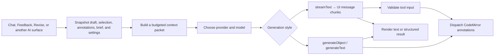
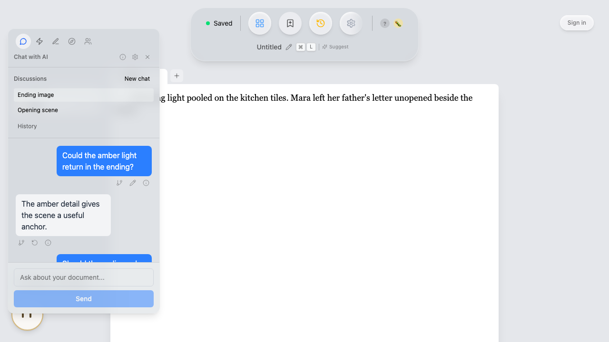
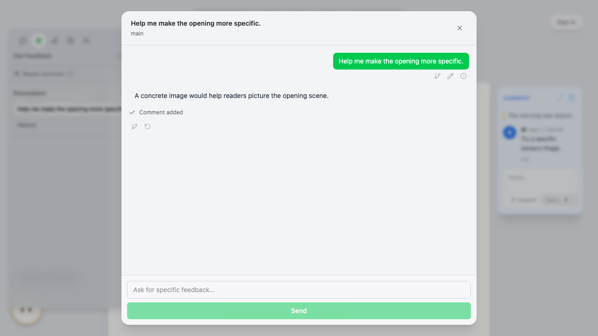

# Sidebar and AI request pipeline

Quillium's AI features run in the desktop client using the writer's selected
provider and credentials. There is no Quillium inference server in the request
path: prompts are assembled locally and sent directly to the selected provider,
ChatGPT connection, or OpenAI-compatible endpoint.

The sidebar hosts both local writing panels and AI panels. It is the main AI entry point, but the same provider, context, and
cancellation infrastructure also powers AutoAI, document-context generation,
the dictionary assistant, annotation-thread suggestions, title suggestions, and
the writing characterizer.

## End-to-End Pipeline

For sidebar conversations, `createAiChat()` creates an AI SDK `Chat` with a
custom transport. At send time the transport snapshots the current document,
tab, draft, nested revision-version path, selection and mapped range, open
annotations, active annotation, writer brief, saved decisions, editorial
preferences, and provider settings. `editorialPolicy.ts` compiles the shared author-first
policy, task recipe, and allowed action types. `clientStreams.ts` prepends the
context packet as a user message and calls `streamText()`.

Chat treats dissatisfaction with wording as a request for diagnosis, not permission
to supply replacement prose. Under Author-first, a diagnosis does not authorize a
rewrite; the writer must explicitly request wording or invoke a permitted rewrite
task. Feedback remains diagnostic for every stance and voice setting, including
selected passages: neither its chat text nor its comment fields should contain
replacement prose. Requests for replacement text belong in Revise. These are model
instructions; tool permissions separately enforce which annotations can be created.

Text chunks update the panel through `@ai-sdk/svelte`. Tool calls are validated
with Zod, checked against the turn's permissions and captured editor identity,
mapped selection, and target text, then routed by `chatFactory.ts` to the
annotation commands. A
stale, out-of-scope, forbidden, or missing target is skipped with a warning.

### Core Files

| File | Purpose |
|------|---------|
| `sidebar/Sidebar.svelte` | Panel navigation, resize behavior, context summary, global stop button |
| `AISettings.svelte` | Connection, provider, model, and API-key UI |
| `settings.svelte.ts` | Shared settings, lazy key loading, task tracking, and cancellation |
| `provider.ts` | Converts the selected provider and model ID into an AI SDK `LanguageModel` |
| `openaiOAuth.ts` | Beta ChatGPT PKCE sign-in, token refresh, model discovery, and keychain session storage |
| `context.ts` | Context budgeting, source metadata, selection focus, and context-aware actions |
| `annotationContext.ts` | Converts CodeMirror annotations into ranked AI context |
| `contextRetrieval.ts` | Captures draft and nested-version discussions for bounded, read-only retrieval |
| `editorialAction.ts` | Unique-range resolution, stale/read-only checks, duplicate-concern screening, and annotation dispatch |
| `editorialPolicy.ts` | Shared editorial constitution, task recipes, and action permissions |
| `editorialTarget.ts` | Transient CodeMirror target bookmarks plus document, tab, draft, nested-branch, and selection validation |
| `conversationController.svelte.ts`, `conversationStore.ts` | Conversation identity, lifecycle, branching, and SQLite persistence |
| `provenance.ts` | Stable request metadata for AI-created annotations and accepted text |
| `chatFactory.ts` | Svelte Chat transport, send-time snapshot, persona fan-out, and tool dispatch |
| `clientStreams.ts` | Policy-driven tools, streaming, context generation, and characterization |

## Built-in panel host

`Sidebar.svelte` consumes the typed contributions in
[`sidebar/builtInPanels.ts`](../packages/desktop/src/lib/sidebar/builtInPanels.ts).
Each contribution declares its stable ID, accessible label, title, icon, order,
optional shortcut, dimensions, AI-feature prerequisite, model prerequisite,
content layout, and mount policy. Adding a contribution adds its navigation and
component through the same loops; it does not require another rendering branch in
the host. Settings uses the utility placement. The `ai_sidebar_opened` analytics
event and `ai-sidebar` DOM IDs remain unchanged for compatibility.

When AI is disabled, Chat, Feedback, Revise, Context, Readers, AI Settings, and
College are hidden through their `requiresAi` metadata. Contributions without
that dependency remain available. The host hides its chrome when no panels are
eligible. College additionally requires a saved opt-in for the active document,
started from the invitation beneath Voice latitude in AI Settings. With that opt-in
and AI enabled, College opens without credentials. Context, Readers, and Settings open without
model credentials; generating a
Context brief still requires an enabled model connection. Opening Context or
Readers does not load credentials; Settings retains its explicit connection and
credential controls. Chat, Feedback, and Revise retain their credential-to-Settings
navigation.

The five eager AI writing panels retain their mounted state while collapsed or
another panel is selected; College
and Settings mount only while active. Hiding a panel ends its host session but
does not erase saved writing context. Disabling its AI prerequisite, removing its contribution, or adding its ID to `disabledPanelIds`
unmounts it and stops outstanding built-in AI work; re-enabling creates one instance keyed by the stable ID. Duplicate
IDs and shortcuts are rejected when the contribution list is assembled. The
`ai_sidebar_opened` analytics event and `ai-sidebar` DOM IDs remain unchanged
for compatibility.

A contribution receives only `active` and a nullable `session` prop. The session
contains a copied document/tab/draft identity, an abort signal, a guarded selection
read, and an `isCurrent()` check. Hiding, disabling, changing writing targets, and
unmounting dispose the session. Panel-owned async work must use the signal and
check `isCurrent()` before applying its result. A session is available only while
active. It is not a mutable editor handle, credential source, storage API, or
permission to dispatch arbitrary transactions. Render/effect failures are caught
per panel with a retry control; panel event handlers and async operations remain
responsible for catching their own errors.

The built-in conversation components continue using `createAiChat()` and the
existing policy, target, and annotation gateways. Their requests may continue when
the sidebar is merely hidden, preserving current behavior. A document, tab, or
draft identity change synchronously aborts host sessions and calls `stopAllAi()`;
existing send-time target checks remain authoritative for annotation dispatch.
Context generation also checks cancellation and document identity before saving
its result. No editor transaction, annotation, or undo machinery is replaced.

Opening focuses the panel region. Escape or Close restores the opening control
(or the first remaining sidebar control when it is no longer available); outside
clicks retain their destination focus. Hidden chrome and panels are inert. Icon
strips support arrow keys, Home, End, and native Tab navigation. Extra icons scroll
vertically in the pill and horizontally in the expanded strip, and panel dimensions
are capped to the viewport.

### Scope of issue #84

This is the host foundation, not the complete plugin interface. A **preset**
configures existing behavior; a **plugin** adds capabilities and may supply presets.
Bundled contributions do not imply external installation or distribution.

The foundation supplies declarative built-in rendering, local panels, navigation,
mount/disposal rules, target-scoped read sessions, and per-panel render failure
containment. Existing AI actions retain their validated gateways. The [College applications consumer](college-applications.md) adds a narrow
host adapter for tab setup persistence, snapshot reads, panel navigation, and
three fixed Chat/Feedback actions. Other namespaced capabilities should be added
only with concrete consumers. Registration is not a security sandbox for
untrusted executable code. External loading, compatibility, isolation, consent,
updates, removal, and a marketplace remain deferred.

Each configured College workspace tab owns one prompt, with drafts representing
alternate attempts at that writing task. A plugin can work across a document:
selecting multiple prompts creates one named tab per prompt, with one root draft
and setup per tab, in a prevalidated atomic batch. Applying one prompt to an
existing workspace tab changes only its College setup and preserves the tab label,
existing prose, and document-owned notes and decisions. There is no preview
acknowledgment or separate context-confirmation screen. Legacy saved setups that
contain multiple prompts remain readable until explicit replacement; no automatic
migration or deletion occurs. School-specific review must distinguish which
responses are read together; reuse between schools is not inherently a problem.
The College consumer persists independent tab briefs and offers explicit school
research. Its overlap action is registered through the small
`ai/feedbackActions.ts` contribution interface. Feedback renders eligible
contributions; the College plugin owns its essay picker, school scope, and
comparison logic. Results use ordinary Feedback comments with validated supporting
passage links. Persistent application grouping and multi-document discovery remain
deferred. LaTeX compilation and word-processor/debate formatting are outside the
intended prose-development scope.

### Acceptance coverage for this slice

| #84 criterion | Status |
|---|---|
| Preserve six built-in panels | Implemented; existing sidebar browser regressions pass. |
| Add an icon and panel without rendering branches | Implemented; test-only contributions exercise the real host. |
| Local operations without credentials | Implemented while AI is enabled; browser tests edit Context and Readers without credential loading or provider traffic. |
| Activation, hiding, disable/re-enable, focus, errors, cancellation | Implemented for built-in contributions and host sessions; async handlers own their error reporting. |
| Stable document/tab/draft targets | Implemented for host sessions; existing request guards retained and late Context generation rejected. |
| Plugin action permission, annotation, and undo guarantees | Existing built-in gateways retained and regression-tested. College delegates three fixed actions to Chat and Feedback; arbitrary plugin actions remain deferred. |
| College panel, setup presets, and review without globals | Implemented by the College consumer; see its [ownership and capability guide](college-applications.md). |
| Keyboard names/navigation, narrow layout, icon overflow | Automated keyboard/layout checks plus a browser check with 14 contributions at 320×600. |
| Lifecycle, target, capability tests and real sidebar exercise | Covered by `tests/sidebar`, `tests/e2e/sidebarHost.pw.ts`, existing sidebar E2E, and editorial-target tests. |
| Owning documentation distinguishes sidebar/presets/plugins/distribution | Documented here and in the glossary. |

## Sidebar Tabs

| Tab | Key | Component | Purpose |
|-----|-----|-----------|---------|
| Chat | 1 | `Chat.svelte` | General writing conversation |
| Feedback | 2 | `Feedback.svelte` | Big-picture editorial feedback and passage annotations |
| Revise | 3 | `Revise.svelte` | Local comments, suggestions, and reversible revisions |
| Context | 4 | `DocumentContext.svelte` | Writer-provided brief sent with AI requests |
| Readers | 5 | `Readers.svelte` | Reader-persona configuration |
| Settings | 6 | `AISettings.svelte` | Provider, connection, model, and credential configuration |

### Chat

- Chat, Feedback, and Revise each keep distinct, durable conversations. New chat
  preserves the previous discussion. History browses the current document within
  the selected mode, including discussions from its other drafts.
- Search matches titles and stored messages. Conversations can be renamed,
  archived, restored, or explicitly deleted. Archive hides a conversation from
  the default list and makes it read-only until restored.
- The sidebar shows three recent discussions. Selecting one opens a centered
  modal for reading and continuing it. History opens a separate modal with
  search and lifecycle controls. Escape closes the modal and keeps the sidebar open.
- Tool activity uses plain language in transcript order. “Comment added” requires
  a successful editor action, not merely a provider response. Rejected actions
  show “Couldn't add comment”; interrupted actions are labeled as interrupted.
  Editor outcomes persist in message metadata and survive reopening. Older
  activity without an editor outcome says “Comment requested,” never “added.”
- Hold Command and click an activity row to inspect raw names, inputs, results,
  errors, and editor outcomes. Releasing Command or leaving the window hides them.
  Unknown tool names appear as “Assistant action” outside inspection.
- Uses the shared context packet before the writer's latest prompt.
- Shows a context lens for selection, nearby text, draft, annotations, brief, and
  saved decisions.
- Offers context-aware action cards based on selection, draft length, brief, and
  open annotations.
- Does not expose annotation-creation tools; its response is conversational text.
- Failed requests show recovery guidance, including signing in again when a
  ChatGPT connection is expired or invalid. Chat permits another send after a
  failure; only submitted and streaming requests disable the composer.
- Streaming failures retain their original error and provider/model context in
  Help → App Logs before being converted to a user-facing message.
- The Reverse outline recipe lists each paragraph or section's current job and
  structural gaps in the conversation without creating annotations.
- When an active revision is in context, Compare versions gives a read-only
  account of meaning, voice, pacing, emphasis, and reader-effect tradeoffs.

Message actions use compact branch, edit, retry, and context icons with tooltips
and accessible names. The context icon toggles the saved turn context.

### Conversation identity and alternative paths

These browser captures use isolated test storage and a deterministic provider
response. The successful feedback capture requires an actual CodeMirror annotation
and verifies the saved editor outcome after reopening. Failure and interrupted
fixtures are tested separately and are not used as showcase screenshots.

[Command inspection of that same successful action](assets/issue-436/tool-details.png)

Each conversation has a stable ID, a mode, a title, creation/update timestamps,
and its original document and draft association. The draft label is captured
when the conversation is created. Reopening shows that association; the next
turn uses the source draft's **current** writing context. A discussion opened
from another draft is readable, but sending requires opening its original draft.
If that draft is no longer available, its discussion remains readable. Permanently
deleting the document deletes its conversations.

Branch here copies messages through the chosen point into a separate conversation
with source conversation/message references. Open origin conversation returns to
the source; deleting the source leaves the copied path intact. Edit as new path
copies the prefix before the edited prompt, then sends its replacement. Retry as
new path copies the prefix before the selected answer and generates another
answer. None of these actions deletes the old path. Copying or reopening messages
does not create a draft, modify prose, or execute historical tools. Stored tool
parts remain intact, but the transport omits them from later provider requests;
current annotations still arrive through the writing-context packet.

Conversation changes stop an active response and wait for its final save before
replacing the displayed messages. Saves target the conversation that initiated
the request. Cancellation and errors retain the available message prefix. A new
prompt is persisted before inference; storage failures are shown in the panel.
Per-turn message metadata records the writing target, provider, a bounded draft
excerpt, and selection at send time;
legacy messages retain their original data without invented provenance.

The appended SQLite migration copies the old draft/mode message arrays into
`ai_conversation_history` once. The legacy table remains for compatibility, but
new panels use conversation IDs. The history table retains draft IDs after a
draft is deleted, while document deletion still cascades. Message updates never
recreate a deleted conversation.

### Feedback

- Focuses on structure, voice, argument, scope, pacing, and style.
- Uses `createComment` for a small number of high-impact passage observations.
- Does not create rewrites during broad review. The writer can move to Revise or
  ask for a targeted rewrite afterward.
- Standard Feedback requests leave tool use optional, and a strong draft may
  receive no annotations. Persona fan-out requests require one or more
  annotation tools or the transport-only `noAction` tool; their generated text
  is not shown in the panel. See [Reader Personas](./reader-personas.md).
- Includes user-defined Feedback quick actions from general app settings.
- Can fan out through enabled reader personas when Feedback's persona toggle is on.

### Revise

- Works on a writer-requested passage while preserving intent and voice.
- Uses `createSuggestion` for local replacements, `createRevision` for coherent
  passage alternatives, and `createComment` when diagnosis or a question should
  precede rewriting.
- Does not require a minimum number of changes. With a selection, every target
  must remain inside that captured selection.
- A selection of at least eight words offers an exact-compression recipe. Its
  target is 75 percent of the current selection, rounded down. The turn can only
  create one reversible revision, must cover the complete captured selection,
  and is rejected unless every proposed alternative meets the exact count.
- Includes user-defined Revise quick actions from general app settings.
- Can fan out through enabled reader personas when Revise's persona toggle is on.

### Context

- Stores one freeform writer brief per document in SQLite.
- Stores explicit editorial decisions separately per document. Writers add and
  remove these decisions themselves; Quillium does not infer permanent rules
  from chat messages or accepted edits.
- The first document opened after this upgrade claims any legacy global brief from
  localStorage, then removes the legacy value.
- Can generate a brief from a prompt with a non-streaming `generateText()` call.
- Uses the `context-generation-format` feature flag to choose freeform or
  structured output.
- The brief is shown separately in the context lens and serialized as writer
  guidance in the user-role context packet. It is never appended to the system
  policy.
- Saved decisions are serialized as a distinct `writer-confirmed` context source,
  so providers can respect them without confusing them with draft text or the brief.

### Readers

See [Reader Personas](./reader-personas.md) for persona configuration, parallel
execution, attribution, and cost behavior.

### Editorial approach

AI Settings stores three device-local preferences that apply to every editorial
request:

| Preference | Options | Default |
|------------|---------|---------|
| Stance | Author-first, Collaborative, Exploratory | Author-first |
| Feedback density | Quiet, Focused, Thorough | Focused |
| Voice latitude | Preserve, Adapt, Transform | Preserve |

The request transport snapshots these values alongside provider settings. The
policy compiler inserts them after the fixed capability contract, so they can
shape advice but cannot grant another action type. Transform applies only to
explicit revision proposals that retain the original text.

### Per-turn task recipes

Context actions carry typed task metadata through the local AI transport. The
transport validates each task against its panel before compiling tools, so prompt
wording cannot expand a turn's permissions.

| Recipe | Surface | Allowed document actions |
|--------|---------|--------------------------|
| Conversation | Chat | None |
| Reverse outline | Chat | None |
| Compare versions | Chat | None |
| Global review | Feedback | Comment |
| Local rewrite | Revise | Comment, suggestion, revision |
| Exact compression | Revise | Revision only |

An unsupported panel/task pair falls back to the text-only conversation policy.
Exact compression also requires a positive whole-word target and a live selection
before provider inference starts.

## Context Packets

AI calls do not send an unbounded raw document. `buildAiContextPacket()` creates
a deterministic, mode-specific initial summary with these possible sources:

| Source | Behavior |
|--------|----------|
| Selection | Included verbatim when text is selected |
| Nearby passage | Paragraph-aware context around a selection; falls back to a character window |
| Draft | Full text up to the mode budget, otherwise a head/tail excerpt with an omission marker |
| Annotations | Up to six relevant open comments, suggestions, or revisions within a separate character budget |
| Brief | Writer-provided context, kept logically separate from draft text |
| Decisions | Explicit document-scoped choices, labeled as writer-confirmed |
| Tab writing brief | Active College prompt, constraints, intent, and feedback focus, capped at 8,000 characters |
| College guidance | Accepted reference snapshots with provenance, capped at 6,000 characters with omissions |

Open annotations include their target, nearby context, recent thread messages,
and a limited number of suggestion replacements or revision versions. They are
ranked with the active annotation first, then by distance from the selection,
then by latest reply time (with annotation ID as a tie-breaker). Omitted messages
and clipped text are marked. The prompt tells the model to treat discussion as
existing editorial state and avoid duplicating the same concern.

Document character budgets are currently:

| Mode | Maximum draft characters |
|------|--------------------------|
| Chat | 18,000 |
| Feedback | 24,000 |
| Revise | 16,000 |
| Dictionary | 0 |
| AutoAI | 26,000 |

When a selection is active, the draft portion is capped at 9,000 characters.
Annotation context is separately capped at six items and approximately 4,800
characters. These are character budgets, not provider token limits.

A sidebar conversation receives one initial summary, anchored before the user
turn that first captures context. Later turns receive a compact change notice
only when captured writing, discussions, selection, focused version, or writer
guidance changes. A notice identifies the current target and selection; draft
text and discussions are fetched through the read tools. Changed writer guidance
is included in its notice because the draft tools do not retrieve it; a prose
edit does not resend unchanged guidance.

The transport retains these model-only references by user message ID. Each
request reconstructs them at their original positions alongside chat history;
it does not append another copy of the initial summary. Normal stateless model
requests still resend retained history. Reset or imported history without a
known context reference gets a new initial summary. Retries compare against the
preceding retained turn, and references for removed turns are discarded. This
cache is local to the Chat transport, not a new conversation persistence system.

Drafts, selections, annotations, and briefs are JSON-serialized and labeled as
untrusted reference material. Initial summaries and change notices describe the
writing at their anchored turn. The context preview follows the focused editor,
including nested revision versions, and explains that changes are noted on send
while passages and discussions can be read on demand.

### Continuity between Feedback and annotation discussions

Each sidebar send captures draft text, selection, annotations, and a read-only
retrieval snapshot synchronously before credential loading. Replies added after
an earlier Feedback turn are included in the next snapshot. An older annotation
with a new reply competes by reply time rather than its original creation ID.

Snapshot capture stays local; it does not inject all captured content into the
prompt. A content fingerprint ignores request IDs and capture times, so unchanged
writing does not create a notice. It includes retained nested versions and full
discussions, including material beyond the automatic summary budget.

Chat, Feedback, and Revise can search/list
annotation discussions, retrieve their complete contents in pages, and read
omitted draft passages. Retrieval covers the current draft and its nested
revision versions, including versions outside the current selection. It does
not search other drafts, documents, saved conversations, or deleted annotations.
The parent state remains authoritative for nested versions. Scope metadata
distinguishes the focused editor from versions included in the current draft,
so a discussion on an inactive alternative is not attributed to current prose.

Each reference includes a request snapshot identity, document, tab, draft, nested
revision/version path, and annotation ID. A bare annotation ID cannot select a
thread. Reads use the captured snapshot and reject a changed writing target;
they never silently fall back to a different draft or version. An edit during
streaming belongs to the next send. Malformed or unavailable nested context is
reported separately from an empty discussion.

When asked to reconsider, the assistant is instructed to compare the current
writing with relevant discussion, distinguish withdrawn or qualified criticism
from remaining concerns, and retrieve missing context before asking the writer
to supply it. This instruction does not guarantee every model will follow it.
Tools return explicit unavailable reasons and pagination metadata so an assistant
can accurately describe incomplete coverage. Lists return at most 20 previews;
text reads return at most 12,000 characters per page. Capture is bounded to 512
scopes and 20 nested levels, with omitted scope counts reported. The focused
version remains available within that limit.

Before starting a new sidebar turn, the SDK's `pruneMessages()` removes prior
retrieval tool calls and results from the model input. Assistant prose and
annotation-creation tool records remain; the visible UI history is unchanged.
Fresh retrieval results remain available throughout the current tool loop.
This uses the installed AI SDK's selective tool pruning and `stopWhen` /
`prepareStep` controls rather than adding a separate loop implementation. See
[SDK message pruning](https://ai-sdk.dev/docs/reference/ai-sdk-ui/prune-messages)
and [tool loop control](https://ai-sdk.dev/docs/agents/loop-control).

Retrieval tools execute locally through the AI SDK, with bounded continuation
steps so the model can use their results in its answer. The eighth step disables
further retrieval and leaves room to report what could and could not be reviewed.
Reading discussion grants
no editing permission. Only the existing annotation-creation tool names enter
the editorial action gateway; historical tool records are never replayed as edits.
Feedback still permits comments only, and all stale-target and selection checks
remain in force.

## Providers, Connections, and Models

`createModel()` is the only layer that imports provider SDKs. The rest of the AI
pipeline consumes a provider-agnostic `LanguageModel`.

### OpenAI Connections

The OpenAI tab has three connection methods:

| Connection | Implementation |
|------------|----------------|
| API key | Direct OpenAI API through `@ai-sdk/openai`; key stored in the OS keychain |
| Local | User-provided OpenAI-compatible base URL and model ID; API key is optional and held only in memory |
| ChatGPT | Beta PKCE OAuth flow through `@openai-oauth`; session stored in the OS keychain |

ChatGPT sign-in opens the browser, validates the callback state, refreshes
expiring tokens, and loads the model IDs available to that account. Requests use
Tauri's native HTTP plugin because the Codex endpoints reject browser/WebView
origins. The OAuth provider instance is reused across turns so its in-memory
response replay state remains available for multi-turn chats. Disconnecting
clears both the keychain session and that cached provider.

The ChatGPT connection is explicitly beta and uses an unofficial integration;
the settings UI tells users to review OpenAI's terms and privacy policy.

### Curated API-Key Models

| Provider | Curated models |
|----------|----------------|
| OpenAI | `gpt-5.6-sol`, `gpt-5.6-luna`, `gpt-5.6-terra` |
| Anthropic | `claude-opus-4-6`, `claude-sonnet-4-6`, `claude-haiku-4-5-20251001` |
| Google | `gemini-3.5-flash`, `gemini-3.1-pro-preview`, `gemini-3-flash-preview` |
| DeepSeek | `deepseek-v4-pro`, `deepseek-v4-flash` |

Quillium deliberately curates for writing behavior rather than always selecting
the newest benchmark leader. Current recommendations are Claude Opus 4.6 for
prose, DeepSeek V4 Flash for value, and OpenAI GPT-5.6 Sol or Luna depending on
whether quality or economy matters more. The model guide in AI Settings explains
this policy.

Every API-key provider also offers **Use a custom model ID**. Quillium passes
that string directly to the selected provider SDK. OpenAI-compatible endpoints
always use a freeform model ID. Existing custom IDs are preserved when settings
reload.

## Credentials and Privacy

- Provider API keys are stored by `keychain.rs` in macOS Keychain, Windows
  Credential Manager, or Linux Secret Service.
- Keys are lazy-loaded on first AI use so the macOS permission prompt does not
  appear at ordinary app startup.
- localStorage contains only presence flags and non-secret preferences, not
  provider API keys or OAuth tokens.
- SQLite stores draft-scoped sidebar conversations plus document-scoped writer briefs
  and editorial decisions.
- ChatGPT OAuth sessions are serialized in the OS keychain under the
  `openai-oauth` provider name.
- A local/custom endpoint's optional key is held in memory and is not persisted.
- Writing and prompts are sent directly to the selected third party. Users are
  shown a provider-specific privacy notice in AI Settings.

## Tools and Annotation Dispatch

| Tool | Used by | Result |
|------|---------|--------|
| `createComment` | Feedback, local Revise | Comment thread anchored to exact text |
| `createRevision` | Local Revise, exact compression | Two or more named passage versions plus a thread message |
| `createSuggestion` | Revise | One or more replacement options for a short target |
| `listAnnotationThreads` | Chat, Feedback, Revise | Searchable pages of scoped discussion references |
| `readAnnotationThread` | Chat, Feedback, Revise | Complete discussion content in bounded pages |
| `readDraftContext` | Chat, Feedback, Revise | Captured draft or revision-version passages in bounded pages |

Tool schemas require exact `targetText` and accept surrounding `context` to
disambiguate repeated phrases. `editorialAction.ts` requires one unique exact
match inside the mapped request scope. It never turns repeated text into a
multi-range annotation; an unresolved or ambiguous target produces a visible
warning. The gateway also rejects read-only editors, incompatible annotation
overlaps, and an open concern with the same or substantially matching wording
on the same passage. Exact compression adds a full-selection and exact-word-count
constraint before dispatch. `chatFactory.ts` also verifies the captured
document, tab, draft, and nested revision-version path, the turn's allowed action
types, selection containment, and that the selected source text has not changed
in place. A selected request also
registers a transient range in `editorialTargetBookmarkField`. CodeMirror maps
the range as the writer edits, so an insertion before the passage moves the
target instead of invalidating it. An edit inside the selected source changes
the mapped text and causes the tool call to be rejected.
It dispatches valid calls through the same CodeMirror annotation commands used
by the rest of the app. Reader-persona tool calls attach the persona name as the
annotation author but cannot expand the parent task's permissions.

Bookmarks live only for the request. They are removed on completion or error,
and persona batches remove their shared bookmark in a `finally` block. The field
is not part of `savedFields`, event persistence, or undo history.

Every AI-created annotation records a request ID, editorial task, provider,
model, timestamp, and optional reader persona. Revisions also copy that metadata
onto each generated version. When the writer applies an AI revision or
suggestion, the event log carries the same request record alongside the existing
AI authorship classification. Human and legacy annotations omit the field.

AutoAI does not consume streamed tool calls. It uses a structured Zod response,
then sends each normalized result through the same `editorialAction.ts` gateway;
see [AutoAI](./autoai.md).

## Provider Conformance Fixtures

`tests/ai/fixtures/editorialConformance.ts` defines deterministic cases for the
OpenAI API, ChatGPT OAuth, OpenAI-compatible endpoints, Anthropic, Google, and
DeepSeek. `providerConformance.test.ts` runs every case through the same stream
builder and proves that:

- reverse outline remains text-only,
- broad feedback exposes only comments,
- exact compression exposes only revisions and keeps its exact target,
- writer briefs and saved decisions remain user-role reference material, and
- canonical and observed alias fields normalize into one AutoAI annotation model.

`provider.test.ts` separately checks each SDK adapter, including reuse of the
stateful ChatGPT OAuth provider across turns. These fixtures do not call remote
models, so failures are deterministic and do not depend on credentials or network
availability.

## Parallel Personas and Document Safety

Feedback and Revise default to one stream. If personas are enabled for that
specific mode, `runMultiPersonaStreams()` starts one stream per enabled persona
with `Promise.all()`.

The fan-out path snapshots the document ID, tab ID, draft ID, nested branch path,
selection, and owning editor once. Tool calls use the same action and target guard as ordinary
requests, preventing a late persona result from landing in another draft or
outside the captured selection. See
[Reader Personas](./reader-personas.md) for the full behavior.

## Processing State and Cancellation

`beginAiTask()` and `endAiTask()` maintain a set of active operations, so the
sidebar processing glow stays active until overlapping work finishes. Standard
Svelte Chat instances register their submitted/streaming state through
`useAiChatEffects()`.

The global stop control calls `stopAllAi()`, which:

1. aborts the shared `AbortController` used by non-chat and persona operations,
2. emits `stop-ai` so each mounted Chat instance calls `chat.stop()`,
3. cancels a pending AutoAI debounce, and
4. clears task and processing indicators.

New work receives a fresh abort signal after a stop.

## Other AI-Powered Surfaces

### Title Suggestions

The sparkle action in `DocumentTitleBar.svelte` sends at most the first 1,000
characters of the current draft to `generateText()` and asks for one short title.
The result is trimmed to 40 characters, written to the document metadata, and
uses the shared provider, lazy credential loading, task indicator, and abort
signal.

### Annotation-Thread Suggestions

Comment cards and comment modals can ask AI to respond to the current thread.
`commentAi.ts` builds a JSON reference packet from the thread messages and
anchored document text, calls the dedicated thread-reply policy, collects text
deltas, and appends the result as an `AI` thread message. This path sends no
additional draft context. The writer brief remains user-role guidance. If stopped, it
keeps any text that streamed before cancellation rather than adding an error.

### Dictionary and Thesaurus

`Mod-D` opens the dictionary popover for a single selected word. Definitions,
synonyms, and antonyms come from the Free Dictionary API. Its AI mode uses
`streamDictionary()` for nuanced lookup and word-finding; it intentionally sends
the selected word or phrase without draft text.

### Writing Characterizer

The Statistics modal can call `generateCharacterization()` on the current
document. It uses `generateObject()` with a Zod schema to return seven 1–10 style
dimensions, tone descriptors, and a short style summary. It shares the selected
provider, model, credential loading, task indicator, and global abort signal.

## Event Bus Integration

`appEventBus` handles cross-component AI actions:

| Event | Typical emitter | Consumer |
|-------|-----------------|----------|
| `dictionary-open` | Dictionary keymap/plugin | Dictionary popover |
| `ai-open-chat` | Dictionary popover | Chat and AI sidebar |
| `ai-open-settings` | AutoAI widget | AI sidebar |
| `stop-ai` | Global stop control | Chat panels and AutoAI |
