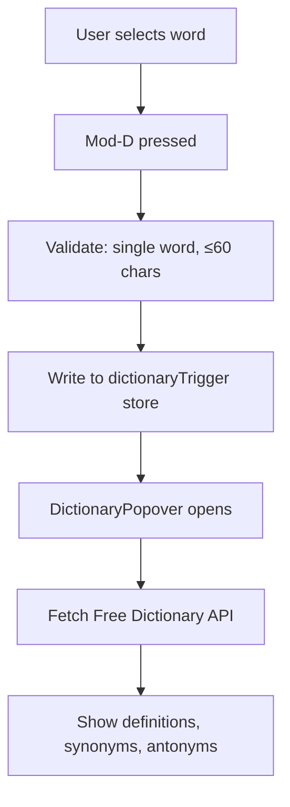

# AI Sidebar

The AI sidebar provides multiple modes for AI-assisted writing. Each mode has its own tab with specialized functionality.

## Tabs

| Tab | Key | Component | Purpose |
|-----|-----|-----------|---------|
| Chat | 1 | `Chat.svelte` | General AI conversation |
| Feedback | 2 | `Feedback.svelte` | AI feedback on document/selection |
| Revise | 3 | `Revise.svelte` | AI-powered revision generation |
| Context | 4 | `DocumentContext.svelte` | Document context reference |
| Readers | 5 | `Readers.svelte` | Reader persona configuration |
| Settings | 6 | `AISettings.svelte` | Provider/model configuration |

## Chat Mode

General-purpose AI chat for writing assistance:
- Supports document context injection
- Quick prompts for common tasks
- "Open in Chat" from dictionary popover
- Message history within session

## Feedback Mode

AI feedback on the document or selected text:
- Routes through enabled reader personas (parallel execution)
- Creates comments, suggestions, revisions
- Quick prompts for specific feedback types
- Falls back to single-stream if no personas enabled

## Revise Mode

AI-powered text revision:
- Takes selection or full document
- Generates alternative versions
- Creates revision annotations with AI-suggested text
- Quick prompts for common revision tasks

## Context Mode

Shows the document context that will be sent to AI:
- Summary of document
- Key topics and themes
- "Generate" button to create/refresh context
- "Clear" button to remove context

## Readers Mode

See [Reader Personas](./reader-personas.md) for full documentation.

## Settings Mode

AI provider configuration:
- Provider selection (OpenAI, Anthropic, Google)
- Model selection per provider
- API key management (stored in OS keychain)
- Custom quick actions configuration

## Dictionary Popover

Triggered by `Mod-D` when a single word is selected:

Features:
- Definitions from Free Dictionary API
- Synonym chips (click to replace word)
- Antonym chips (click to look up)
- "Describe → find word" AI mode
- "Open in Chat" button

### Integration

- `dictionaryPlugin.ts` — keymap and validation
- `dictionaryUtils.ts` — pure helper functions
- `DictionaryPopover.svelte` — floating UI
- `streamDictionary` in `clientStreams.ts` — AI mode

## Provider Abstraction

### Files

| File | Purpose |
|------|---------|
| `provider.ts` | Provider-agnostic client setup |
| `chatFactory.ts` | Request builders, streaming helpers |
| `clientStreams.ts` | Mode-specific stream handlers |
| `settings.svelte.ts` | AI settings store |

### Supported Providers

| Provider | Models |
|----------|--------|
| OpenAI | gpt-4o, gpt-4o-mini, gpt-4-turbo |
| Anthropic | claude-3-5-sonnet, claude-3-opus, claude-3-haiku |
| Google | gemini-1.5-pro, gemini-1.5-flash |

### API Key Storage

Keys stored in OS keychain via `src-tauri/src/keychain.rs`:
- macOS: Keychain
- Windows: Credential Manager
- Linux: Secret Service

Not stored in localStorage (security).

## Event Bus Integration

`appEventBus` handles cross-component events:

| Event | Emitter | Consumer |
|-------|---------|----------|
| `dictionary-open` | dictionaryPlugin | DictionaryPopover |
| `ai-open-chat` | DictionaryPopover | Chat, AISidebar |
| `ai-open-settings` | AutoAIWidget | AISidebar |

## Tool Calls

AI responses can include tool calls for annotation creation:

| Tool | Action |
|------|--------|
| `createComment` | Create comment annotation |
| `createSuggestion` | Create suggestion annotation |
| `createRevision` | Create revision annotation |

Tool handlers dispatch directly to CodeMirror via annotation factory functions.
