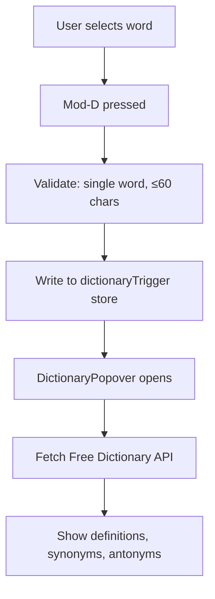

# AI Sidebar

The AI sidebar provides a primary **Ask Editor** surface plus legacy/advanced AI modes.
Ask Editor is the unified editor-in-the-margin entry point: focus toggles describe what
Quillium should look for, and results route through the annotation system rather than
silent document edits.

## Tabs

| Tab | Key | Component | Purpose |
|-----|-----|-----------|---------|
| Ask Editor | 1 | `EditorReview.svelte` | Unified editor with focus toggles and protected-writing controls |
| Chat | 2 | `Chat.svelte` | General AI conversation |
| Feedback | 3 | `Feedback.svelte` | AI feedback on document/selection |
| Revise | 4 | `Revise.svelte` | AI-powered revision generation |
| Context | 5 | `DocumentContext.svelte` | Document context reference |
| Readers | 6 | `Readers.svelte` | Reader persona configuration |
| Settings | — | `AISettings.svelte` | Provider/model configuration |

## Ask Editor

Unified editor surface:

- Primary action: `Ask Editor` / `Review`
- Focus toggles: Reader View, Voice Guard, Specificity, Structure, Clarity, Line Notes,
  Grammar Only, Policy Safety, Challenge
- Risk selector: ordinary, high stakes, college app
- Policy selector: normal, unknown, grammar only, no substantive AI, custom policy
- Optional Reader Personas layer through `personaModes.editor`, default OFF
- Uses the shared editor contract in `src/lib/ai/editor/`
- Currently routes through the existing annotation-first feedback stream while the
  structured generate-object harness matures

## Chat Mode

General-purpose AI chat for writing assistance:
- Uses the shared AI context packet before the user's prompt
- Shows a context lens with the active scope and included sources
- Offers context-aware action cards based on selection/document state
- "Open in Chat" from dictionary popover
- Message history within session

## Feedback Mode

AI feedback on the document or selected text:
- Uses the context lens instead of generic built-in prompt pills
- Routes through enabled reader personas (parallel execution)
- Creates comments, suggestions, revisions
- Keeps user-defined custom actions from settings
- Falls back to single-stream if no personas enabled

## Revise Mode

AI-powered text revision:
- Uses context-aware action cards for selection-level vs document-wide revision
- Takes selection or full document
- Generates alternative versions
- Creates revision annotations with AI-suggested text
- Keeps user-defined custom actions from settings

## Context Mode

Shows writer-provided context that will be sent to AI:
- Freeform document-context textarea persisted to localStorage
- Optional prompt/brief input that can generate context with the selected model
- "Clear" button to remove stored context
- Same context appears as the `writer-context` source in the context lens

## Readers Mode

See [Reader Personas](./reader-personas.md) for full documentation.

## Settings Mode

AI provider configuration:
- Provider selection (OpenAI, OpenAI-compatible, Anthropic, Google, DeepSeek)
- Model selection per provider
- Custom base URL + freeform model id for OpenAI-compatible endpoints
- API key management (stored in OS keychain)
- Custom quick actions configuration

## Dictionary Popover

Triggered by `Mod-D` when a single word is selected:

Features:
- Definitions from Free Dictionary API
- Synonym chips (click to replace word)
- Antonym chips (click to look up)
- "Describe → find word" AI mode
- "Open in Chat" button

### Integration

- `dictionaryPlugin.ts` — keymap and validation
- `dictionaryUtils.ts` — pure helper functions
- `DictionaryPopover.svelte` — floating UI
- `streamDictionary` in `clientStreams.ts` — AI mode

## Provider Abstraction

### Files

| File | Purpose |
|------|---------|
| `provider.ts` | Provider-agnostic client setup |
| `context.ts` | Context packet assembly, budgeting, UI action suggestions |
| `chatFactory.ts` | Request builders, streaming helpers |
| `clientStreams.ts` | Mode-specific stream handlers |
| `settings.svelte.ts` | AI settings store |

### Context Packets

AI calls use a shared context packet instead of sending an unbounded raw
document blob. The packet:

- prioritizes selected text when present
- includes nearby passage context around selections
- clips long drafts with an explicit omission marker
- keeps writer-provided document context labeled separately from document text
- is inserted before the user's actual prompt, so the prompt remains the latest
  user instruction

The sidebar mirrors this same packet through the context lens, which displays
the active scope (`Selection lens`, `Document lens`, or `Blank draft`) and the
sources currently in play.

### Supported Providers

| Provider | Models |
|----------|--------|
| OpenAI | gpt-5.5, gpt-5.4-mini, gpt-5.4-nano |
| OpenAI-compatible | User-provided model id and base URL |
| Anthropic | claude-opus-4-8, claude-sonnet-4-6, claude-haiku-4-5 |
| Google | gemini-3.5-flash, gemini-3.1-pro-preview, gemini-3-flash-preview |
| DeepSeek | deepseek-v4-pro, deepseek-v4-flash |

### API Key Storage

Keys stored in OS keychain via `packages/desktop/src-tauri/src/keychain.rs`:
- macOS: Keychain
- Windows: Credential Manager
- Linux: Secret Service

Not stored in localStorage (security).

OpenAI-compatible endpoints can run without a stored API key; `createModel()`
passes a placeholder key and uses the configured `baseURL`.

## Event Bus Integration

`appEventBus` handles cross-component events:

| Event | Emitter | Consumer |
|-------|---------|----------|
| `dictionary-open` | dictionaryPlugin | DictionaryPopover |
| `ai-open-chat` | DictionaryPopover | Chat, AISidebar |
| `ai-open-settings` | AutoAIWidget | AISidebar |

## Tool Calls

AI responses can include tool calls for annotation creation:

| Tool | Action |
|------|--------|
| `createComment` | Create comment annotation |
| `createSuggestion` | Create suggestion annotation |
| `createRevision` | Create revision annotation |

Tool handlers dispatch directly to CodeMirror via annotation factory functions.
