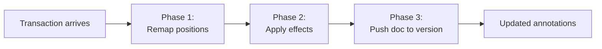

# Annotation System

The annotation system is the core of Quillium's non-linear editing model. It enables comments, suggestions, and revisions anchored to document ranges.

## Architecture Layers

```
models.ts           — Plain types, factory helpers, type guards (no CM imports)
annotationField.ts  — StateField + StateEffects + undo/redo (CM state layer)
utils.ts            — Pure query helpers: range mapping, active annotation
index.ts            — ViewPlugins + keybindings + public factory functions
Svelte components   — UI rendering, nested editor lifecycle
```

## Data Model

All annotation types share a `BaseAnnotation`:

```typescript
type BaseAnnotation = {
    selection: EditorSelection; // what text is annotated (document positions)
    id: number;                 // unique within the annotation map
    thread: Thread;             // array of { message, author, time }
};

type CommentAnnotation    = BaseAnnotation & { _type: "comment" };
type SuggestionAnnotation = BaseAnnotation & { _type: "suggestion"; replacements: SuggestionReplacement[] };
type RevisionAnnotation   = BaseAnnotation & {
    _type: "revision";
    activeVersionId: string;    // stable id of the active version (versions[].id)
    versions: VersionState[];   // all version texts, ordered for display
};

type VersionState = { id: string; doc: string; label?: string } & object;

type Annotations = { [id: number]: GenericAnnotation };
```

**Important:** Always use `isAnnotationOfType(annotation, "revision")` — never compare `_type` directly.

**Important:** A revision points at its active version by **stable `id`** (`activeVersionId`), not by array index. The `versions[]` array stays ordered (pills, `Ctrl-[` / `Ctrl-]` navigation are positional), but identity is the id. Read the active version with the `activeVersion(rev)` / `activeVersionIndex(rev)` helpers — never `rev.versions[rev.activeVersionId]` (it's not an index). See [Version identity](#version-identity).

### Adding a new annotation type

A new variant of `GenericAnnotation` is **not** picked up automatically — several
places enumerate the union by hand. Work through this checklist; the build will
stop you at most of these, but not all:

1. **`models.ts` — the type and its raw schema.** Add the new `…Annotation` type
   to the `GenericAnnotation` union, then add a matching member to
   `RawAnnotationSchema` (the discriminated union persisted to disk). These are
   the source of truth everything else derives from.
2. **`models.ts` — the clipboard-serialized shape.** Add a member to
   `SerializedAnnotationSchema`, carrying the type's extra fields the same way
   the revision/suggestion members do. This is the part most likely to be missed:
   without it, copy/cut **deletes** an annotation of the new type but never writes
   it to the clipboard, so paste silently loses it. Two compile-time tripwires
   guard this — the `RawAnnotationSchema.options satisfies […]` length check and
   the `_AssertSerializedCoversAllTypes` equality — so forgetting step 2 fails the
   build. (The serialize/rebuild functions in `clipboardAnnotations.ts` spread all
   fields generically, so they need no change once the schema covers the type.)
3. **`annotationField.ts` — Phase 3 / `pushDocToVersionState`** if the new type
   mirrors document text the way revisions do. Most types won't.
4. **Decorations and UI** — `annotationDecorations` in `index.ts`, plus whatever
   sidebar/card component renders the type.
5. **Factory + commands** — a `createNew…` path and any keybinding, if the type
   is user-creatable.

Steps 1–2 are enforced by the compiler; 3–5 are not, so add tests for the new
type's create → edit → undo and (if it should be copyable) copy → paste flows.

### VersionState

`VersionState` is `{ id: string; doc: string; label?: string } & object`. Each entry reflects the most recent text under a revision range. Phase 3 pushes the parent document slice into the active version's `doc` on each edit (located via `activeVersionIndex(rev)`). `VersionStateSchema` uses `.passthrough()` so extra keys survive serialization (e.g. a nested editor's serialized `annotationField`).

### Version identity

Each version carries a stable string `id`; a revision references its active version
by `activeVersionId`, and all version-targeting effects/builders take a version id
(not an array index). This matters because an array index silently rots when a
version is added, deleted, or reordered — a link or active-pointer stored as an
index would then point at the wrong text.

**ID scheme — deliberately *not* a UUID.** `newVersionId()` (in `models.ts`) returns
a session counter plus a short random suffix, e.g. `v3_a9k2zq`:

```ts
let _versionIdCounter = 0;
export function newVersionId(): string {
    _versionIdCounter += 1;
    return `v${_versionIdCounter}_${Math.random().toString(36).slice(2, 8)}`;
}
```

- **Scope is per-revision, not global.** An id only needs to be unique within one
  revision's `versions[]` (a handful of entries), so a full UUID is overkill. The
  counter gives readable, roughly-ordered ids; the 6-char base-36 suffix is the
  collision guard for the one case the counter can't cover — two collab clients
  minting a version concurrently (each client's counter starts at 0).
- **Session-scoped, not persisted.** The counter resets to 0 on reload. That's safe
  because the *ids* are persisted; existing versions keep their stored id, new ones
  continue from a fresh counter, and the random suffix prevents any clash with
  reloaded ids. (Annotation `id`s, by contrast, are sequential integers via
  `getNewId` — a separate scheme.)
- **Regenerated on paste.** `clipboardAnnotations.rebuildAnnotation` mints fresh
  version ids on paste and remaps `activeVersionId`, so a pasted version can't
  collide with an existing one in the destination revision.

**Helpers** (all in `models.ts`): `makeVersion({doc, label?, id?})` (mints an id if
absent — use it at every construction site), `versionById(rev, id)`,
`versionIndexById(rev, id)`, `activeVersion(rev)`, `activeVersionIndex(rev)`.

**Back-compat.** Legacy persisted revisions carry the old `activeVersionIndex`
(number) and id-less versions. `normalizeRevision()` heals them at the load
boundary (`annotationField.fromJSON` and the collab read path): it mints
position-stable ids and derives `activeVersionId` from the clamped legacy index.
It's idempotent, so already-migrated data passes through untouched. The collab
Yjs wire schema is still index-based (read-tolerant) pending an id-native rewrite;
see issue #269.

### Version groups (linking versions across revisions)

A **version group** links one version from each of several *different* revisions
into a matched set, so activating any member switches every member to its partner
(e.g. flip the intro to "Casual" and the conclusion follows). Lives in a sibling
`versionGroupField: StateField<VersionGroups>`, kept separate from
`annotationField` so the annotation reducer stays untouched.

```typescript
type VersionGroupMember = { revisionId: number; versionId: string };
type VersionGroup       = { id: string; label: string; members: VersionGroupMember[] };
type VersionGroups      = { [groupId: string]: VersionGroup };
```

Reducer invariants:
- **Exclusive membership** — adding a member detaches it from any prior group.
- **One version per revision per group** (`canAddMemberToGroup`) — a second
  version of the same revision is rejected (the cascade target would be
  ambiguous).
- **Referential integrity** — when a revision is removed or a version deleted
  (observed via `removeAnnotation` / `_deleteVersionFromRevision` effects in the
  same transaction), matching members are pruned; a group that drops below two
  members dissolves. Undo restores the dissolved group (snapshot-restore
  inversion via `_restoreVersionGroups`).

**Cascade.** `setActiveRevisionVersion` resolves the target version's group
partners (`groupSwitchTargets` → `groupPartnersOf`) and bundles every partner's
`_updateActiveRevisionVersion` effect + doc replacement into the *same*
transaction. So a group switch is atomic and reverts in one undo, and every
switch entry point (pill, `Ctrl-[` / `Ctrl-]`, modal) cascades for free. The
`annotationField ↔ versionGroupField` import pair is a safe ESM cycle (all
cross-references are inside function bodies).

Public builders: `createVersionGroup(label, members)` → `{ spec, groupId }`,
`addVersionToGroup`, `removeVersionFromGroup`, `deleteVersionGroup`,
`renameVersionGroup`. Group switches sync over collab today (they ride the normal
annotation sync as one transaction); syncing the group *structure* map is tracked
in #273.

## The annotationField StateField

`annotationField` is the single source of truth for all annotation data. Its `update()` function runs on **every** CodeMirror transaction in three phases:



### Phase 1: Remap Positions

```typescript
remapAnnotationSelections(annotations, tr)
```

Maps every annotation's `selection` through `tr.changes` so positions stay accurate as text is inserted or deleted.

- Comments and suggestions are **removed** if their range collapses to zero width
- Revisions **temporarily survive** empty ranges via `allowEmpty: true` in `cleanRangesOf()`, keeping them alive for `collapsedRevisionResolver` to handle

### Phase 2: Apply Effects

Processes each `StateEffect` in the transaction:

| Effect | Action |
|--------|--------|
| `addAnnotation` | Insert into map |
| `removeAnnotation` | Delete from map |
| `updateThread` | Replace `annotation.thread` |
| `_addVersionToRevision` | Splice new version into `versions`; make it active |
| `_deleteVersionFromRevision` | Remove version by id; recompute `activeVersionId` |
| `_updateActiveRevisionVersion` | Update `activeVersionId` (target by id), rebuild selection |
| `_updateRevisionVersionState` | Replace version blob (by id) with nested editor state |
| `addSuggestion` | Text search + add suggestion |
| `_applySuggestion` | Delete suggestion from map |

Effects touching a specific revision ID are tracked in `revisionsWithExplicitEffect` (used in Phase 3).

### Phase 3: Push Document Text

```typescript
if (tr.docChanged) {
    annotations = pushDocToVersionState(annotations, tr, revisionsWithExplicitEffect);
}
```

For each revision **not** in `revisionsWithExplicitEffect`, reads the document slice under the revision's range and writes it into the active version's `doc` (the slot at `activeVersionIndex(rev)`).

**Critical invariant:** Phase 3 only runs when `tr.docChanged` and skips revisions with explicit effects this transaction.

## Undo/Redo: invertedAnnotationFieldEffects

Registered via `invertedEffects.of(...)`. When CodeMirror undoes/redoes a transaction, this returns the effects for the inverse transaction.

| Original effect | Inverted effect |
|-----------------|-----------------|
| `addAnnotation` | `removeAnnotation` (same object) |
| `removeAnnotation` | `addAnnotation` (same object) |
| `updateThread` | `updateThread` with old thread |
| `_addVersionToRevision` | `_deleteVersionFromRevision` by the added version's id |
| `_deleteVersionFromRevision` | `_addVersionToRevision` with old version, at its old slot |
| `_updateActiveRevisionVersion` | `_updateActiveRevisionVersion` with old `activeVersionId` |
| `_updateRevisionVersionState` | `_updateRevisionVersionState` with old blob (by id) |
| `_applySuggestion` | `addAnnotation` (restores suggestion) |
| *(implicit)* collapsed revision | `removeAnnotation(collapsed)` + `_restoreAnnotation(original)` |

### `_revisionCleanup` Guard

The cleanup transaction from `collapsedRevisionResolver` (tagged `_revisionCleanup.of(true)` and `addToHistory.of(false)`) is skipped by `invertedAnnotationFieldEffects`. This prevents spurious `addAnnotation(collapsed)` effects from appearing in undo entries.

## Public API

Effects prefixed with `_` are internal. External code uses transaction builders:

```typescript
// Each returns a TransactionSpec — caller dispatches.
// `toId` / `versionId` are STABLE version ids (VersionState.id), not indices.
setActiveRevisionVersion(state, annotationId, toId)
createNewRevision(state, annotationId)
deleteRevisionVersion(state, annotationId, versionId)
updateRevisionVersionState(state, annotationId, versionId, newVersionState)
updateRevisionVersionLabel(state, annotationId, versionId, label)
branchSuggestion(state, annotationId)
applySuggestion(state, annotationId, replacementIndex)
```

Positional callers (a pill click, `Ctrl-[` / `Ctrl-]`) translate the target index
to its id first, e.g. `setActiveRevisionVersion(state, id, rev.versions[next].id)`.

## Transaction Annotations

### `revisionInternalEdit`

Set to `true` on transactions dispatched by revision API builders. Marks the transaction as revision-system-driven (not user typing).

Consumers:
1. `collapsedRevisionResolver` — skips auto-removal (collapse is intentional)
2. `boundaryInsertNudge` — skips nudge events for programmatic insertions
3. `invertedAnnotationFieldEffects` — skips implicit remapping detection

### `_revisionCleanup`

Set to `true` on cleanup transactions from `collapsedRevisionResolver`. Always paired with `addToHistory.of(false)`. Sole consumer is `invertedAnnotationFieldEffects` (returns empty effects).

## Common Flows

### Creating a Comment

```
User selects text → Mod-Alt-M
→ canCreateNewComment() check (single-pending mutex)
→ addAnnotation { _type: "comment", thread: [] }
→ PreComment.svelte renders (pending state)
→ User submits → updateThread with first message
→ Comment.svelte renders
```

### Creating a Revision

```
User selects text → Mod-Alt-K
→ addAnnotation { _type: "revision", versions: [makeVersion({ doc: selected })], activeVersionId: <that version's id> }
→ Text becomes atomic in main doc
→ Revision.svelte renders with one version pill
→ isActive → nested editor auto-opens
```

### Switching Versions

```
User clicks version pill N
→ view.dispatch(setActiveRevisionVersion(state, id, versions[N].id))
  Transaction contains:
    - _updateActiveRevisionVersion effect (target version id)
    - doc change: replace revision range with that version's doc
    - revisionInternalEdit.of(true)
    - Transaction.addToHistory.of(true)
→ Phase 2: updates activeVersionId, rebuilds selection
→ Phase 3 skipped (revision in revisionsWithExplicitEffect)
→ Svelte store sync → Revision.svelte re-renders
```
