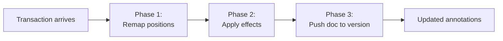

# Annotation System

The annotation system is the core of Quillium's non-linear editing model. It enables comments, suggestions, and revisions anchored to document ranges.

## Architecture Layers

```
models.ts           — Plain types, factory helpers, type guards (no CM imports)
annotationField.ts  — StateField + StateEffects + undo/redo (CM state layer)
utils.ts            — Pure query helpers: range mapping, active annotation
index.ts            — ViewPlugins + keybindings + public factory functions
Svelte components   — UI rendering, nested editor lifecycle
```

## Data Model

All annotation types share a `BaseAnnotation`:

```typescript
type BaseAnnotation = {
    selection: EditorSelection; // what text is annotated (document positions)
    id: number;                 // unique within the annotation map
    thread: Thread;             // array of { message, author, time }
};

type CommentAnnotation    = BaseAnnotation & { _type: "comment" };
type SuggestionAnnotation = BaseAnnotation & { _type: "suggestion"; replacements: SuggestionReplacement[] };
type RevisionAnnotation   = BaseAnnotation & {
    _type: "revision";
    activeVersionIndex: number; // index into versions[]
    versions: VersionState[];   // all version texts
};

type Annotations = { [id: number]: GenericAnnotation };
```

**Important:** Always use `isAnnotationOfType(annotation, "revision")` — never compare `_type` directly.

### VersionState

`VersionState` is `{ doc: string; label?: string } & object`. Each entry reflects the most recent text under a revision range. Phase 3 pushes the parent document slice into `versions[activeVersionIndex].doc` on each edit. `VersionStateSchema` uses `.passthrough()` so extra keys survive serialization.

## The annotationField StateField

`annotationField` is the single source of truth for all annotation data. Its `update()` function runs on **every** CodeMirror transaction in three phases:



### Phase 1: Remap Positions

```typescript
remapAnnotationSelections(annotations, tr)
```

Maps every annotation's `selection` through `tr.changes` so positions stay accurate as text is inserted or deleted.

- Comments and suggestions are **removed** if their range collapses to zero width
- Revisions **temporarily survive** empty ranges via `allowEmpty: true` in `cleanRangesOf()`, keeping them alive for `collapsedRevisionResolver` to handle

### Phase 2: Apply Effects

Processes each `StateEffect` in the transaction:

| Effect | Action |
|--------|--------|
| `addAnnotation` | Insert into map |
| `removeAnnotation` | Delete from map |
| `updateThread` | Replace `annotation.thread` |
| `_addVersionToRevision` | Splice new version into `versions` |
| `_deleteVersionFromRevision` | Splice version out |
| `_updateActiveRevisionVersion` | Update `activeVersionIndex`, rebuild selection |
| `_updateRevisionVersionState` | Replace version blob with nested editor state |
| `addSuggestion` | Text search + add suggestion |
| `_applySuggestion` | Delete suggestion from map |

Effects touching a specific revision ID are tracked in `revisionsWithExplicitEffect` (used in Phase 3).

### Phase 3: Push Document Text

```typescript
if (tr.docChanged) {
    annotations = pushDocToVersionState(annotations, tr, revisionsWithExplicitEffect);
}
```

For each revision **not** in `revisionsWithExplicitEffect`, reads the document slice under the revision's range and writes it into `versions[activeVersionIndex].doc`.

**Critical invariant:** Phase 3 only runs when `tr.docChanged` and skips revisions with explicit effects this transaction.

## Undo/Redo: invertedAnnotationFieldEffects

Registered via `invertedEffects.of(...)`. When CodeMirror undoes/redoes a transaction, this returns the effects for the inverse transaction.

| Original effect | Inverted effect |
|-----------------|-----------------|
| `addAnnotation` | `removeAnnotation` (same object) |
| `removeAnnotation` | `addAnnotation` (same object) |
| `updateThread` | `updateThread` with old thread |
| `_addVersionToRevision` | `_deleteVersionFromRevision` at same index |
| `_deleteVersionFromRevision` | `_addVersionToRevision` with old version |
| `_updateActiveRevisionVersion` | `_updateActiveRevisionVersion` with old index |
| `_updateRevisionVersionState` | `_updateRevisionVersionState` with old blob |
| `_applySuggestion` | `addAnnotation` (restores suggestion) |
| *(implicit)* collapsed revision | `removeAnnotation(collapsed)` + `_restoreAnnotation(original)` |

### `_revisionCleanup` Guard

The cleanup transaction from `collapsedRevisionResolver` (tagged `_revisionCleanup.of(true)` and `addToHistory.of(false)`) is skipped by `invertedAnnotationFieldEffects`. This prevents spurious `addAnnotation(collapsed)` effects from appearing in undo entries.

## Public API

Effects prefixed with `_` are internal. External code uses transaction builders:

```typescript
// Each returns a TransactionSpec — caller dispatches
setActiveRevisionVersion(state, annotationId, to)
createNewRevision(state, annotationId)
deleteRevisionVersion(state, annotationId, versionId)
updateRevisionVersionState(state, annotationId, versionId, newVersionState)
branchSuggestion(state, annotationId)
applySuggestion(state, annotationId, replacementIndex)
```

## Transaction Annotations

### `revisionInternalEdit`

Set to `true` on transactions dispatched by revision API builders. Marks the transaction as revision-system-driven (not user typing).

Consumers:
1. `collapsedRevisionResolver` — skips auto-removal (collapse is intentional)
2. `boundaryInsertNudge` — skips nudge events for programmatic insertions
3. `invertedAnnotationFieldEffects` — skips implicit remapping detection

### `_revisionCleanup`

Set to `true` on cleanup transactions from `collapsedRevisionResolver`. Always paired with `addToHistory.of(false)`. Sole consumer is `invertedAnnotationFieldEffects` (returns empty effects).

## Common Flows

### Creating a Comment

```
User selects text → Mod-Alt-M
→ canCreateNewComment() check (single-pending mutex)
→ addAnnotation { _type: "comment", thread: [] }
→ PreComment.svelte renders (pending state)
→ User submits → updateThread with first message
→ Comment.svelte renders
```

### Creating a Revision

```
User selects text → Mod-Alt-K
→ addAnnotation { _type: "revision", versions: [{ doc: selected }], activeVersionIndex: 0 }
→ Text becomes atomic in main doc
→ Revision.svelte renders with one version pill
→ isActive → nested editor auto-opens
```

### Switching Versions

```
User clicks version pill N
→ view.dispatch(setActiveRevisionVersion(state, id, N))
  Transaction contains:
    - _updateActiveRevisionVersion effect (N)
    - doc change: replace revision range with versions[N].doc
    - revisionInternalEdit.of(true)
    - Transaction.addToHistory.of(true)
→ Phase 2: updates activeVersionIndex, rebuilds selection
→ Phase 3 skipped (revision in revisionsWithExplicitEffect)
→ Svelte store sync → Revision.svelte re-renders
```
