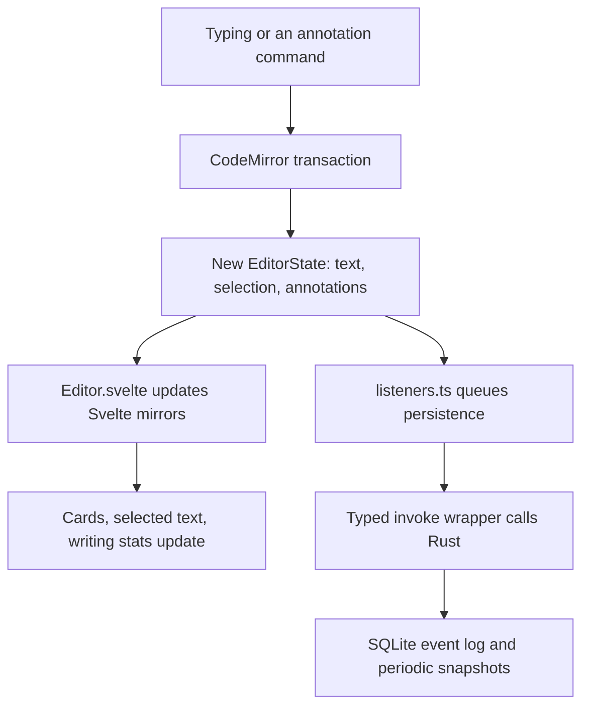

# Follow an edit through Quillium

Quillium is a SvelteKit writing app packaged with Tauri. CodeMirror manages the
text and annotations; Rust stores local writing in SQLite. The central design
problem is making alternate versions of a passage behave like part of the same
document, through editing, undo, saving, and reopening.

## Start with what the writer sees

Imagine a document called "The crossing". Its draft tab holds a draft of a story.
The writer selects "She crossed the bridge" and creates a revision with two
versions: the original and "She turned back". Switching the active version changes
that passage in the draft. The unselected alternative remains available.

These are different levels of the writing model:

```text
Document: The crossing
└── Draft tab
    └── Draft: a complete writing state
        └── Revision: a selected passage
            ├── Version: She crossed the bridge
            └── Version: She turned back
```

A draft tab can contain multiple drafts. Iteration creates the next draft in a
run; branching starts an alternate run. A revision version can itself contain
annotations, including another revision. The [glossary](../CONTEXT.md) defines
these terms precisely, and [tabs and drafts](tabs-and-drafts.md) explains lineage.

The desktop route [src/routes/+page.svelte](../packages/desktop/src/routes/+page.svelte)
mounts the editor and app overlays. [Editor.svelte](../packages/desktop/src/lib/editor/Editor.svelte)
owns the writing workspace and connects the editor state to the surrounding UI.

## Who owns the state?

| State | Owner | How it changes |
|---|---|---|
| Draft text, selection, annotations | CodeMirror `EditorState` | Transactions dispatched to an `EditorView` |
| UI copies of text, selection, annotations | Svelte stores | Explicit updates from the CodeMirror listener |
| Panels, modal stack, preferences | Svelte stores and rune state | UI actions and owning controllers |
| Durable local content history | SQLite events and snapshots | Rust commands called by the persistence queue |
| Shared live text and annotations | Yjs structures during a Live Room | Bindings translate between Yjs and CodeMirror |

The Svelte store containing an `EditorView` provides access to that editor. It
does not notify components every time `view.state` changes. That is why there is
an explicit bridge from CodeMirror to Svelte. Read [state management](state-management.md)
for the distinction between a content mutation and a UI update.

## What happens when the writer types?

Follow the ordinary local editing path first. Collaboration adds another path,
explained below.



1. CodeMirror applies the text change to an immutable state. Its extensions also
   map annotation ranges through the change, so a comment stays attached when
   text is inserted before it.
2. The shared [annotation field](../packages/share/src/core/annotationField.ts)
   maps ranges, handles annotation effects, and copies the resulting text into
   active revision versions. Those phases keep the passage and its active
   version consistent.
3. `syncStoresToEditorState()` in `Editor.svelte` publishes the text, annotations,
   selection, version groups, and writing statistics to Svelte. The cards render
   from those mirrors.
4. The separate [persistence listener](../packages/desktop/src/lib/editor/listeners.ts)
   records relevant transactions in order. [Database wrappers](../packages/desktop/src/lib/db/index.ts)
   call Rust, which appends events and requests snapshots when needed. The
   [persistence guide](persistence.md) covers queueing, recovery, and history policy.

On reopen, [documentLoader.ts](../packages/desktop/src/lib/editor/documentLoader.ts)
loads a snapshot and replays subsequent events before presenting the editor.
Snapshots limit replay work; the event log records changes between snapshots.
Structural actions such as creating a tab use document activity records, separate
from a draft's content events.

## Why a nested editor edits the parent

The small editor inside a revision card and the expanded editor in its modal
show the active version of the same passage. Each is a full CodeMirror
`EditorView`, with positions relative to that passage.

If the passage begins at offset 100 in its parent, an edit at nested offset 3
must be translated to the corresponding parent position. The
[NestedEditorController](../packages/desktop/src/lib/editor/plugins/annotations/NestedEditorController.ts)
uses helpers in [nestedEditor.ts](../packages/desktop/src/lib/editor/plugins/annotations/nestedEditor.ts)
to dispatch that edit to the parent. Parent state then updates the active
version and the other views. Undo follows the parent chain as well.

This ownership rule prevents an inline card and a modal from saving competing
copies. It also explains why annotation IDs need an editor context: an ID inside
one version can collide with an ID in the root editor. See
[nested editors](nested-editors.md) for lifecycle, rebuilds, and sync flags.

## Which package should I open?

| Package | Responsibility |
|---|---|
| `packages/desktop` | Editable app, Svelte stores, persistence, AI, auth, collaboration bindings, and native integration |
| `packages/share` | Canonical annotation state, shared cards and modals, read-only hosts, and wire contracts |
| `packages/landing` | Public website and hosted Web Preview routes |
| `packages/relay` | WebSocket service for Live Rooms |
| `packages/e2e` | Tests that cross package and service boundaries |

The name `share` understates its role. Desktop and Web Preview both use its
annotation core and presentation. Desktop's `models.ts` and `annotationField.ts`
are compatibility re-exports; follow them into `packages/share/src/core/` to
change the implementation.

Shared UI accepts callbacks and snippets for capabilities such as editing or
navigation. Desktop adapters supply mutations, analytics, persistence, and modal
navigation. Read-only adapters omit mutation capabilities while retaining safe
local interactions such as previewing another revision version. This avoids two
visual implementations drifting apart. See the
[package boundary rules](monorepo.md#shared-editor-surface-architecture).

## Where AI and collaboration join the flow

AI requests gather writing context, call a provider, and turn results into
ordinary annotation commands. They reach the same state, undo, and persistence
path as manual annotations. Start with [the AI request pipeline](ai-sidebar.md);
[AutoAI](autoai.md) schedules background reviews through that machinery.

A Live Room uses Yjs, a data structure library that merges concurrent edits.
Bindings translate between its shared text/annotation structures and CodeMirror.
Remote updates carry origin markers so they are not sent back as fresh local
edits. The owner governs the session and local persistence; joiners have a
temporary session. [Collaboration](collaboration.md) explains the relay, undo,
reconnection, and participant lifecycle.

A Web Preview is a published, read-only document view. It uses shared rendering
in the landing app and has a different lifecycle from a Live Room.

## Continue with your change

Use [the code map](file-structure.md) to locate a feature and its tests. Before
changing a state boundary, read its system guide and relevant
[architecture decision record](adr/README.md). The ADRs explain why local event
history, parent authority, stable version IDs, and app-neutral UI exist.
