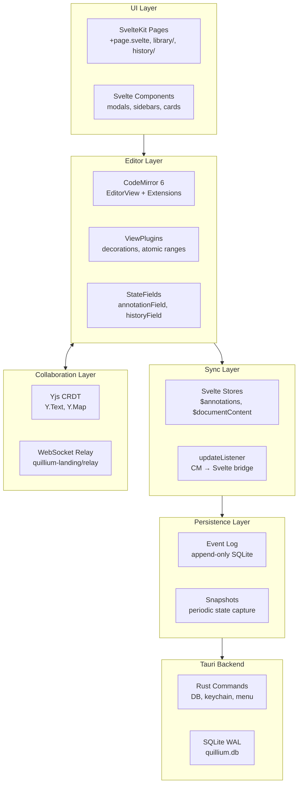
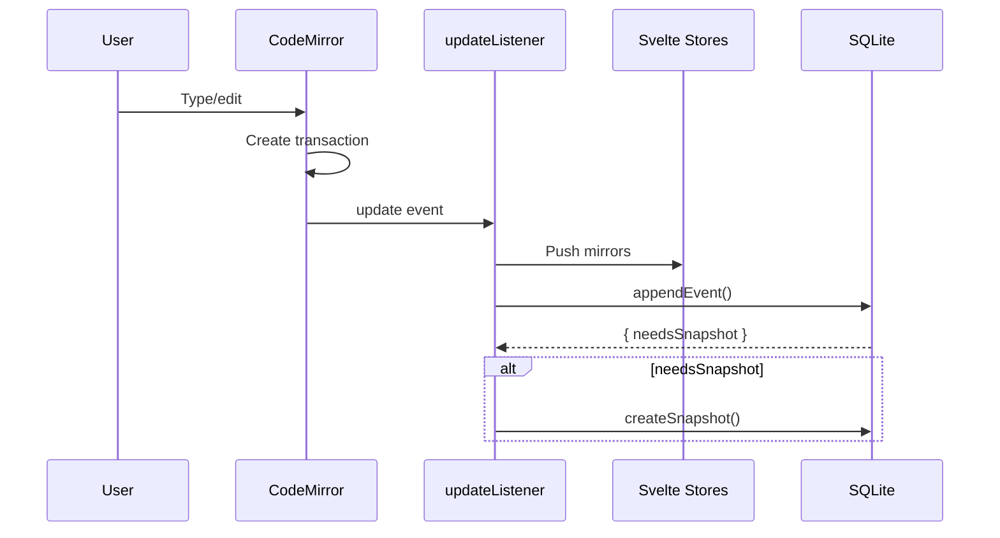

# Architecture Overview

Quillium is built as a modern web application using SvelteKit, packaged as a cross-platform desktop app via Tauri. The architecture is dominated by the complexity of the annotation and revision system — understanding how CodeMirror state, Svelte stores, and nested editors interact is the main onboarding challenge.

## Application Layout

`src/routes/+page.svelte` is the app shell and overlay host. It mounts a single `<Editor />` root, then layers app-wide UI on top: update/banner flows, tutorial and legal modals, auth/collab entry points, the bottom-left utility stack, and the nested annotation modal stack.

The three-panel writing workspace is rendered inside `src/lib/editor/Editor.svelte`:

```
                                        ┌────────┐
                                        │ Share  │  ← Top-right entry point
                                        └────────┘
┌──────────────┬──────────────────────┬──────────────────┐
│  AI Sidebar  │       Editor         │   Annotations    │
│              │                      │                  │
│  Chat        │  CodeMirror 6        │  Comment cards   │
│  Feedback    │  (816px fixed width) │  Revision cards  │
│  Revise      │  Status bar          │  Suggestion cards│
└──────────────┴──────────────────────┴──────────────────┘
                        ┌─────┐
                        │AutoAI│  ← Bottom-left bubble
                        └─────┘
```

Top-right controls: `AuthButton` (account/profile) and `GoLiveButton` (Share / live-collaboration modal).

App-wide overlays (tutorial, beta disclaimer, changelog, licenses, stats modal, update banner) are rendered by `+page.svelte`. Annotation overlays use `modalStack` from `src/lib/stores.ts` as a stack of `<RevisionModal>`, `<DiffModal>`, and `<CommentModal>` instances.

## Architecture Layers



## Data Flow



## Key Abstractions

| Abstraction | Purpose | Location |
|-------------|---------|----------|
| `EditorView` | DOM-mounted editor with plugin system | `Editor.svelte`, `extensions.ts` |
| `annotationField` | Unified annotation state management | `annotationField.ts` |
| `NestedEditorController` | Lifecycle/sync for inline and modal editors | `NestedEditorController.ts` |
| `modalStack` | Nested modal overlay management | `stores.ts` |
| Event buses | Typed pub/sub for cross-component events | `appEventBus.ts`, `annotationEventBus.ts` |
| Event log | Crash-safe append-only persistence | `db/events.ts`, `events.rs` |
| AI abstraction | Provider-agnostic streaming | `provider.ts`, `chatFactory.ts` |

## Entry Points

| Entry Point | Trigger | Responsibilities |
|-------------|---------|------------------|
| `+page.svelte` | App startup, navigation | Mount Editor, render modals, dispatch menu events |
| `library/+page.svelte` | `goToLibrary()` | Document grid, search, trash/restore |
| `history/+page.svelte` | `goToHistory()` | Version history browser |
| `Editor.svelte` | Document load | Create EditorView, set up listeners, manage nested editors |
| `AISidebar.svelte` | Tab selection | Route to Chat/Feedback/Revise/Context/Readers/Settings |
| `engine.ts` (AutoAI) | `startAutoAI()` | Subscribe to content, debounce, trigger reviews |

## Design Constraints

- **Revisions survive empty ranges** — deletion triggers cleanup, undo restores via `_restoreAnnotation` effects
- **Nested editors are full EditorView instances** — no local history, undo delegates to parent
- **Separate StateEffect per mutation** — explicit undo/redo inversion for each operation
- **Full annotation in add/remove effects** — enables cheap inversion without startState lookup
