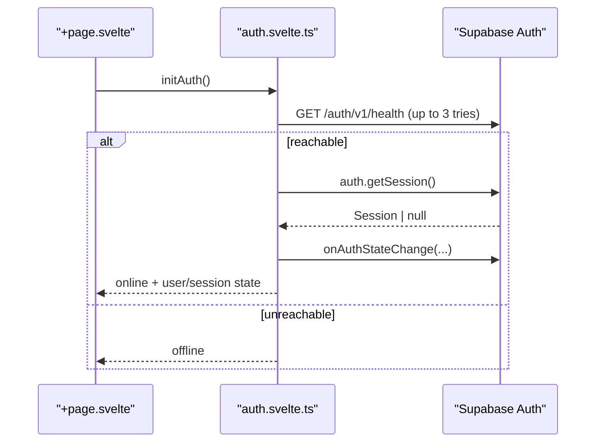

# Auth

Quillium uses Supabase Auth for Omni identity: read-only public sharing, live
rooms, collaborator display names, and per-user collaboration metadata. Local
writing remains usable without auth; auth-dependent UI degrades to sign-in or
offline states.

Architecture decision: [Supabase collaboration identity](./adr/0007-supabase-collaboration-identity.md).

## Files

| File | Purpose |
|------|---------|
| `src/lib/auth/supabase.ts` | Supabase client singleton and session storage config |
| `src/lib/auth/auth.svelte.ts` | Reactive auth state, init/reconnect, sign-in helpers |
| `src/lib/auth/schemas.ts` | Zod validation for login, signup, display names |
| `src/lib/auth/AuthButton.svelte` | Top-right account/sign-in entry point |
| `src/lib/auth/AuthModal.svelte` | Email/password login and gated signup |
| `src/lib/auth/AvatarDropdown.svelte` | Logged-in account menu |
| `src/lib/auth/ProfileModal.svelte` | Profile dialog and logout |
| `src/lib/auth/avatarUtils.ts` | Initials and deterministic avatar colors |

## Environment

| Variable | Purpose |
|----------|---------|
| `PUBLIC_SUPABASE_URL` | Supabase project URL |
| `PUBLIC_SUPABASE_PUBLISHABLE_KEY` | Browser-safe Supabase publishable key |

If either variable is missing, `supabaseConfigured` is false and auth features
show an offline/not-configured state. The desktop client never embeds a
service-role key.

## Client and Session Storage

`supabase.ts` creates a browser-style `@supabase/supabase-js` client because
Quillium is a static Tauri app, not an SSR app:

- `storage: localStorage`
- `autoRefreshToken: true`
- `persistSession: true`
- `detectSessionInUrl: false`
- `lock: processLock`

`processLock` avoids cross-window Web Lock contention. Multiple Tauri webviews
share the same localStorage origin, and the default Supabase Web Lock can throw
`LockAcquireTimeoutError` when two windows contend for the same auth-token lock.

## State Flow

`+page.svelte` calls `initAuth()` on mount.

The exported reactive getters are intentionally simple:

| Getter | Meaning |
|--------|---------|
| `getUser()` | Current Supabase user, or null |
| `getSession()` | Current session, or null |
| `isLoading()` | Initial auth load/reconnect in progress |
| `getConnectionState()` | `idle`, `connecting`, `online`, or `offline` |
| `isOffline()` | Auth server/config unavailable |
| `isAuthenticated()` | Any current user, including anonymous guests |
| `isAnonymous()` | Supabase anonymous user |
| `getCurrentUserName()` | Display name, email local part, or `"User"` |

## Account Flows

| Flow | Implementation |
|------|----------------|
| Email/password login | `signIn(email, password)` -> `supabase.auth.signInWithPassword()` |
| Signup | `signUp(email, password, displayName)` with `options.data.display_name` |
| Anonymous guest | `signInAnonymously(displayName)` with `options.data.display_name` |
| Logout | `signOut()` -> `supabase.auth.signOut()` |

Anonymous sessions remain supported by the auth API and Live Room join flow.
The desktop has no dedicated anonymous name-entry modal.

During beta, production signup is waitlist-gated in `AuthModal.svelte`.
Development builds can enable the signup tab unless the debug waitlist mode is
active.

Display names live in Supabase user metadata and are used only for UI/presence.
Do not use `raw_user_meta_data` / `user_metadata` for authorization decisions.
Authorization should use stable server-side facts such as `auth.uid()` and, when
needed, app metadata or table ownership columns.

## Consumers

| Consumer | Auth dependency |
|----------|-----------------|
| `GoLiveButton.svelte` | Requires a user/session to publish links or start/join rooms |
| `collab/yjsProvider.ts` | Sends the Supabase access token to the relay |
| `collab/index.ts` | Uses `user.id` as the Yjs client/user identity |
| `collab/share.ts` | Uses Supabase tables for read-only shares and author name |
| `collab/awareness.ts` | Broadcasts display name/color presence |

Anonymous users count as authenticated for Supabase's `authenticated` Postgres
role. If a future RLS policy must distinguish permanent accounts from anonymous
guest collaborators, check the anonymous-user claim explicitly rather than
assuming `TO authenticated` means permanent account.

## Testing

- `tests/lib/auth/schemas.test.ts` covers form validation.
- `tests/lib/auth/avatarUtils.test.ts` covers avatar initials/colors.
- Collab tests cover authenticated user/session consumers through harnesses and
  mocks.
