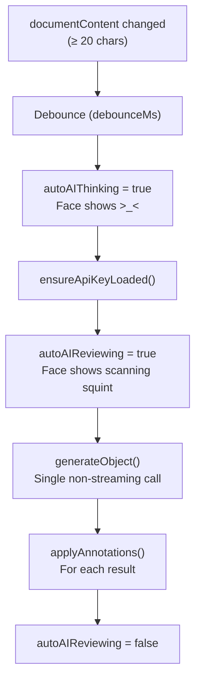

# AutoAI

AutoAI is a background AI review system that watches document content and creates annotations automatically. It runs independently from the AI sidebar and is controlled via a bubble widget in the bottom-left corner.

## Files

| File | Purpose |
|------|---------|
| `settings.svelte.ts` | Settings store, localStorage persistence |
| `engine.ts` | Review orchestration, AI calls, annotation dispatch |
| `AutoAIWidget.svelte` | Bubble + expanded panel UI |
| `AutoAIFace.svelte` | Animated face SVG component |
| `faceAnimation.svelte.ts` | Eye tracking + sleep/wake state |

## Settings

Stored in localStorage under `"quillium-autoai-settings"`:

| Setting | Type | Default | Description |
|---------|------|---------|-------------|
| `enabled` | boolean | `false` | Whether AutoAI is active |
| `mode` | `"continuous"` \| `"manual"` | `"continuous"` | Auto-review vs manual trigger |
| `debounceMs` | number | 10000 | Delay before review after change |
| `persona` | string | `"AutoAI"` | Name in annotation author fields |
| `annotationTypes` | set | all three | Which types to create |
| `conservativeness` | enum | `"balanced"` | Review depth |

## Review Engine



### Engine API

| Function | Purpose |
|----------|---------|
| `startAutoAI()` | Subscribe to `documentContent`, schedule reviews |
| `stopAutoAI()` | Unsubscribe, cancel pending timer |
| `triggerManualReview()` | Cancel debounce, run immediately |

### Annotation Application

For each AI result:
1. Find `targetText` in current document
2. Dispatch `createComment` / `createSuggestion` / `createRevision`

## Widget UI

Fixed at `bottom: 24px; left: 24px`:

### Collapsed (67 × 67px)

- Animated `<AutoAIFace>` reacting to app state
- Rainbow gradient border while enabled; spinning during review
- Dimmed to 50% opacity when no API key

### Expanded (320 × 310px)

- Persona name (editable), enable toggle, close button
- Mode selector (Auto / Manual)
  - Auto: delay slider (2–60s)
  - Manual: "Review now" button
- Annotation type pills
- Depth slider (Conservative → Balanced → Thorough)

## Face State Machine

`AutoAIFace.svelte` is a presentational SVG driven by `state` and eye offset props. All animation is CSS keyframes.

```mermaid
stateDiagram-v2
    [*] --> idle
    idle --> sleeping: 30s no interaction
    sleeping --> waking: Any interaction
    waking --> idle: 1600ms elapsed
    idle --> tracking: Sustained typing (1s)
    tracking --> idle: 2s after last edit
    idle --> thinking: autoAIThinking
    thinking --> reviewing: autoAIReviewing
    reviewing --> idle: Review complete
    
    note right of disabled: No API key
```

| State | Appearance | Trigger |
|-------|------------|---------|
| `disabled` | × eyes | No API key |
| `reviewing` | Narrow squint, scanning | `autoAIReviewing` true |
| `thinking` | `>_<` with head bob | `autoAIThinking` true |
| `waking` | Eyes stretch open | Within 1600ms of wake |
| `sleeping` | Horizontal bars + zzz | 30s idle |
| `tracking` | Eyes follow caret/cursor | Sustained typing |
| `idle` | Bar eyes, periodic blink | Default |

### Eye Tracking

`computeEyeOffset()` maps distance/direction from widget center to ±4px offset. Two tracking modes:

1. **Caret tracking** — via `quillium:caret-moved` custom event (throttled, from `listeners.ts`). Requires sustained typing gate (1s streak) with 2s linger.

2. **Mouse tracking** — when caret tracking active OR cursor within 180px of widget center.

Eyes glide back to center (0.35s transition) when tracking ends.

### Sleep/Wake

After 30s of no `keydown` or caret events, the face sleeps. Any interaction triggers 1600ms waking animation. Opening the panel silently clears sleep.

## Keybinding

`Mod-Shift-R` — registered in main editor only. Dispatches `"quillium:manual-review"` event, which `+page.svelte` handles by calling `triggerManualReview()`.

## Integration Points

- **Document content**: Engine subscribes to `documentContent` store
- **Annotation creation**: Uses same factory functions as AI sidebar
- **AI settings**: Shares provider config via `createModel()`
- **+page.svelte**: Renders widget, handles manual review event
