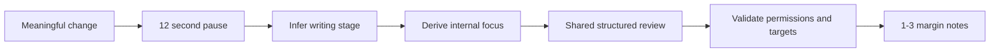

# Quiet Review (AutoAI)

Quiet Review watches meaningful writing changes, waits for a pause, and invokes the same
structured Quillium editor used by manual review. It is an automatic trigger, not a
separate editorial product.

## Files

| File | Purpose |
|------|---------|
| `settings.svelte.ts` | Minimal persisted settings and legacy migration |
| `engine.ts` | Pause detection, recent-change context, shared review invocation |
| `AutoAIWidget.svelte` | On/off, stage, and Review now controls |
| `AutoAIFace.svelte` | Animated face states |
| `faceAnimation.svelte.ts` | Eye tracking and sleep/wake behavior |

## Writer-Facing Settings

Stored under `quillium-autoai-settings`:

| Setting | Default | Purpose |
|---------|---------|---------|
| `enabled` | `false` | Whether quiet review watches changes |
| `stagePreference` | `auto` | Auto detection or a writer override |

Review delay, depth, persona name, annotation types, and conservativeness are no longer
writer-facing settings. Old continuous-mode settings migrate to quiet review; old manual
mode migrates paused so an upgrade never begins automatic review unexpectedly.

## Review Flow

The engine compares the current draft with the last reviewed content. It sends the recent
change as the immediate target and the whole draft as context. Existing annotations are
included so the model can avoid duplicate concerns.

Automatic review uses feedback-only policy before Proofing and grammar-only policy during
Proofing. It does not create substantive revisions. The document kind from the Writing
Brief supplies protected-writing risk.

## Stage Behavior

- **Discovering:** validate ideas, surface promising material, ask generative questions.
- **Shaping:** structure, sequence, stakes, paragraph purpose, specificity.
- **Refining:** clarity, pacing, voice consistency, specificity, line friction.
- **Proofing:** grammar, punctuation, consistency, settled local wording.

The local inference is a conservative starting hypothesis. The model reports its own
`stageAssessment`, which updates the displayed stage after review. Intentional roughness is
not, by itself, evidence of an early draft.

## Engine API

| Function | Purpose |
|----------|---------|
| `startAutoAI()` | Subscribe and schedule quiet reviews |
| `stopAutoAI()` | Unsubscribe and cancel pending review |
| `cancelPendingReview()` | Cancel the current pause window |
| `triggerManualReview()` | Run immediately using the same contract |

`Mod-Shift-R` triggers immediate review. The face retains disabled, idle, tracking,
sleeping, thinking, reviewing, and waking states.
