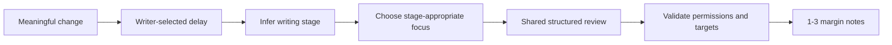

# Quiet Review (AutoAI)

Quiet Review watches meaningful writing changes, waits for a pause, and invokes the same
structured Quillium editor used by manual review. It is an automatic trigger, not a
separate editorial product.

## Files

| File | Purpose |
|------|---------|
| `settings.svelte.ts` | Persisted writer controls and migration |
| `engine.ts` | Pause detection, recent-change context, shared review invocation |
| `AutoAIWidget.svelte` | Mode, delay, output, depth, name, and Review now controls |
| `AutoAIFace.svelte` | Animated face states |
| `faceAnimation.svelte.ts` | Eye tracking and sleep/wake behavior |

## Writer-Facing Settings

Stored under `quillium-autoai-settings`:

| Setting | Default | Purpose |
|---------|---------|---------|
| `enabled` | `false` | Whether quiet review watches changes |
| `mode` | `continuous` | Review after a pause or only on request |
| `debounceMs` | `10000` | Pause before continuous review |
| `persona` | `AutoAI` | Name shown on generated annotations |
| `annotationTypes` | all | Comments, suggestions, and/or revisions AutoAI may create |
| `conservativeness` | `conservative` | Annotation budget and selectivity |

## Review Flow

The engine compares the current draft with the last reviewed content. It sends the recent
change as the immediate target and the whole draft as context. Existing annotations are
included so the model can avoid duplicate concerns.

The selected annotation forms and review depth constrain what the runner may create. The
document kind from Document Context supplies protected-writing risk, and those protections
continue to override any custom editor instruction.

## Stage Behavior

- **Discovering:** validate ideas, surface promising material, ask generative questions.
- **Shaping:** structure, sequence, stakes, paragraph purpose, specificity.
- **Refining:** clarity, pacing, voice consistency, specificity, line friction.
- **Proofing:** grammar, punctuation, consistency, settled local wording.

The local inference is a conservative starting hypothesis. The model reports its own
`stageAssessment` as part of the structured result. Intentional roughness is not, by itself,
evidence of an early draft.

## Morph Animation

The `67px` collapsed widget uses a finite `33.5px` radius and expands to `16px`. Do not use
`rounded-full` or `9999px` on the morphing container: WebKit can snap at the end while
interpolating an effectively infinite radius. Inner icon buttons may remain circular.

## Engine API

| Function | Purpose |
|----------|---------|
| `startAutoAI()` | Subscribe and schedule quiet reviews |
| `stopAutoAI()` | Unsubscribe and cancel pending review |
| `cancelPendingReview()` | Cancel the current pause window |
| `triggerManualReview()` | Run immediately using the same contract |

`Mod-Shift-R` triggers immediate review. The face retains disabled, idle, tracking,
sleeping, thinking, reviewing, and waking states.
