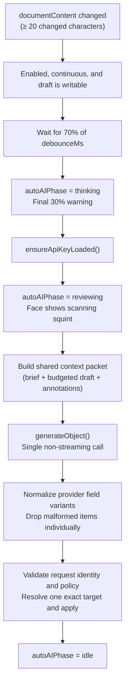

# AutoAI

AutoAI is a background AI review system that watches document content and creates annotations automatically. It runs independently from the AI sidebar and is controlled via a bubble widget in the bottom-left corner.

## Files

| File | Purpose |
|------|---------|
| `settings.svelte.ts` | Settings store, localStorage persistence |
| `engine.ts` | Review orchestration, AI calls, annotation dispatch |
| `reviewSchema.ts` | Provider-tolerant structured schema and strict result normalization |
| `outcome.ts` | Typed last-review result and compact user-facing labels |
| `AutoAIWidget.svelte` | Bubble + expanded panel UI |
| `AutoAIFace.svelte` | Animated face SVG component |
| `faceAnimation.svelte.ts` | Eye tracking + sleep/wake state |

## Settings

Stored in localStorage under `"quillium-autoai-settings"`:

| Setting | Type | Default | Description |
|---------|------|---------|-------------|
| `enabled` | boolean | `false` | Whether AutoAI is active |
| `mode` | `"continuous"` \| `"manual"` | `"continuous"` | Auto-review vs manual trigger |
| `debounceMs` | number | 10000 | Delay before review after change |
| `persona` | string | `"AutoAI"` | Name in annotation author fields |
| `annotationTypes` | set | comments only | Which types to create |
| `conservativeness` | enum | `"conservative"` | Review depth |

## Review Engine



### Engine API

| Function | Purpose |
|----------|---------|
| `startAutoAI()` | Subscribe to `documentContent`, schedule reviews |
| `stopAutoAI()` | Unsubscribe, cancel pending timer |
| `cancelPendingReview()` | Clear the debounce without disabling the engine |
| `triggerManualReview()` | Cancel debounce, run immediately |

### Annotation Application

Before review, AutoAI builds the same context packet used by the sidebar:

1. The writer brief and explicit saved editorial decisions are included as
   separate user-role guidance sources.
2. Long drafts are clipped to the AutoAI budget with an explicit omission marker.
3. Open annotations are included as editorial state so the model can avoid duplicates.
4. The model is instructed to annotate only exact substrings present in the
   included document text.

This keeps background review aligned with the visible sidebar context model and
prevents unbounded prompt growth on long drafts.

The generation schema intentionally accepts common provider field aliases.
`normalizeAutoAIReview()` converts each item to Quillium's strict comment,
suggestion, or revision shape and discards only malformed items rather than
rejecting an otherwise useful review.

For each normalized result:

1. Check that the request generation, document ID, tab ID, and draft ID still match.
2. Check that the annotation type is still enabled and allowed by the shared
   editorial policy.
3. Resolve `targetText` to one exact range in the live editor. Missing or repeated
   targets are rejected rather than applied to the first or every match.
4. Skip concerns that substantially repeat an active annotation on the same passage.
5. Dispatch through the shared editorial action gateway, which also rejects
   read-only editors.
6. If a suggestion or revision overlaps an existing one and comments are allowed,
   preserve the feedback as a comment and show a warning.

New edits abort an in-flight AutoAI request when a new review is scheduled. Every
content change also advances a generation counter, so even a small edit prevents
an older result from applying. Switching documents or drafts always schedules a
fresh review regardless of text similarity.

Each completed review publishes a document-local in-memory outcome. The expanded
widget reports whether the last review added notes, found no new concerns, skipped
duplicate or unsafe results, was discarded after the draft changed, or failed. The
outcome is cleared when the active document or draft changes. Routine cancellation
while the writer keeps typing is not presented as an error.

Continuous review is skipped for read-only drafts. Manual review runs immediately
when the document is non-empty and shows a “No issues found” toast when the model
returns no applicable annotations.

## Widget UI

Fixed at `bottom: 24px; left: 24px`:

### Collapsed (67 × 67px)

- Animated `<AutoAIFace>` reacting to app state
- Rainbow gradient border while enabled; spinning during review
- Dimmed to 50% opacity when no API key

### Expanded (320 × 310px)

- Persona name (editable), enable toggle, close button
- Last completed review outcome, when one exists for the active draft
- Mode selector (Auto / Manual)
  - Auto: delay slider (2–60s)
  - Manual: "Review now" button
- Annotation type pills
- Depth slider (Conservative → Balanced → Thorough)

## Face State Machine

`AutoAIFace.svelte` is a presentational SVG driven by `state` and eye offset props. All animation is CSS keyframes.

```mermaid
stateDiagram-v2
    [*] --> idle
    idle --> sleeping: 30s no interaction
    sleeping --> waking: Any interaction
    waking --> idle: 1600ms elapsed
    idle --> tracking: Sustained typing (1s)
    tracking --> idle: 2s after last edit
    idle --> thinking: Final 30% of debounce
    thinking --> reviewing: Request starts
    reviewing --> idle: Review complete
    
    note right of disabled: No API key
```

| State | Appearance | Trigger |
|-------|------------|---------|
| `disabled` | × eyes | No API key |
| `reviewing` | Narrow squint, scanning | `autoAIPhase === "reviewing"` |
| `thinking` | `>_<` with head bob | `autoAIPhase === "thinking"` |
| `waking` | Eyes stretch open | Within 1600ms of wake |
| `sleeping` | Horizontal bars + zzz | 30s idle |
| `tracking` | Eyes follow caret/cursor | Sustained typing |
| `idle` | Bar eyes, periodic blink | Default |

### Eye Tracking

`computeEyeOffset()` maps distance/direction from widget center to ±4px offset. Two tracking modes:

1. **Caret tracking** — via `quillium:caret-moved` custom event (throttled, from `listeners.ts`). Requires sustained typing gate (1s streak) with 2s linger.

2. **Mouse tracking** — when caret tracking active OR cursor within 180px of widget center.

Eyes glide back to center (0.35s transition) when tracking ends.

### Sleep/Wake

After 30s of no `keydown` or caret events, the face sleeps. Any interaction triggers 1600ms waking animation. Opening the panel silently clears sleep.

## Keybinding

`Mod-Shift-R` — registered in main editor only. Dispatches `"quillium:manual-review"` event, which `+page.svelte` handles by calling `triggerManualReview()`.

## Integration Points

- **Document content**: Engine subscribes to `documentContent` store
- **Annotation creation**: Uses the same guarded `editorialAction.ts` gateway as the AI sidebar
- **Context**: Shares the budgeted draft, writer brief, saved decisions, and
  annotation context builder
- **Provenance**: Records the request ID, provider, model, task, timestamp, and configured
  persona on every created annotation
- **AI settings**: Shares provider config, lazy credential loading, and `createModel()`
- **Processing/cancellation**: Registers an AI task, uses the shared abort signal,
  and cancels a pending debounce on the global `stop-ai` event
- **+page.svelte**: Renders widget, handles manual review event
