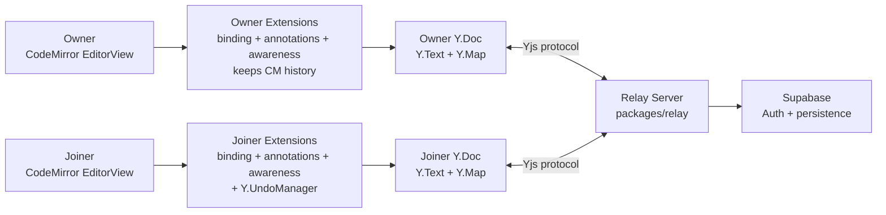
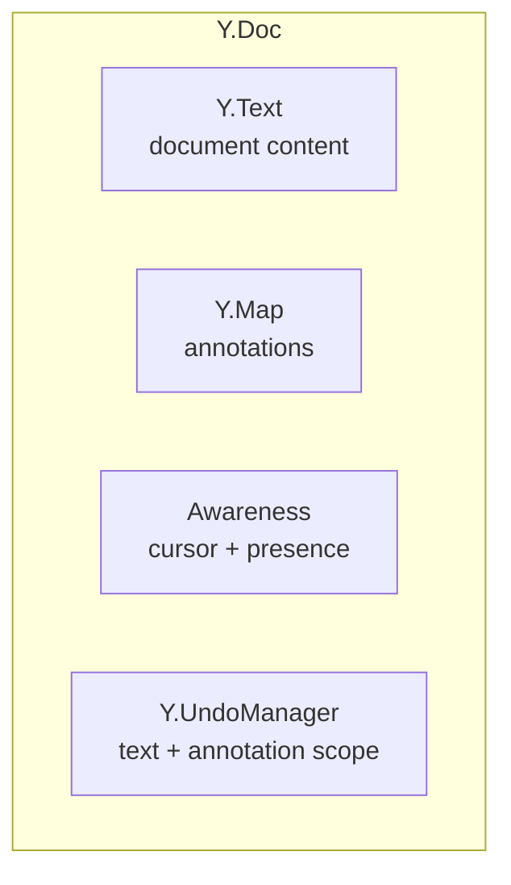
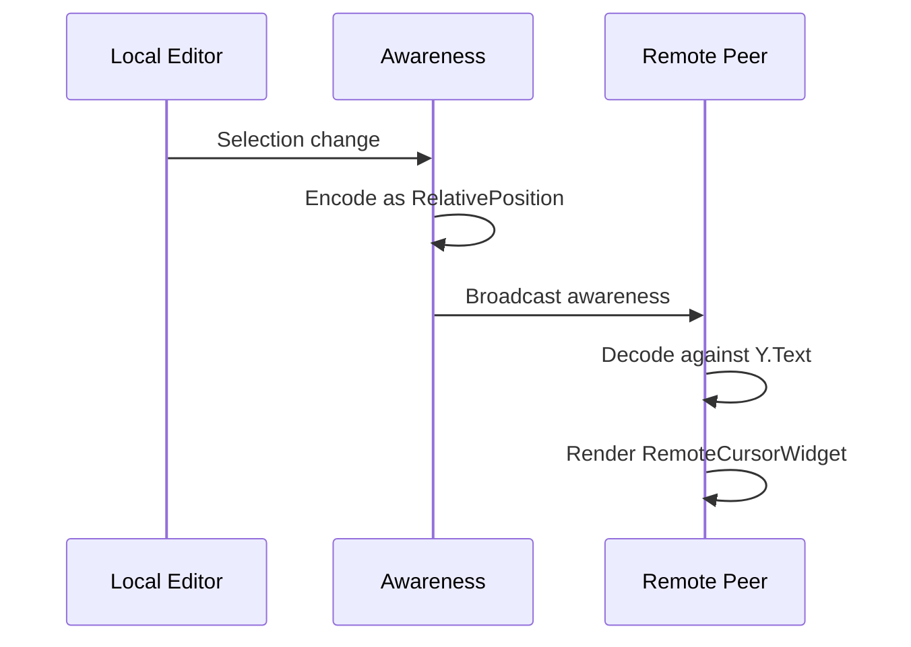
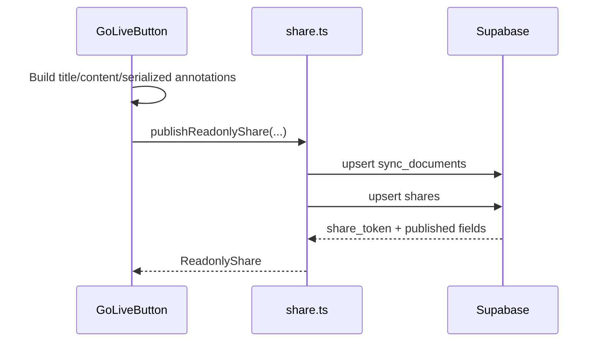

# Real-time Collaboration (Quillium Omni)

Quillium Omni has two sharing surfaces:

- **Web Preview** — a read-only public page generated from the currently
  active tab+draft snapshot.
- **Live Room** — an owner-led real-time session between Quillium instances.

The Live Room editor remains CodeMirror locally, while live document state is
mirrored through Yjs CRDTs.

## Architecture Overview



Current Live Room mode is owner-led: the owner's local SQLite draft is the
source of truth when a room starts, joiners are ephemeral, and the room ends
when the owner leaves.

## Files

| File | Purpose |
|------|---------|
| `index.ts` | Public API: `enableCollab()`, `disableCollab()` |
| `yjsProvider.ts` | Y.Doc + WebsocketProvider with JWT auth |
| `yjsBinding.ts` | Bidirectional Y.Text ↔ CodeMirror sync |
| `yjsAnnotations.ts` | Bidirectional Y.Map ↔ annotationField sync |
| `annotationSchema.ts` | CM ↔ Yjs annotation converters |
| `relativePosition.ts` | Position anchoring utilities |
| `awareness.ts` | Remote cursor rendering + follow mode |
| `yjsUndo.ts` | Unified undo via Y.UndoManager |
| `store.ts` | Svelte stores for collab state |
| `GoLiveButton.svelte` | Share modal UI |
| `share.ts` | Supabase read-only share CRUD and URL building |
| `sharePayload.ts` | Public-share annotation serialization |

## Yjs Data Model



### YjsAnnotationNode Shape

Annotations stored as recursive Y.Map structures:

```typescript
// Shared keys
{
    id: string;
    _type: "comment" | "suggestion" | "revision";
    startPos: Uint8Array;  // encoded RelativePosition
    endPos: Uint8Array;
    thread: Y.Array<MessageObject>;
    annotations: Y.Map<YjsAnnotationNode>;  // nested
}

// Suggestion-only
{ replacements: Y.Array<string>; author: string | null; }

// Revision-only
{
    versions: Y.Map<string, Y.Map<unknown>>;  // keyed by String(index)
    // versionNode: { text: Y.Text, label?: string, annotations: Y.Map }
    activeVersionIndex: number;
}
```

> **Note — wire shape is still index-based.** Locally, revision versions use a
> stable `id` and a revision points at `activeVersionId` (see
> [annotations.md → Version identity](./annotations.md#version-identity)). The Yjs
> wire schema above is intentionally *not yet* migrated: the versions `Y.Map` is
> keyed by `String(index)` and the active pointer is `activeVersionIndex: number`.
> The CM→Yjs write path derives the index from `activeVersionId`, and the Yjs→CM
> read path runs `normalizeRevision()` to mint local ids. The relay has no schema
> migration framework yet, so the id-native rewrite is deferred — see issue #269.

## Sync Loops

### Text Sync

**Local → Remote:**
```
CM transaction → yjsBinding update hook → skip Yjs-originated
→ write Y.Text inside "local" transaction → provider broadcasts
```

**Remote → Local:**
```
Provider applies update → Y.Text.observe() fires → yjsBinding
→ convert delta to CM changes → dispatch with yjsAnnotation
```

### Annotation Sync

**Local → Remote:**
```
annotationField effect → yjsAnnotations update hook
→ diff CM annotations vs Y.Map → write changes with "local" origin
```

**Remote → Local:**
```
Y.Map.observeDeep() → yjsAnnotations observer → skip "local" origin
→ project Yjs nodes to annotationField → dispatch with Yjs marker
```

## RelativePosition Anchoring

Annotation positions use Yjs RelativePosition instead of absolute indices — survives concurrent edits:

```typescript
// Save: absolute CM → RelativePosition
const { startPos, endPos } = absoluteToRelative(ytext, selection);

// Load: RelativePosition → absolute CM
const selection = relativeToAbsolute(ydoc, ytext, startPos, endPos);
// Returns null if anchored text was deleted
```

## Remote Cursors

Google Docs-style colored carets with name labels. Stored as encoded Yjs relative positions in awareness state:



### Nested Editor Awareness

Nested editors use the same extension with position mappers:
- `toSharedPosition(localPos, state)` — nested → root coordinates
- `fromSharedPosition(sharedPos, state)` — root → nested coordinates

Remote cursors outside the revision range return `null` and aren't rendered.

### Follow Mode

Click a collaborator avatar to follow their cursor. Each awareness tick scrolls the active editor toward that user's decoded cursor. Auto-clears when target disappears.

## Sharing Flows

### Read-only Web Preview

The Web Preview tab in `GoLiveButton.svelte` publishes a read-only snapshot to
Supabase:



The share row is keyed by **document id**, not draft id. Publishing from a
different tab or draft replaces the single public view for that document. See
[Tabs & Drafts](./tabs-and-drafts.md#omni-web-preview-and-the-single-view) for
why that keeps the door open for a future multi-tab public renderer.

| Action | Function | Notes |
|--------|----------|-------|
| Load status | `getReadonlyShare(documentId)` | Reads existing share row |
| Publish/update | `publishReadonlyShare(...)` | Stores current snapshot + annotations |
| Copy link | `buildReadonlyShareUrl(token)` | `https://quillium.bryanhu.com/share/{token}` |
| Disable | `disableReadonlyShare(documentId)` | Deletes the share row |

Modern public payloads carry both the serialized CodeMirror state and a flat
annotation projection. `ReadonlyDocument` restores the state through the shared
read-only editor host; revision modals resolve the selected nested `VersionState`
and mount that same host, preserving decorations and nested annotations. The flat
projection drives cards and modal navigation without duplicating editor behavior.

The renderer follows the three-layer shared-editor model documented in
[Monorepo Guide — Shared editor surface architecture](./monorepo.md#shared-editor-surface-architecture):
app-neutral core/presentation, surface capability adapters, and consuming
surfaces. `Readonly*` components are compositional adapters that omit persistence
and mutation capabilities; they are not subclasses or a parallel visual system.

Shares published before serialized state was added are isolated behind
`LegacyReadonlyDocument`. That compatibility path keeps index-style active
revision state and the static annotated-text renderer; new behavior should not be
added there unless an old payload specifically requires it.
The legacy path is retained only for rows where `published_state` is absent and
is scheduled for removal after the production compatibility prerequisites in
[GitHub issue #339](https://github.com/ThatXliner/Quillium/issues/339) are satisfied.

Modal presentation shared with desktop lives in `@quillium/share`: context
viewport lifecycle, modal frame/header sizing, revision breadcrumbs, suggestion
diff/selection state, and the collapsible annotation panel. Desktop supplies
edit/delete/reply capabilities; Web Preview omits them and remains read-only.
`ReadonlyEditorController` also keeps projection, active-annotation selection,
and linked revision switching identical between Web Preview and desktop history.

### Owner Goes Live

1. User opens Share → clicks "Start live room"
2. Creates named snapshot: "Before going live (auto)"
3. `registerDocumentForCollab()` upserts `sync_documents`
4. `createYjsProvider()` opens WebsocketProvider with JWT
5. After sync, owner replaces relay Y.Text with local doc
6. `enableCollab()` installs Yjs extensions
7. UI shows "You're live!"

### Joiner Joins

1. User pastes document UUID
2. Capture prior draft ID and state in `joinerPriorView`
3. `currentDraftId = null`, `isCollabJoiner = true` — persistence disabled
4. `createYjsProvider()` opens WebsocketProvider
5. After sync, replace local editor with relay Y.Text
6. Clear local annotations, project shared annotations
7. `enableCollab()` installs Yjs extensions + Y.UndoManager
8. UI shows "Joined shared document"

### Disconnect

1. `disableCollab()` calls `disconnectYjsProvider()`
2. `collabCompartment` reconfigured to `[]`
3. `historyCompartment` restores standard CM history
4. Joiners restore captured snapshot and navigate back

## Unified Undo (Y.UndoManager)

Tracks both Y.Text and Y.Map in a single stack:

```typescript
const undoManager = new Y.UndoManager([ytext, ymap], {
    trackedOrigins: new Set(["local"]),
    captureTimeout: 500,
});
```

- `Mod-z` → `undoManager.undo()`
- `Mod-Shift-z` / `Mod-y` → `undoManager.redo()`
- `breakUndoCapture()` — force new step at modal boundaries
- `addSubtreeToUndoScope()` — register nested editor Y.Text

## Connection States

| State | Meaning |
|-------|---------|
| `disconnected` | Not connected |
| `connecting` | Handshake/sync in progress |
| `connected` | Active session |
| `reconnecting` | Lost connection, auto-retry |
| `error` | Failed after max retries |

After 5 reconnect attempts, provider enters `error` and disconnects. User must start a new session.

## Owner Disconnect Handling

Relay signals owner disconnect via websocket close reason. Flow:

```
Provider close reason "Owner left" → handleOwnerLeft()
→ increment ownerLeftSignal → disconnectYjsProvider()
→ GoLiveButton effect calls disableCollab()
→ Toast: "The owner ended the session"
```

## Environment Variables

| Variable | Purpose |
|----------|---------|
| `PUBLIC_RELAY_URL` | WebSocket relay server |
| `PUBLIC_SUPABASE_URL` | Supabase project URL |
| `PUBLIC_SUPABASE_PUBLISHABLE_KEY` | Supabase publishable key |

If `PUBLIC_RELAY_URL` is not configured, GoLiveButton is hidden.

## Known Limitations

- **Live Room mode only** — no persistent shared documents yet
- **Manual Live Room IDs** — joiners paste a draft UUID manually; there are no
  invite links or room permissions yet
- **No local persistence for joiners** — restored to prior state after leaving
- **No offline queue** — if reconnects exhaust, must restart session
- **Single-view public preview** — read-only shares publish one active tab+draft
  snapshot, not the whole document tab set
