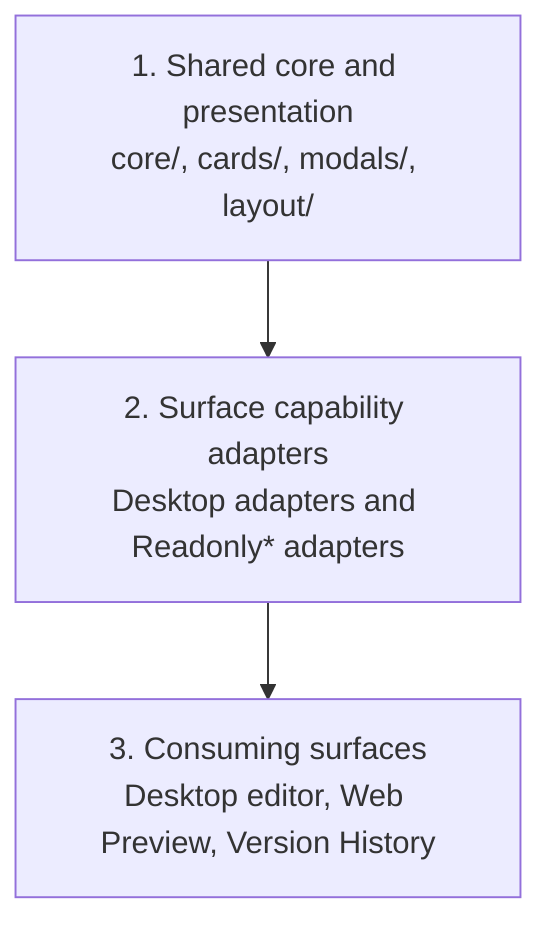

# Monorepo Guide

Quillium is a Bun workspace monorepo. All packages live under `packages/*`; the
repository root owns dependency installation, shared tooling, Supabase migrations,
and cross-package scripts.

Architecture decision: [app-neutral editor capabilities](./adr/0009-app-neutral-editor-capabilities.md).

## Package Layout

| Path | Package | Purpose |
|------|---------|---------|
| `packages/desktop` | `@quillium/desktop` | Tauri + SvelteKit desktop app |
| `packages/landing` | `@quillium/landing` | Public SvelteKit site deployed on Vercel |
| `packages/relay` | `@quillium/relay` | Omni WebSocket relay deployed with Fly/Docker |
| `packages/share` | `@quillium/share` | Shared wire types, rendering utilities, and read-only share UI |
| `supabase` | n/a | Single source for Omni schema and migrations |

## Dependency Rules

Run `bun install` from the repository root. The root `bun.lock` is the only Bun
lockfile that should be committed.

Add dependencies to the package that imports them, then run root `bun install`.
Use `workspace:*` for local package dependencies such as `@quillium/share`.

Do not commit generated package outputs such as `.svelte-kit`, `.vercel`, `build`,
`dist`, `coverage`, or `packages/desktop/src-tauri/target`.

## Common Commands

Run commands from the root unless a package README says otherwise:

```bash
bun run desktop:dev
bun run desktop:tauri:dev
bun run landing:dev
bun run relay:dev

bun run check:all
bun run build:all
bun run test:all
```

Target one package with its root script:

```bash
bun run desktop:check
bun run landing:build
bun run relay:typecheck
bun run share:test:run
```

For package-local one-offs, use `bun run --cwd packages/<name> <script>`.

## Shared Package

`@quillium/share` is intentionally app-neutral. It can contain:

- Serialized annotation, document, and Live Room wire types.
- Pure fingerprinting, paragraph segmentation, annotation ordering, and revision
  rendering utilities.
- The canonical CodeMirror annotation fields/models plus the app-neutral
  read-only extension stack and editor host.
- Capability-driven Svelte presentation used by both desktop and public share
  pages (cards, threads, breadcrumbs, context viewports, diff content, and
  annotation-panel shells).

It must not import Supabase, PostHog, Tauri APIs, or app-specific stores. Desktop
adapters retain mutations, analytics, persistence, and modal-stack navigation;
shared components receive those capabilities through callbacks or snippets.
CodeMirror state serialization at the desktop/Supabase boundary remains in the
desktop package, while state restoration and read-only rendering are shared.

### Shared editor surface architecture

Editor presentation shared by Desktop, Web Preview, and Version History follows
three compositional layers:



1. **Shared core and presentation** owns app-neutral annotation state, editor
   extensions, cards, modal content, threads, diffs, and layout. Presentation
   components accept optional capabilities through callbacks and snippets.
2. **Surface capability adapters** compose those shared pieces for a particular
   environment. Desktop adapters provide mutation, persistence, analytics, and
   modal-stack capabilities. `Readonly*` adapters deliberately omit mutation
   capabilities while retaining safe local interactions such as selection,
   modal navigation, and revision-version previewing.
3. **Consuming surfaces** mount the configured adapters. The desktop editor is
   editable; Web Preview and Version History are non-persisting read-only hosts.

This is composition, not inheritance: there is no base Svelte document component
that `ReadonlyDocument` subclasses. `ReadonlyDocument` and `ReadonlyEditorHost`
are orchestration adapters around the same shared state and presentation used by
editable surfaces. The `Readonly` prefix should be reserved for this capability
boundary, not used for a second visual implementation of a shared component.

Use these placement rules when changing the UI:

- Put neutral visuals and state behavior in `core/`, `cards/`, `modals/`, or
  `layout/` inside `packages/share`.
- Keep desktop-only mutations and application services in `packages/desktop`.
- Put non-mutating surface orchestration in a `Readonly*` adapter only when it
  configures multiple shared pieces or owns read-only lifecycle behavior.
- Do not create separate editable and read-only lookalikes when optional
  capabilities can express the difference.

The read-only Svelte UI should visually track the desktop annotation components
first. Use these desktop files as the source of truth when changing shared share
components:

- `packages/desktop/src/lib/editor/plugins/annotations/Comment.svelte`
- `packages/desktop/src/lib/editor/plugins/annotations/Suggestion.svelte`
- `packages/desktop/src/lib/editor/plugins/annotations/Revision.svelte`
- `packages/desktop/src/lib/editor/plugins/annotations/Thread.svelte`
- `packages/desktop/src/lib/editor/plugins/annotations/ThreadMessage.svelte`

When presentation exists on both surfaces, extract it into `packages/share` and
keep a thin desktop capability adapter. Do not create a second read-only lookalike
inside the Web Preview. State-backed shares and revision modals use
`ReadonlyEditorHost`; only pre-migration payloads without serialized CodeMirror
state use `LegacyReadonlyDocument` and the static annotated-text fallback.
That fallback is a temporary data-compatibility boundary, not a fourth
architectural layer; removal is tracked in
[GitHub issue #339](https://github.com/ThatXliner/Quillium/issues/339).

## Environment Files

Runtime env examples live with the package that consumes them:

- `packages/desktop/.env.example`
- `packages/landing/.env.example`
- `packages/relay/.env.example`

The repository root `.env.example` is only an index. Use
`PUBLIC_SUPABASE_PUBLISHABLE_KEY` for browser-safe Supabase keys.

## Deployments

Vercel should point the `quillium-landing` project at `packages/landing` as its
project root. The landing package imports `@quillium/share` through the Bun
workspace.

The relay build type-checks its sources and bundles the shared Live Room contract
into `dist/index.js` with Bun for Node. Its Docker build copies `packages/share/src`
to resolve that workspace dependency.

Fly deploys the relay from the monorepo root so `packages/relay/Dockerfile` can
install the filtered workspace. Run Fly commands from the root and keep
`packages/relay/fly.toml` pointed at `packages/relay/Dockerfile`.

Supabase migrations stay in the root `supabase` directory. Do not create
package-local schema sources.

## Verification Checklist

Before merging monorepo-affecting changes, run the smallest relevant set:

```bash
bun install
bun run check:all
bun run test:all
```

For deployment-sensitive changes, also run:

```bash
bun run desktop:build
bun run landing:build
bun run relay:build
```

Smoke the relay locally with `/health` when relay code, Docker, Fly config, or
environment handling changes.
