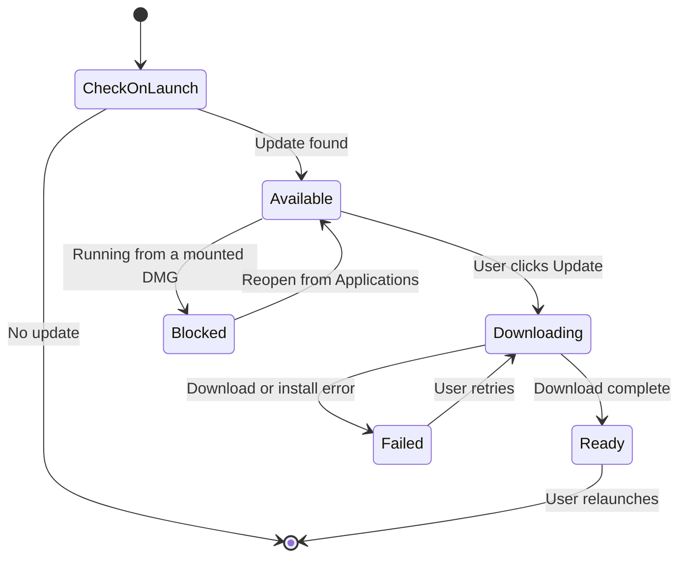

# Native Integration

Tauri provides native desktop capabilities: app menu, keychain, auto-updater, file dialogs, and PDF export.

## Native App Menu

`lib.rs` builds a native menu with six submenus:

| Submenu | Custom Items | Accelerator |
|---------|--------------|-------------|
| Quillium | Settings…, Open Source Licenses… | `Cmd+,` / `Ctrl+,` |
| File | Library, Open in New Window, Export variants | `Cmd+O`, `Cmd+Shift+O`, `Cmd+Shift+E` |
| Edit | Undo, Redo, Cut, Copy, Paste, Select All | Standard |
| View | Version History, Authorship Report | `Cmd+Shift+H`, `Cmd+Shift+A` |
| Window | Minimize, Maximize, Close | Standard |
| Help | Send Feedback, App Logs | None |

### Export Menu Items

| Item | Format |
|------|--------|
| Export Plain Text | `.txt` |
| Export Text + Annotations | `.txt` with JSON after `---` |
| Export JSON | `.json` structured object |
| Export Markdown | `.md` with footnotes |
| Export PDF | `.pdf` document body only |
| Export PDF + Annotations | `.pdf` with expanded annotation cards |

### Event Bridge

Custom menu items emit Tauri events to frontend. `+page.svelte` listens via `@tauri-apps/api/event`. Events are emitted to the **focused** window (falling back to `"main"`), so menu actions affect whichever window the user is looking at:

| Event | Action |
|-------|--------|
| `menu:settings` | Toggle settings modal |
| `menu:library` | Navigate to library |
| `menu:history` | Navigate to version history |
| `menu:authorship` | Navigate to authorship/provenance playback |
| `menu:open-in-new-window` | Open selected document in a new window (library page) |
| `menu:licenses` | Open licenses modal |
| `menu:feedback` | Open the feedback URL |
| `menu:app-logs` | Open the persistent diagnostic log viewer from any route |
| `menu:export-txt` | Export plain text |
| `menu:export-txt-json` | Export text + annotations |
| `menu:export-json` | Export JSON |
| `menu:export-md` | Export Markdown |
| `menu:export-pdf` | Export PDF |
| `menu:export-pdf-annotations` | Export PDF with annotations |

`settingsOpen` store is shared between native menu and in-app UI.

Selected prose also gets a native context menu with the operating system's Cut, Copy,
Paste, and Select All roles plus Quillium's Add Comment and Add Revision actions. Outside a
selection, the webview's default context menu remains untouched.

## Persistent App Log

`app_log.rs` writes bounded JSONL to `quillium.log` in the same app-local data directory as
the database (or `QUILLIUM_DATA_DIR` in tests). The current file rotates at 2 MB and the
viewer reads both the rotated and current logs. **Help → App Logs…** works from every route
and can copy the log plus app version, platform, user agent, timestamp, and resolved path.

The log captures Rust panics, frontend console output, native menu events, startup version / OS /
architecture, and explicit operational events. Comment-shortcut diagnosis has three boundaries:

1. `menu` / `menu event` proves a native accelerator reached Tauri.
2. `comment-shortcut` / `comment shortcut reached webview` proves a physical key event reached JS.
3. `comment-command` records the entry point and outcome without recording selected prose.

If neither boundary 1 nor 2 appears, the shortcut did not reach Tauri or the webview. If either
appears without boundary 3, event routing failed. Boundary 3 reports command blockers such as an
empty selection, a locked draft, or an already-open pending comment.

## Multi-Window

Documents can open in separate OS windows. Each window is a Tauri `WebviewWindow` running its own SvelteKit instance, so all stores (`currentDocumentId`, `editorView`, `annotations`, …) are naturally isolated per window.

### Open-window tracking

`OpenWindows(Arc<Mutex<HashMap<String, String>>>)` in `lib.rs` maps `doc_id → window_label`, preventing the same document from being open in two windows at once. Four commands manage the map:

| Command | Purpose |
|---------|---------|
| `cmd_open_in_new_window` | Creates a `WebviewWindow` at `/?doc={id}`, or focuses the existing window if the doc is already open |
| `cmd_register_open_doc` | Registers a doc→window mapping (frontend calls on document load) |
| `cmd_deregister_open_doc` | Removes all entries for a window label (on navigate-away or window close) |
| `cmd_is_doc_open_elsewhere` | Returns whether a doc is open in a *different* window; focuses that window if so |

Secondary windows use label format `editor-{short_uuid}`. A `WindowEvent::Destroyed` handler removes the entry on close.

### Frontend integration

- `+page.svelte` reads a `?doc=` query param and sets `$currentDocumentId` before `Editor.svelte` mounts — this is how secondary windows know which document to load.
- `Editor.svelte` calls `registerOpenDoc` on load and `deregisterOpenDoc` on switch/cleanup.
- `navigation.ts` calls `deregisterOpenDoc` in `goToLibrary()` before navigating away.
- The library page checks `isDocOpenElsewhere` before opening in-window; if open elsewhere, it shows a toast and focuses the other window.

### Entry points

1. **Document card** — an `ExternalLink` button appears on hover next to the trash button (grid and list views).
2. **File menu** — "Open in New Window" (`Cmd+Shift+O`).
3. **Keyboard** — `Cmd+Shift+O` on the library page when a single non-trash document is selected.

### Capabilities

`default.json` and `desktop.json` grant `["main", "editor-*"]` so dynamically created windows inherit the main window's permissions.

### DB concurrency

All windows share one `DbState(Mutex<Connection>)`. Since a document is only open in one window, there are no conflicting writes to the same draft; concurrent saves for different documents serialize through the Mutex (each lock held for microseconds), so contention is negligible.

## Keychain (`keychain.rs`)

API keys stored in OS keychain:
- **macOS**: Keychain
- **Windows**: Credential Manager
- **Linux**: Secret Service

Keyed by `("com.bryanhu.quillium", provider_name)`.

| Command | Purpose |
|---------|---------|
| `set_api_key` | Store key |
| `get_api_key` | Retrieve key |
| `delete_api_key` | Remove key |

Intentionally separate from localStorage — keychain requires user-level auth and isn't accessible from web layer without Tauri command bridge.

## Auto-Updater

Uses `@tauri-apps/plugin-updater` to check for updates on launch.

### Update Flow



### States

| State | UI |
|-------|-----|
| Available | Banner with version + "Update" button |
| Downloading | "Downloading…" (disabled) |
| Blocked | Persistent instructions to move the app from the DMG to Applications |
| Failed | Persistent failure message + retry and manual-download options |
| Ready | "is ready — relaunch to finish" + "Relaunch" button |

Uses `downloadAndInstall()` for reliable updates, `relaunch()` from `@tauri-apps/plugin-process`.
The orchestration in `updater/install.ts` checks the executable location before downloading,
classifies install failures, and returns explicit outcomes for the page to render and log.

The release workflow validates the final macOS updater archive after `tauri-action` completes. It
checks the embedded version, Apple code signature, Gatekeeper assessment, notarization ticket, and
Tauri Minisign signature. Public release publication is skipped if any validation fails.

Tags named `mas-vX.Y.Z` run only the signed Mac App Store build and upload it to App Store Connect.
Use that tag for TestFlight-only builds so the regular desktop updater and public release remain
unchanged. The version in the desktop manifests must be newer than the last uploaded MAS build.

### Rate Limiting (`updater/schedule.ts`)

Handles update check rate limiting:
- `canCheckForUpdatesNow()` — check localStorage timestamp
- `deferUpdateChecksUntil()` — set backoff
- `nextUpdateCheckAfterRateLimit()` — parse rate limit headers
- Default backoff: 1 hour

## PDF Export (`pdf_export.rs`)

Native PDF generation using `printpdf` crate:

### Page Layout

- A4 size (210 × 297mm)
- 19.05mm margins
- Title: 22pt, Heading: 14pt, Body: 11.5pt

### Structure

```rust
pub struct PdfExportPayload {
    pub title: String,
    pub body_paragraphs: Vec<String>,
    pub annotations: Vec<PdfAnnotationCard>,
}

pub struct PdfAnnotationCard {
    pub kind: PdfAnnotationCardKind,
    pub title: String,
    pub subtitle: Option<String>,
    pub body: Vec<String>,
    pub children: Vec<PdfAnnotationCard>,  // nested annotations
}
```

### Features

- Text wrapping with `textwrap`
- Annotation cards with colored borders
- Nested annotation support (recursive children)
- Automatic page breaks

## Document Export (`export.ts`)

Frontend export helpers:

| Format | Extension | Contents |
|--------|-----------|----------|
| Plain text | `.txt` | Document text only |
| Text + annotations | `.txt` | Text + JSON after `---` |
| JSON | `.json` | Structured object with title, timestamp, text, annotations |
| Markdown | `.md` | Text with annotations as footnotes |
| PDF | `.pdf` | Document body only |
| PDF + Annotations | `.pdf` | PDF with expanded annotation cards |

`exportDocument(view, format)` serializes current state, derives a filename
from the title, and writes through the native Tauri save dialog.

## Changelog ("What's New")

Discord-style modal shown on startup when upgrading to a new **minor** version. Patch-only updates don't trigger it.

### Flow

1. `+page.svelte` calls `tryShowChangelog()` after beta disclaimer
2. `minorVersion()` extracts `"major.minor"` from `__APP_VERSION__`
3. Key looked up in `packages/desktop/src/lib/changelog.json`
4. Compared against `localStorage("quillium_changelog_seen")`
5. On dismiss, current minor saved to localStorage

### Manual Trigger

Settings modal header has "What's New" button → dispatches `quillium:show-changelog` → calls `forceShowChangelog()`.

### Adding Entries

Add `"major.minor"` key to `changelog.json`:
```json
{
  "0.16": {
    "date": "April 2026",
    "content": "Markdown content here..."
  }
}
```
