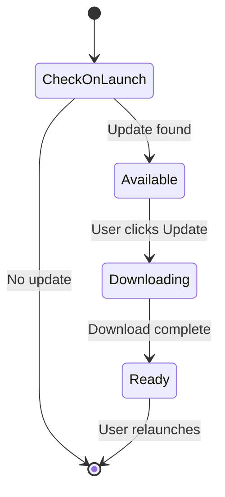

# Native Integration

Tauri provides native desktop capabilities: app menu, keychain, auto-updater, file dialogs, and PDF export.

## Native App Menu

`lib.rs` builds a native menu with five submenus:

| Submenu | Custom Items | Accelerator |
|---------|--------------|-------------|
| Quillium | Settings…, Open Source Licenses… | `Cmd+,` / `Ctrl+,` |
| File | Library, Export variants | `Cmd+O`, `Cmd+Shift+E` |
| Edit | Undo, Redo, Cut, Copy, Paste, Select All | Standard |
| View | Version History | `Cmd+Shift+H` |
| Window | Minimize, Maximize, Close | Standard |

### Export Menu Items

| Item | Format |
|------|--------|
| Export Plain Text | `.txt` |
| Export Text + Annotations | `.txt` with JSON after `---` |
| Export JSON | `.json` structured object |
| Export Markdown | `.md` with footnotes |
| Export PDF | `.pdf` with annotation cards |

### Event Bridge

Custom menu items emit Tauri events to frontend. `+page.svelte` listens via `@tauri-apps/api/event`:

| Event | Action |
|-------|--------|
| `menu:settings` | Toggle settings modal |
| `menu:library` | Navigate to library |
| `menu:history` | Navigate to version history |
| `menu:licenses` | Open licenses modal |
| `menu:export-txt` | Export plain text |
| `menu:export-txt-json` | Export text + annotations |
| `menu:export-json` | Export JSON |
| `menu:export-md` | Export Markdown |
| `menu:export-pdf` | Export PDF |

`settingsOpen` store is shared between native menu and in-app UI.

## Keychain (`keychain.rs`)

API keys stored in OS keychain:
- **macOS**: Keychain
- **Windows**: Credential Manager
- **Linux**: Secret Service

Keyed by `("com.bryanhu.quillium", provider_name)`.

| Command | Purpose |
|---------|---------|
| `set_api_key` | Store key |
| `get_api_key` | Retrieve key |
| `delete_api_key` | Remove key |

Intentionally separate from localStorage — keychain requires user-level auth and isn't accessible from web layer without Tauri command bridge.

## Auto-Updater

Uses `@tauri-apps/plugin-updater` to check for updates on launch.

### Update Flow



### States

| State | UI |
|-------|-----|
| Available | Banner with version + "Update" button |
| Downloading | "Downloading…" (disabled) |
| Ready | "is ready — relaunch to finish" + "Relaunch" button |

Uses `downloadAndInstall()` for reliable updates, `relaunch()` from `@tauri-apps/plugin-process`.

### Rate Limiting (`updater/schedule.ts`)

Handles update check rate limiting:
- `canCheckForUpdatesNow()` — check localStorage timestamp
- `deferUpdateChecksUntil()` — set backoff
- `nextUpdateCheckAfterRateLimit()` — parse rate limit headers
- Default backoff: 1 hour

## PDF Export (`pdf_export.rs`)

Native PDF generation using `printpdf` crate:

### Page Layout

- A4 size (210 × 297mm)
- 19.05mm margins
- Title: 22pt, Heading: 14pt, Body: 11.5pt

### Structure

```rust
pub struct PdfExportPayload {
    pub title: String,
    pub body_paragraphs: Vec<String>,
    pub annotations: Vec<PdfAnnotationCard>,
}

pub struct PdfAnnotationCard {
    pub kind: PdfAnnotationCardKind,
    pub title: String,
    pub subtitle: Option<String>,
    pub body: Vec<String>,
    pub children: Vec<PdfAnnotationCard>,  // nested annotations
}
```

### Features

- Text wrapping with `textwrap`
- Annotation cards with colored borders
- Nested annotation support (recursive children)
- Automatic page breaks

## Document Export (`export.ts`)

Frontend export helpers:

| Format | Extension | Contents |
|--------|-----------|----------|
| Plain text | `.txt` | Document text only |
| Text + annotations | `.txt` | Text + JSON after `---` |
| JSON | `.json` | Structured object with title, timestamp, text, annotations |
| Markdown | `.md` | Text with annotations as footnotes |

`exportDocument(view, format)` serializes current state, derives filename from title, triggers download via `Blob` + `<a>` click.

## Changelog ("What's New")

Discord-style modal shown on startup when upgrading to a new **minor** version. Patch-only updates don't trigger it.

### Flow

1. `+page.svelte` calls `tryShowChangelog()` after beta disclaimer
2. `minorVersion()` extracts `"major.minor"` from `__APP_VERSION__`
3. Key looked up in `src/lib/changelog.json`
4. Compared against `localStorage("quillium_changelog_seen")`
5. On dismiss, current minor saved to localStorage

### Manual Trigger

Settings modal header has "What's New" button → dispatches `quillium:show-changelog` → calls `forceShowChangelog()`.

### Adding Entries

Add `"major.minor"` key to `changelog.json`:
```json
{
  "0.16": {
    "date": "April 2026",
    "content": "Markdown content here..."
  }
}
```
