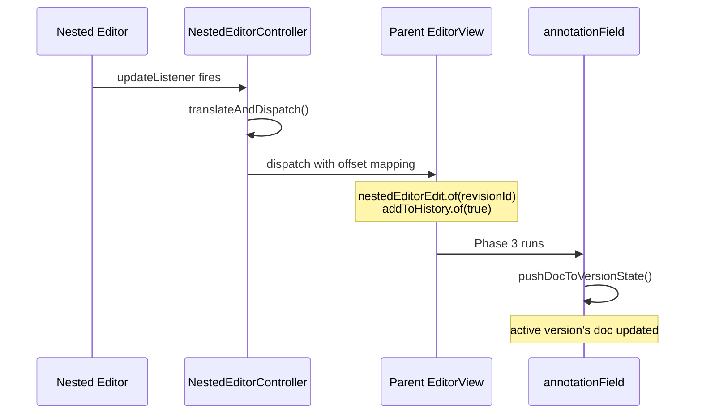
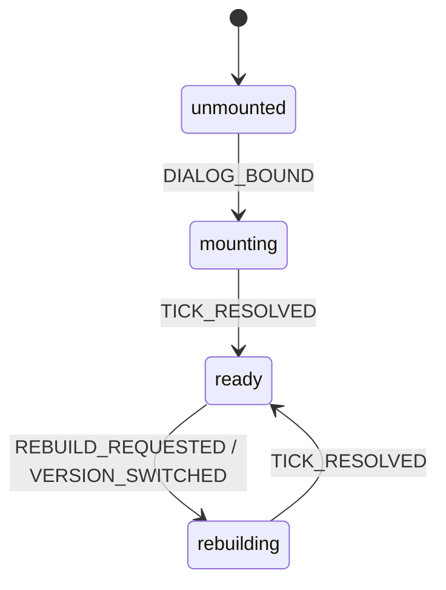

# Nested Editors

Each `RevisionAnnotation` supports two editing surfaces: a lightweight inline editor inside the revision card and a full-screen modal. Both are full `CodeMirror EditorView` instances. The parent document remains the **single source of truth**.

## Architecture: Direct Parent Dispatch

Nested editors are intentional viewports that never own their document. When the user types inside a nested editor:



1. The `updateListener` calls `translateAndDispatch(update, parentView, revisionId)`
2. `translateAndDispatch` translates each change into parent coordinates (`rev.selection.main.from + delta`)
3. Dispatches to parent with `nestedEditorEdit.of(revisionId)` + `addToHistory.of(true)`
4. Phase 3 re-reads the post-transaction slice and keeps the active version's `doc` current (the slot at `activeVersionIndex(rev)`)

## NestedEditorController

Both inline (`Revision.svelte`) and modal (`RevisionModal.svelte`) editors delegate lifecycle to `NestedEditorController`:

| Method | Purpose |
|--------|---------|
| `constructor` | Creates `EditorView` from `VersionState` blob |
| `syncFromParent(doc)` | Replaces nested buffer on external changes |
| `translateAndDispatch` | Maps nested edits to parent coordinates |
| `needsVersionSwitch()` | Detects when to rebuild for new version |
| `needsAnnotationRebuild()` | Detects when annotation blob changed |
| `destroy()` | Cleanup, optional flush |

### Flush Behavior

| Mode | Behavior | Used By |
|------|----------|---------|
| `"flush"` | Serialize nested state to parent on destroy | Modal |
| `"no-flush"` | Parent is source of truth via Phase 3 | Inline |

The flush is believed to be redundant (translateAndDispatch syncs per-keystroke), kept as a safety net. Instrumented with PostHog `nested_editor_flush_to_parent_meaningful` to verify.

### Parent Sync Edit Annotation

The controller tags sync transactions with `parentSyncEdit` so the listener reliably skips them regardless of async callback timing. This prevents feedback loops when external changes arrive.

## Inline Editor (Revision.svelte)

Creates a `NestedEditorController` with `flushBehavior: "no-flush"`. Svelte `$effect` blocks watch `activeVersion?.doc` and call `controller.syncFromParent()`. Version switches trigger destroy + recreate.

## Modal Editor (RevisionModal.svelte)

Creates a `NestedEditorController` with `flushBehavior: "flush"`. External sync watches the parent's annotation state:

- **Root-level modals** (`stackIndex === 0`) watch `$annotationsStore`
- **Deeply nested modals** (`stackIndex > 0`) watch `$modalAnnotationStores[stackIndex - 1]`

Annotation IDs are scoped per-editor and can collide across nesting levels.

### RevisionModal FSM

The modal editor uses a finite state machine for lifecycle:



| State | Description |
|-------|-------------|
| `unmounted` | Waiting for `dialogEl` to bind |
| `mounting` | Dialog open, waiting for `tick()` |
| `ready` | Normal operation |
| `rebuilding` | Editor destroyed, awaiting recreate |

### Sensor Effects

| Effect | Watches | Sends |
|--------|---------|-------|
| A | `dialogEl`, `rebuildToken` | `DIALOG_BOUND`, `REBUILD_REQUESTED` |
| B | Parent annotation state | `VERSION_SWITCHED`, `EXTERNAL_DOC_CHANGED` |
| C-0 | `"annotation-add-version"` event | Calls `addVersion()` |
| C | `"nested-annotation-create"` event | `NESTED_ANNOTATION_EVENT` |
| D | `"revision-focus-request"` event | Pushes new modal |

## Undo in Nested Editors

`makeParentUndoKeymap` delegates `Mod-z`/`Mod-y` to `undo(parentView)`/`redo(parentView)`. Nested editors have no local history (`getExtensions({ history: false })`). The parent history records nested edits as plain doc changes.

## Version Switching

Version switching is the **only** time the nested editor is torn down and recreated. Other parent-driven updates mutate the existing view via buffer replacements.

## Infinite Nesting

Modal's `parentView` can be another nested `EditorView`. `translateAndDispatch` chains up the stack automatically.

**Upward path** (nested edit → root): Each `translateAndDispatch` maps to parent coordinates and dispatches. If parent is also nested, its watcher propagates further up.

**Downward path** (undo → nested editors): Each modal's external-sync `$effect` detects changes and patches its nested buffer. This cascades through all nesting levels.

**Sub-annotation creation**: The nested editor's `makeParentUndoKeymap` binds Mod-Alt-m/k to emit `"nested-annotation-create"` on the event bus. The modal catches this and pushes a new modal.

**ID independence**: Each nested editor has its own `annotationField` with IDs starting from 0. Nested modals must not look up `revisionId` in `$annotationsStore`.

## The modalStack

`modalStack` in `stores.ts` manages nested revision/diff overlays:

```typescript
type ModalEntry =
    | { type: "diff"; suggestionId: number; parentView: EditorView; label: string }
    | { type: "revision"; revisionId: number; parentView: EditorView; label: string; pendingNestedCommand?: PendingNestedCommand };
```

| Method | Effect |
|--------|--------|
| `push(entry)` | Open new modal on top |
| `pop()` | Close topmost modal |
| `popTo(i)` | Close all above index `i` |
| `popToAndRebuild(i)` | `popTo(i)` + stamp `rebuildToken` |
| `clear()` | Close all modals |

**`popToAndRebuild`**: When a child modal switches the parent's active version, the parent must recreate its editor. `rebuildToken: Date.now()` signals this.

## Collab Awareness in Nested Editors

When collab is active, `createNestedEditorState` installs `createAwarenessExtension` with position mappers over the parent revision range. The nested editor has no Yjs text binding and syncs through `translateAndDispatch`; awareness only maps cursor coordinates.

Options: `broadcastInitialCursor: false`, `clearCursorOnDestroy: false` — mounting a background nested editor doesn't steal the user's shared cursor.
