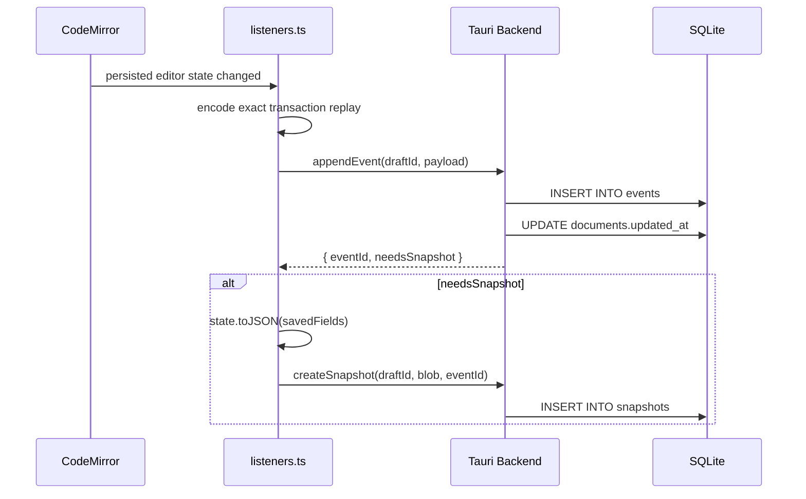

# Persistence

Quillium uses a crash-safe, append-only SQLite event log (WAL mode) with periodic snapshots. All database operations run in Rust via Tauri commands.

Architecture decisions: [event log and snapshots](./adr/0001-event-log-with-snapshots.md),
[lossless persisted undo](./adr/0006-lossless-persisted-undo.md).

## Schema Overview

| Table | Purpose |
|-------|---------|
| `documents` | Document metadata (title, word count, preview, tags, undo-history policy) |
| `tabs` | Document tabs (label, position, type, soft-delete) — see [Tabs & Drafts](./tabs-and-drafts.md) |
| `drafts` | Draft tree per tab (`tab_id`, `parent_draft_id`, `locked`, soft-delete) |
| `doc_events` | Document-level structural audit log (tab CRUD, branching, locks, checkpoints) |
| `events` | Append-only log of CM transactions (draft-scoped) |
| `snapshots` | Full `EditorState.toJSON()` blobs (draft-scoped) |
| `_meta` | Key/value flags (`active_tab:{doc}`, `active_draft:{tab}`) |

The `documents` table has **no `state_json` column**. Document state lives entirely in `snapshots`.

## Schema migrations

The schema is built and evolved by a versioned migration runner in
`packages/desktop/src-tauri/src/db/migrations.rs`, keyed on `PRAGMA user_version`. `open_db()`
(`schema.rs`) opens the connection, sets WAL/foreign-key pragmas, then calls
`migrate()`, which applies every migration newer than the DB's recorded
version — each in its own transaction, so a failed migration leaves the DB at
the previous version. A migration is either plain SQL or a Rust function (for
backfills and conditional DDL).

**To change the schema, append a new numbered `Migration` — never edit a
shipped one**, since deployed DBs have already recorded its version as applied.
Migration #1 is the baseline; pre-framework databases report `user_version = 0`
but already have the baseline tables, so early migrations are written to be
safe to re-apply (`IF NOT EXISTS` / column-existence guards).

The full numbered list of migrations lives in
[search.md § Schema & migrations](./search.md#schema--migrations).

## Event Log Flow



```typescript
// extensions.ts
// The wrapper supplements CodeMirror's JSON with tagged annotation and
// version-group effects. Its facet writes null for session-only documents.
export const savedFields = {
    historyField: persistentHistoryField,
    annotationField,
    versionGroupField,
};

// listeners.ts
const result = await appendEvent(draftId, JSON.stringify(payload));
if (result.needsSnapshot) {
    createSnapshot(draftId, JSON.stringify(state.toJSON(savedFields)), result.eventId);
}
```

Snapshot triggers:
- ≥50 events since last snapshot
- ≥120 seconds elapsed

## Load Flow

```typescript
// Editor.svelte
const loaded = await loadDocumentState(docId, draftId);
// loaded.snapshotStateJson  → latest snapshot blob
// loaded.snapshotEventId    → id of that snapshot (-1 for seed)
// loaded.eventsSince        → events after the snapshot
```

`loadDocumentState` (Rust) fetches the most-recent snapshot and all events with `event_id > snapshot.up_to_event_id`. The snapshot is restored first, then events are replayed via `replayEvents()`.

New event payloads carry a versioned `transactionReplay` trace. It preserves each accepted
CodeMirror transaction boundary, `ChangeSet`, start/final selection, tagged annotation/version-group
effects, history annotations, and undo/redo intent. Replay therefore rebuilds the exact document and
semantic state instead of approximating a transaction from the older aggregate event fields.
Selection-only cursor movement is not logged by itself; the next persisted transaction records the
surviving selection contribution on the current history item and whether it split the live undo
group. That avoids cursor-event log churn while preserving both grouping and the cursor restored by
later undo/redo. Undo and redo are replayed against the restored branch when cross-restart history is
enabled; the payload also contains the exact accepted transaction as a fallback when that branch is
absent.

Legacy events without a trace still restore their content through the older payload fields, but are
applied with `addToHistory: false`. They must not manufacture an undo stack whose annotation effects
were never recorded. If a persistent snapshot is followed by a legacy, fallback, or failed replay
event, reconstruction also clears that snapshot's branch because it can no longer prove the branch
describes the final semantic state.

Live collaboration temporarily removes CodeMirror history and uses `Y.UndoManager`. Exact traces
record that boundary as `historyRuntimeDisabled`; crash recovery then rejects any pre-collaboration
CodeMirror branch, applies the rest of the tail without manufacturing history, and starts the reopened
document with a fresh stack.

## Event Payload Format

| Type | Shape |
|------|-------|
| `doc_change` | `{ changes: [{from, to, insert}], selection }` |
| `annotation_add` | Full annotation object |
| `annotation_remove` | Annotation ID |
| `annotation_update` | Full annotation object (diff detected) |
| `compound` | Doc change + annotation effects together |
| `state_transaction` | Effect-only persisted-state change, such as version-group membership |

Every new payload can include:

- `transactionReplay`: the versioned exact transaction trace described above
- `stateFallback`: a full document/annotation/version-group state used only when a future persistent
  effect has no transaction codec

The listener verifies a trace by replaying it against the transaction's starting state and comparing
the resulting document, annotation map, and version-group map before the event enters the log. A
failed verification records `stateFallback` instead of accepting a partial codec.

## Snapshot Pruning

Automatic pruning on app startup: if retention policy is configured via `setSnapshotRetention`, all unlabeled snapshots older than N days are pruned. Named snapshots (non-null `label`) are never auto-pruned.

Manual pruning via Version History:
- `pruneSnapshotsKeepLastN(draftId, n)`
- `pruneSnapshotsOlderThan(draftId, days)`

## Crash-Safety Matrix

| Data | Durability |
|------|------------|
| Main doc text | Per-keystroke — every `doc_change` event written before next keystroke |
| Active revision version text | Per-keystroke — `translateAndDispatch` forwards nested changes as `doc_change`; Phase 3 keeps the active version's `doc` current |
| Non-active revision version text | Per-action — exact effect replay records version-state updates |
| `activeVersionId` | Per-action — exact effect replay records version switches |
| Version labels | Per-action — exact effect replay records label updates |
| Version groups | Per-action — effect-only updates use `state_transaction` |
| Thread messages | Per-action — captured as `annotation_update` events |
| Undo/redo stack | Per-document policy — session-only by default for new documents; losslessly persisted for pre-July 14, 2026 documents and opt-in new documents |

## Undo History Policy (0.22+)

`documents.persist_history` captures the undo policy when a document is created. Migrations 8–9 use
`2026-07-14T00:00:00Z` as a temporary release-version proxy: documents created before that boundary
become persistent, while documents at or after it keep the session-only database default. The
separate migration 9 also covers documents created while pre-release builds already had the policy
column. New documents explicitly use the current **Settings → Editor → Undo after restart for new
documents** preference, whose default is off. Changing the preference affects future documents only;
it does not silently rewrite an existing document's policy.

Session-only documents still use normal undo and redo while they are open. Their snapshots serialize
`historyField` as `null`, and exact event-tail replay applies changes without adding them to a new
history branch, so reopening starts with a clean stack while preserving all content and annotations.

Persistent documents use `persistentHistoryField`, which stores CodeMirror's changes and selections
alongside tagged Quillium effects. Pre-0.22 CodeMirror history JSON omitted those effects and could
undo text without restoring its annotations or revisions. The adapter rejects that legacy shape and
clears the unsafe stack on the document's first post-upgrade load. This is a one-time reset: the next
snapshot uses the lossless format, and subsequent restarts preserve the rebuilt history. Unknown or
malformed future history data also fails closed to a fresh stack rather than loading partially.

## Revision Version Persistence

`extractAnnotationEvents` writes `addAnnotation`, `removeAnnotation`, and `updateThread` as explicit events. Internal revision effects (`_updateRevisionVersionState`, `_addVersionToRevision`, etc.) are captured by a pre/post diff on `annotationField`: any annotation whose identity changed gets an `annotation_update` event. The exact transaction trace is authoritative for new events; these explicit event shapes remain useful for compatibility, provenance, and replaying older logs.

Nested-editor flushes write back through `updateRevisionVersionState`, making the parent `annotationField` the source of truth. The normal persistence path observes the parent transaction.

## DB Wrapper Functions (TypeScript)

These are the TypeScript wrapper functions in `src/lib/db/index.ts` that call Tauri commands (actual Tauri command names are `cmd_*` variants).

### Documents

| Function | Purpose |
|----------|---------|
| `listDocuments` | Get all documents with metadata |
| `createDocument` | Create new document |
| `updateDocumentMeta` | Update title, tags, etc. |
| `trashDocument` | Soft-delete |
| `restoreDocument` | Restore from trash |
| `deleteDocument` | Permanent delete |
| `getTrashRetention` | Get auto-empty period |
| `setTrashRetention` | Set auto-empty period |

### Events & Snapshots

| Function | Purpose |
|----------|---------|
| `appendEvent` | Add event to log |
| `loadDocumentState` | Get snapshot + events |
| `createSnapshot` | Create manual snapshot |
| `createNamedSnapshot` | Create labeled snapshot |
| `listSnapshots` | Get all snapshots for draft |
| `loadSnapshotState` | Get specific snapshot blob |
| `labelSnapshot` | Add/update label |
| `restoreToSnapshot` | Reset to snapshot state |
| `getSnapshotStorageSize` | Get total size |
| `getSnapshotRetention` | Get retention policy |
| `setSnapshotRetention` | Set retention policy |
| `pruneSnapshotsKeepLastN` | Keep only N most recent |
| `pruneSnapshotsOlderThan` | Delete older than N days |
