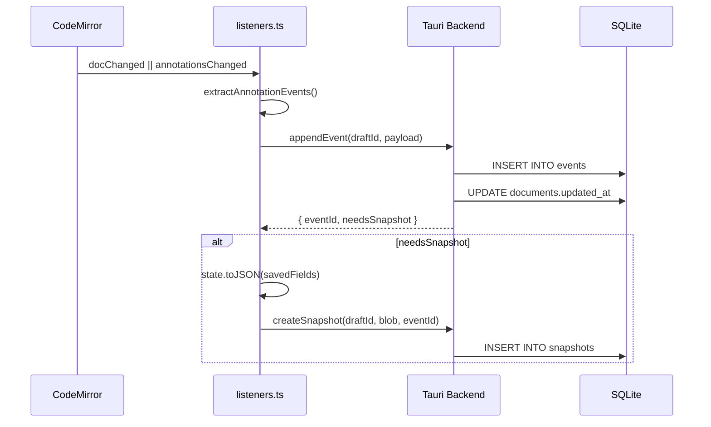

# Persistence

Quillium uses a crash-safe, append-only SQLite event log (WAL mode) with periodic snapshots. All database operations run in Rust via Tauri commands.

## Schema Overview

| Table | Purpose |
|-------|---------|
| `documents` | Document metadata (title, word count, preview, tags) |
| `drafts` | Named drafts per document (default one per document) |
| `events` | Append-only log of CM transactions |
| `snapshots` | Full `EditorState.toJSON()` blobs |
| `_meta` | Key/value flags (active draft pointers) |

The `documents` table has **no `state_json` column**. Document state lives entirely in `snapshots`.

## Event Log Flow



```typescript
// extensions.ts
export const savedFields = { historyField, annotationField };

// listeners.ts
const result = await appendEvent(draftId, JSON.stringify(payload));
if (result.needsSnapshot) {
    createSnapshot(draftId, JSON.stringify(state.toJSON(savedFields)), result.eventId);
}
```

Snapshot triggers:
- ≥50 events since last snapshot
- ≥120 seconds elapsed

## Load Flow

```typescript
// Editor.svelte
const loaded = await loadDocumentState(docId, draftId);
// loaded.snapshotStateJson  → latest snapshot blob
// loaded.snapshotEventId    → id of that snapshot (-1 for seed)
// loaded.eventsSince        → events after the snapshot
```

`loadDocumentState` (Rust) fetches the most-recent snapshot and all events with `event_id > snapshot.up_to_event_id`. The snapshot is restored first, then events are replayed via `replayEvents()`.

## Event Payload Format

| Type | Shape |
|------|-------|
| `doc_change` | `{ changes: [{from, to, insert}], selection }` |
| `annotation_add` | Full annotation object |
| `annotation_remove` | Annotation ID |
| `annotation_update` | Full annotation object (diff detected) |
| `compound` | Doc change + annotation effects together |

## Snapshot Pruning

Automatic pruning on app startup: if retention policy is configured via `setSnapshotRetention`, all unlabeled snapshots older than N days are pruned. Named snapshots (non-null `label`) are never auto-pruned.

Manual pruning via Version History:
- `pruneSnapshotsKeepLastN(draftId, n)`
- `pruneSnapshotsOlderThan(draftId, days)`

## Crash-Safety Matrix

| Data | Durability |
|------|------------|
| Main doc text | Per-keystroke — every `doc_change` event written before next keystroke |
| Active revision version text | Per-keystroke — `translateAndDispatch` forwards nested changes as `doc_change`; Phase 3 keeps `versions[activeVersionIndex].doc` current |
| Non-active revision version text | **Snapshot-only** |
| `activeVersionIndex` | **Snapshot-only** |
| Version labels | **Snapshot-only** |
| Thread messages | Per-action — captured as `annotation_update` events |

## Revision Version Persistence

`extractAnnotationEvents` writes `addAnnotation`, `removeAnnotation`, and `updateThread` as explicit events. Internal revision effects (`_updateRevisionVersionState`, `_addVersionToRevision`, etc.) are captured by a pre/post diff on `annotationField`: any annotation whose identity changed gets an `annotation_update` event.

Nested-editor flushes write back through `updateRevisionVersionState`, making the parent `annotationField` the source of truth. The normal persistence path observes the parent transaction.

## Tauri Commands

### Documents

| Command | Purpose |
|---------|---------|
| `list_documents` | Get all documents with metadata |
| `create_document` | Create new document |
| `update_document_meta` | Update title, tags, etc. |
| `trash_document` | Soft-delete |
| `restore_document` | Restore from trash |
| `delete_document` | Permanent delete |
| `get_trash_retention` | Get auto-empty period |
| `set_trash_retention` | Set auto-empty period |

### Events & Snapshots

| Command | Purpose |
|---------|---------|
| `append_event` | Add event to log |
| `load_document_state` | Get snapshot + events |
| `create_snapshot` | Create manual snapshot |
| `create_named_snapshot` | Create labeled snapshot |
| `list_snapshots` | Get all snapshots for draft |
| `load_snapshot_state` | Get specific snapshot blob |
| `label_snapshot` | Add/update label |
| `restore_to_snapshot` | Reset to snapshot state |
| `get_snapshot_storage_size` | Get total size |
| `get_snapshot_retention` | Get retention policy |
| `set_snapshot_retention` | Set retention policy |
| `prune_snapshots_keep_last_n` | Keep only N most recent |
| `prune_snapshots_older_than` | Delete older than N days |
