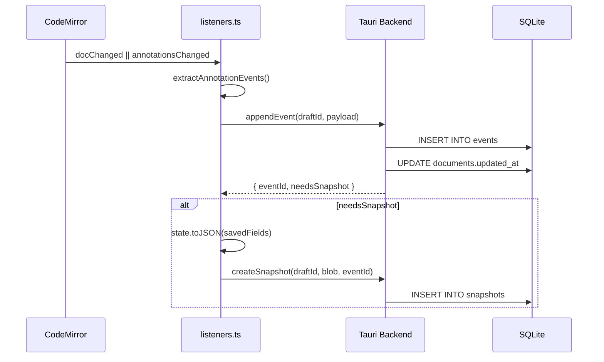

# Persistence

Quillium uses a crash-safe, append-only SQLite event log (WAL mode) with periodic snapshots. All database operations run in Rust via Tauri commands.

## Schema Overview

| Table | Purpose |
|-------|---------|
| `documents` | Document metadata (title, word count, preview, tags) |
| `tabs` | Document tabs (label, position, type, soft-delete) — see [Tabs & Drafts](./tabs-and-drafts.md) |
| `drafts` | Draft tree per tab (`tab_id`, `parent_draft_id`, `locked`, soft-delete) |
| `doc_events` | Document-level structural audit log (tab CRUD, branching, locks, checkpoints) |
| `events` | Append-only log of CM transactions (draft-scoped) |
| `snapshots` | Full `EditorState.toJSON()` blobs (draft-scoped) |
| `_meta` | Key/value flags (`active_tab:{doc}`, `active_draft:{tab}`) |

The `documents` table has **no `state_json` column**. Document state lives entirely in `snapshots`.

## Schema migrations

The schema is built and evolved by a versioned migration runner in
`packages/desktop/src-tauri/src/db/migrations.rs`, keyed on `PRAGMA user_version`. `open_db()`
(`schema.rs`) opens the connection, sets WAL/foreign-key pragmas, then calls
`migrate()`, which applies every migration newer than the DB's recorded
version — each in its own transaction, so a failed migration leaves the DB at
the previous version. A migration is either plain SQL or a Rust function (for
backfills and conditional DDL).

**To change the schema, append a new numbered `Migration` — never edit a
shipped one**, since deployed DBs have already recorded its version as applied.
Migration #1 is the baseline; pre-framework databases report `user_version = 0`
but already have the baseline tables, so early migrations are written to be
safe to re-apply (`IF NOT EXISTS` / column-existence guards).

The full numbered list of migrations lives in
[search.md § Schema & migrations](./search.md#schema--migrations).

## Event Log Flow



```typescript
// extensions.ts
export const savedFields = { historyField, annotationField };

// listeners.ts
const result = await appendEvent(draftId, JSON.stringify(payload));
if (result.needsSnapshot) {
    createSnapshot(draftId, JSON.stringify(state.toJSON(savedFields)), result.eventId);
}
```

Snapshot triggers:
- ≥50 events since last snapshot
- ≥120 seconds elapsed

## Load Flow

```typescript
// Editor.svelte
const loaded = await loadDocumentState(docId, draftId);
// loaded.snapshotStateJson  → latest snapshot blob
// loaded.snapshotEventId    → id of that snapshot (-1 for seed)
// loaded.eventsSince        → events after the snapshot
```

`loadDocumentState` (Rust) fetches the most-recent snapshot and all events with `event_id > snapshot.up_to_event_id`. The snapshot is restored first, then events are replayed via `replayEvents()`.

## Event Payload Format

| Type | Shape |
|------|-------|
| `doc_change` | `{ changes: [{from, to, insert}], selection }` |
| `annotation_add` | Full annotation object |
| `annotation_remove` | Annotation ID |
| `annotation_update` | Full annotation object (diff detected) |
| `compound` | Doc change + annotation effects together |

## Snapshot Pruning

Automatic pruning on app startup: if retention policy is configured via `setSnapshotRetention`, all unlabeled snapshots older than N days are pruned. Named snapshots (non-null `label`) are never auto-pruned.

Manual pruning via Version History:
- `pruneSnapshotsKeepLastN(draftId, n)`
- `pruneSnapshotsOlderThan(draftId, days)`

## Crash-Safety Matrix

| Data | Durability |
|------|------------|
| Main doc text | Per-keystroke — every `doc_change` event written before next keystroke |
| Active revision version text | Per-keystroke — `translateAndDispatch` forwards nested changes as `doc_change`; Phase 3 keeps the active version's `doc` current |
| Non-active revision version text | **Snapshot-only** |
| `activeVersionId` | **Snapshot-only** |
| Version labels | **Snapshot-only** |
| Thread messages | Per-action — captured as `annotation_update` events |

## Revision Version Persistence

`extractAnnotationEvents` writes `addAnnotation`, `removeAnnotation`, and `updateThread` as explicit events. Internal revision effects (`_updateRevisionVersionState`, `_addVersionToRevision`, etc.) are captured by a pre/post diff on `annotationField`: any annotation whose identity changed gets an `annotation_update` event.

Nested-editor flushes write back through `updateRevisionVersionState`, making the parent `annotationField` the source of truth. The normal persistence path observes the parent transaction.

## DB Wrapper Functions (TypeScript)

These are the TypeScript wrapper functions in `src/lib/db/index.ts` that call Tauri commands (actual Tauri command names are `cmd_*` variants).

### Documents

| Function | Purpose |
|----------|---------|
| `listDocuments` | Get all documents with metadata |
| `createDocument` | Create new document |
| `updateDocumentMeta` | Update title, tags, etc. |
| `trashDocument` | Soft-delete |
| `restoreDocument` | Restore from trash |
| `deleteDocument` | Permanent delete |
| `getTrashRetention` | Get auto-empty period |
| `setTrashRetention` | Set auto-empty period |

### Events & Snapshots

| Function | Purpose |
|----------|---------|
| `appendEvent` | Add event to log |
| `loadDocumentState` | Get snapshot + events |
| `createSnapshot` | Create manual snapshot |
| `createNamedSnapshot` | Create labeled snapshot |
| `listSnapshots` | Get all snapshots for draft |
| `loadSnapshotState` | Get specific snapshot blob |
| `labelSnapshot` | Add/update label |
| `restoreToSnapshot` | Reset to snapshot state |
| `getSnapshotStorageSize` | Get total size |
| `getSnapshotRetention` | Get retention policy |
| `setSnapshotRetention` | Set retention policy |
| `pruneSnapshotsKeepLastN` | Keep only N most recent |
| `pruneSnapshotsOlderThan` | Delete older than N days |
