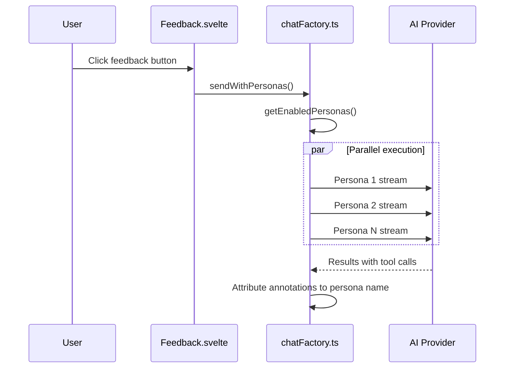

# Reader Personas

Reader personas are configurable AI "readers" that provide feedback from distinct perspectives. When personas are turned **on** for a mode, all enabled personas run in parallel — each producing annotations attributed to that persona's name.

Because personas fan a single request out into one AI stream **per enabled persona**, they cost roughly N× the tokens of a normal request. For that reason they are an explicit, **per-mode opt-in that defaults to OFF** — see [Per-Mode Opt-In](#per-mode-opt-in) below.

## Files

| File | Purpose |
|------|---------|
| `presets.ts` | `ReaderPersona` type, `DEFAULT_PERSONAS` |
| `settings.svelte.ts` | Persona list store, localStorage persistence |
| `prompt.ts` | `buildPersonaPrompt()` |
| `colors.ts` | `lightTint()` / `mediumTint()` for avatars |
| `Readers.svelte` | Configuration panel UI |

## Data Model

```typescript
type ReaderPersona = {
    id: string;          // UUID for custom, slug for builtin
    name: string;        // Display name
    emoji: string;       // Avatar emoji
    color: string;       // Hex color for accent
    description: string; // Short tagline
    profile?: {          // Rich profile for builtins
        about: string;
        goodFor: string[];
        example: string;
    };
    instruction: string; // AI prompt (not shown to users)
    builtin: boolean;
    enabled: boolean;
    chattiness: "quiet" | "normal" | "verbose";
};
```

## Builtin Personas

| Persona | Focus | Default |
|---------|-------|---------|
| Skeptical Editor 🔍 | Logical gaps, weak claims | Enabled |
| Clarity Coach 💡 | Jargon, ambiguity, readability | Enabled |
| First-Time Reader 👶 | Missing context, assumed knowledge | Enabled |
| Emotional Reader 💜 | Tone, voice, emotional resonance | Enabled |
| Flow Reader 🌊 | Pacing, transitions, momentum | Disabled |
| Devil's Advocate 😈 | Challenging assumptions | Disabled |
| Expert Reader 🎓 | Depth, accuracy, rigor | Disabled |
| Casual Skimmer ⚡ | Scannability, key points | Disabled |

## Chattiness

Each persona has a 3-level chattiness setting:

| Level | Behavior |
|-------|----------|
| `quiet` | Only significant issues; nothing if solid |
| `normal` | Issues worth writer's attention |
| `verbose` | Thorough; flag everything |

The directive is prepended to the persona's system prompt via `buildPersonaPrompt()`.

## Settings Persistence

Stored in localStorage under `"quillium-readers-settings"`. On load, saved state merges with `DEFAULT_PERSONAS`:
- User toggles and chattiness preserved
- New builtins added if preset list grows
- Custom personas appended after builtins

## Multi-Persona Execution



When feedback is triggered:
1. The panel checks the **per-mode opt-in** (`personaModes[mode]`). If the mode is OFF, it uses a single plain stream and stops here.
2. If ON, it reads `getEnabledPersonas()`; if any exist, it calls `runMultiPersonaStreams()`
3. Each persona runs **in parallel** (`Promise.all`)
4. Each stream uses `buildPersonaPrompt(persona)` prepended to system prompt
5. Tool-call handlers attribute annotations to persona's name

If the mode is OFF, or it is ON but no personas are enabled, it falls back to standard single-stream.

## Per-Mode Opt-In

Personas are gated by a per-mode toggle so the cost is opt-in and explicit (issue #259).

| Where | Detail |
|-------|--------|
| State | `personaModes: { feedback: boolean; revise: boolean; editor: boolean }` in `src/lib/ai/settings.svelte.ts` |
| Default | All `false` (plain single-stream by default) |
| Persistence | localStorage key `"quillium-ai-persona-modes"` |
| Setter | `setPersonasForMode(mode, enabled)` — persists + updates the rune |
| UI | A switch in the **Feedback** and **Revise** tab headers today; the unified editor uses the same setting shape with `editor` defaulting off |

The per-persona toggles in the Readers tab still select *which* personas run, but they only take effect once the mode toggle is ON. Chat mode does not use personas.

## Unified Editor Integration

The unified editor keeps personas as an advanced layer, not a replacement for focus
toggles.

- Focus toggles answer: what should the editor look for?
- Reader Personas answer: who is reading?
- Internal specialists answer: how might the prompt/orchestrator organize work?

The baseline Quillium review is one structured editor run using the visible stage and focus
controls. If `personaModes.editor` is enabled, each enabled persona receives the same editor
request, focus plan, document risk level, policy posture, replacement permission, and schema
constraints. Persona prompts can change perspective, but they cannot override high-stakes
safety, no-fabrication, detector-evasion refusals, or replacement permissions.

Use `Challenge` for the editor focus that stress-tests claims. Do not call it
`Devil's Advocate`; that name already belongs to a built-in persona.

## UI (Readers.svelte)

Tab 5 in AI sidebar. Rose theme accent.

Layout:
- **Enabled personas** at top
- **Disabled personas** below divider (dimmed 55%)
- Each card: emoji avatar, name, description, chattiness dots (1–3), toggle
- Clicking builtin card expands: about text, "Good for" tags, example quote
- **Custom reader form** at bottom: name, emoji, color swatch, instruction textarea
- Custom personas deletable; builtins are not

## Integration Points

- **Feedback.svelte / Revise.svelte**: Gate sends on `personaModes[mode]`, then route through the persona check; render the per-mode toggle
- **ai/settings.svelte.ts**: Owns `personaModes` and `setPersonasForMode()`
- **chatFactory.ts**: `runMultiPersonaStreams()` handles parallel execution
- **AI sidebar**: Tab index 5 in `AISidebar.svelte`
