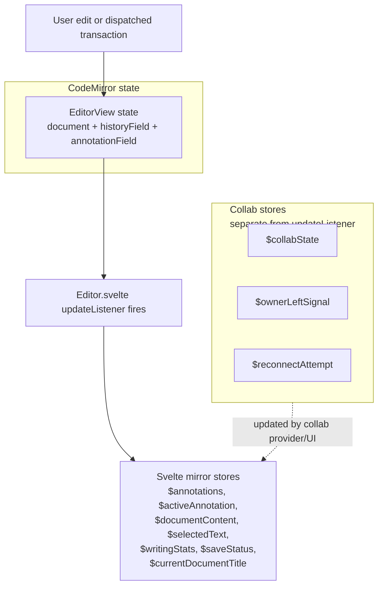

# State Management

Understanding the dual state system is critical before touching any annotation or editor code.

## Two Separate State Worlds

Quillium runs two parallel state systems that must be kept in sync:

**1. CodeMirror state** — lives inside `EditorView`. Immutable, transaction-based. Every change produces a new state object. Extensions (`StateField`, `ViewPlugin`, etc.) live here. Supports undo/redo via `historyField`.

**2. Svelte stores** — reactive signals consumed by components. Do not update automatically when CodeMirror state changes. Must be manually pushed by `Editor.svelte`'s `updateListener`.



## Why `$editorView` Doesn't Trigger Reactivity

`editorView` is a `writable<EditorView>`. It's set once at mount and never updated again — the `EditorView` object is mutated in place by CodeMirror on each transaction. Svelte's reactivity won't fire.

This is intentional: the store is only for *imperative access* (e.g., dispatching a transaction from the AI sidebar). For *reactive data*, use the manually-synced mirror stores.

In-flight AI selection targets are an exception to the persisted editor model.
`editorialTargetBookmarkField` holds request IDs and ranges only while a Feedback
or Revise request with a selection is running. CodeMirror maps those ranges through transactions,
but `savedFields` excludes the field because a request cannot survive an editor
reload. Adding and removing a bookmark also uses `addToHistory.of(false)` so the
writer's undo stack contains only writing actions.

## Transaction Annotation vs StateEffect

CodeMirror has two mechanisms for attaching metadata to a transaction:

| Mechanism | Persistence | Invertible | Use Case |
|-----------|-------------|------------|----------|
| `StateEffect` | Stored in history | Yes | Annotation mutations |
| `Transaction.annotation()` | Ephemeral | No | Flags like `revisionInternalEdit`, `nestedEditorEdit` |

### Key Transaction Annotations

| Annotation | Purpose |
|------------|---------|
| `revisionInternalEdit` | Marks revision-system-driven transactions |
| `nestedEditorEdit` | Identifies which revision's nested editor originated a parent dispatch |
| `parentSyncEdit` | Tags sync transactions in nested editors |
| `yjsAnnotation` | Marks Yjs-originated transactions to prevent feedback loops |

## Stores Overview

### Mirror Stores (from updateListener)

| Store | Source | Purpose |
|-------|--------|---------|
| `$annotations` | `annotationField` | All annotations as `{ id: annotation }` |
| `$activeAnnotation` | Selection + annotations | Currently active annotation |
| `$documentContent` | `state.doc` | Full document text |
| `$selectedText` | Selection | Currently selected text |
| `$writingStats` | Document analysis | Word count, character count |
| `$saveStatus` | Persistence state | Save indicator |
| `$currentDocumentTitle` | Document metadata | Title for status bar |

### Independent Stores

| Store | Purpose |
|-------|---------|
| `$editorView` | Imperative access to EditorView |
| `$modalStack` | Open annotation modals |
| `$modalAnnotationStores` | Per-modal annotation state |
| `$collabState` | Connection status |
| `$collabSession` | Active session info |
| `$settingsOpen` | Settings modal visibility |
| `$dictionaryTrigger` | Dictionary popover state |

## Derived vs Writable

Stores in `src/lib/stores.ts` are writable because the update listener is the only place aware of doc/annotation changes. Attempting to make these derived would mean repeating the imperative update logic inside their calculations.

Components only derive from these mirrors when the dependency chain is direct (e.g., modal breadcrumbs from `modalStack`).

## Event Routing

Two typed event buses for cross-component communication:

### `appEventBus` (`src/lib/events/appEventBus.ts`)

App-level, cross-component one-shot messages:
- Opening the dictionary popover
- Opening AI chat with a prefilled message
- Opening AI settings

### `annotationEventBus` (`src/lib/events/annotationEventBus.ts`)

Annotation-system routing where sender and receiver may live in different editor layers:
- `revision-boundary-nudge` — nudge UI events
- `nested-annotation-create` — sub-annotation creation
- `revision-focus-request` — click handling
- `pending-nested-editor-selection` — deferred selection (with caching)

### Why Event Buses?

Some messages are not durable state — they're one-shot intents. The old pattern required writing a transient value into a store, reacting elsewhere, then clearing it. The event bus removes that bookkeeping.

```typescript
// Pattern for consuming events in Svelte
$effect(() => {
    return annotationEventBus.on("revision-boundary-nudge", (event) => {
        if (event.revisionId !== revision.id) return;
        // handle event
    });
});
```
