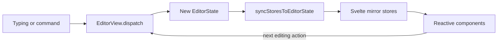

# State management

A component can change what the UI displays without changing the document. To
avoid that mistake, first identify who owns the value you want to change.
CodeMirror owns editor content; Svelte holds UI state and explicit copies of
editor values.

## The bridge from CodeMirror to Svelte

An `EditorView` is a stable object. Each accepted transaction replaces its
immutable `EditorState`, but Svelte does not observe that replacement. Reading
`$editorView.state` in a reactive expression does not subscribe to CodeMirror.

[Editor.svelte](../packages/desktop/src/lib/editor/Editor.svelte) supplies an
`updateListener` that calls `syncStoresToEditorState()`. That function writes the
values components need into [stores.ts](../packages/desktop/src/lib/stores.ts).
It also runs after loading a draft, so the UI reflects the newly loaded state
before the writer makes another edit.



For example, adding a comment dispatches an annotation effect. The annotation
field applies it, the listener copies the new annotation map to Svelte, and the
comment card appears. Adding an object only to the `$annotations` store skips
the field, undo, and persistence, and the next editor update can overwrite it.

The separate persistence listener in
[listeners.ts](../packages/desktop/src/lib/editor/listeners.ts) records changes.
The UI bridge and save queue react to the same editor updates but do different
jobs. See [persistence](persistence.md) for the durable path.

## Store ownership

| Value | Written by | Use it for |
|---|---|---|
| `annotations`, `versionGroups` | `syncStoresToEditorState()` | Rendering annotation and group state |
| `activeAnnotation` | Same bridge, using the editor selection | Showing which annotation is active |
| `documentContent`, `selectedText`, `selectedTextRange` | Same bridge | Text-dependent UI and AI context |
| `writingStats` | Same bridge, using document and selection analysis | Word and character counts |
| `editorView` | Editor lifecycle | Imperatively dispatching commands |
| `modalStack`, `modalAnnotationStores` | Modal actions and nested editor listeners | Open overlays and their editor-specific state |
| `saveStatus` | Persistence queue | Saving, saved, or error indicator |
| `currentDocumentTitle` | Document loading and metadata updates | The document's title |
| Collaboration stores | Collaboration provider and UI | Connection and session state |

Only the first four rows are editor mirrors. Metadata, persistence status, and
connection state have their own owners. Use derived state when its inputs are
already reactive; a derived store cannot observe an unannounced CodeMirror change.

Nested modal editors publish their own annotations and active selection. Read
from the relevant editor level instead of always using the root annotation map.
See [nested editors](nested-editors.md) for parent/child ownership and ID scope.

## Effects and transaction annotations

A Quillium annotation is a comment, suggestion, or revision attached to prose.
CodeMirror also uses the word *annotation* for transaction metadata. They are
unrelated concepts.

| CodeMirror mechanism | Purpose | Example |
|---|---|---|
| `StateEffect` | Describe a change an extension should apply | Add an annotation or update its thread |
| Transaction annotation | Describe the origin or handling of a transaction | Mark an edit as parent sync |

Neither mechanism automatically guarantees undo or persistence. Quillium
registers inverse effects for annotation mutations and codecs for supported
persisted effects. A new mutation needs those paths considered along with its
field reducer. See [annotations](annotations.md) and
[persisted undo](adr/0006-lossless-persisted-undo.md).

Origin markers prevent feedback loops:

| Marker | Meaning |
|---|---|
| `revisionInternalEdit` | The revision system produced the transaction |
| `nestedEditorEdit` | A particular revision's nested editor sent the parent edit |
| `parentSyncEdit` | The nested editor is receiving parent state |
| `yjsAnnotation` | The collaboration binding produced the transaction |

For instance, a nested editor receiving parent text must not send that text back
as a new edit. Its listener recognizes `parentSyncEdit` and skips forwarding.

## Temporary editor state

Some state needs CodeMirror's position mapping but should not survive the session.
An AI Feedback or Revise request aimed at a selection uses
`editorialTargetBookmarkField` to keep its target aligned while the writer types.
The field is excluded from `savedFields`. Adding or removing a bookmark also
uses `addToHistory.of(false)` so it does not become a writing undo step.

Use that distinction when adding editor state: decide whether it belongs in
snapshots, replay, and undo independently of whether it is a StateField.

## One-shot UI events

Use the typed buses for an intent such as opening AI settings or focusing a
revision. These are messages, not document state:

- [appEventBus.ts](../packages/desktop/src/lib/events/appEventBus.ts) routes app-wide intents.
- [annotationEventBus.ts](../packages/desktop/src/lib/events/annotationEventBus.ts)
  routes annotation intents across editor levels, including deferred selection.

Subscribe in a Svelte effect and return the unsubscribe function for cleanup:

```typescript
$effect(() => {
    return annotationEventBus.on("revision-boundary-nudge", (event) => {
        if (event.revisionId !== revision.id) return;
        // Handle this revision's UI action.
    });
});
```

## Diagnose a stale view

Follow the ownership chain in order. Check the affected `EditorState` first,
then its update listener, then the mirror value, then the component reading it.
If state is correct but a card is stale, investigate the bridge. If the card
changes but undo or reopen loses the change, investigate whether the action
reached a real transaction and the persistence path.
