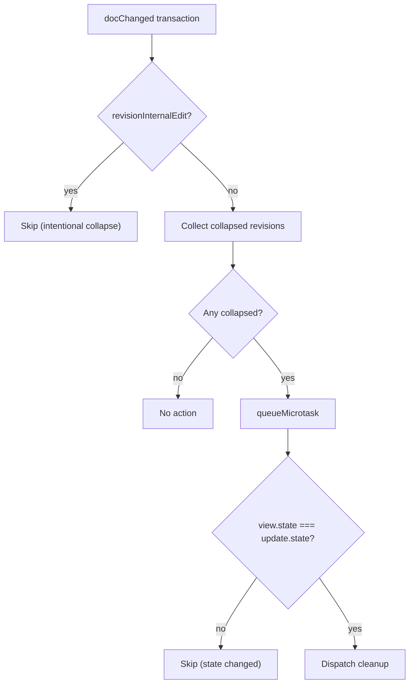

# ViewPlugins and Extensions

[Desktop annotations/index.ts](../packages/desktop/src/lib/editor/plugins/annotations/index.ts)
registers view plugins and facet extensions that react to editor updates. Shared
annotation decorations live in
[annotationDecorations.ts](../packages/share/src/core/annotationDecorations.ts).
The field owns annotation data; these extensions control how it looks and how
the cursor interacts with it. Read [annotations](annotations.md) for the data model.

## annotationDecorations

Builds `DecorationSet`s for all annotation types on every `selectionSet`, `docChanged`, or annotation state change. Applies CSS classes:

| Class | State |
|-------|-------|
| `cm-comment` / `cm-comment-active` | Comment annotation |
| `cm-revision` / `cm-revision-active` | Revision annotation |
| `cm-suggestion` / `cm-suggestion-active` | Suggestion annotation |

Inactive revisions use a thin, muted purple underline that returns to full strength on hover.
Touch devices keep the full underline; active revisions retain their purple background.
The shared read-only renderer follows the same treatment, and legacy preview buttons also reveal
the underline on keyboard focus. Empty-revision markers remain visible.

Active state is determined by `getActiveAnnotation()` — the annotation whose range contains the cursor. If multiple ranges overlap, the narrowest one wins.

## revisionAtomicRanges

Registered via `EditorView.atomicRanges.of(...)` (a facet provider, not a `ViewPlugin`). When `appSettings.atomicRevisions` is enabled, marks **all** revision ranges as atomic. The cursor jumps over the entire span instead of entering it.

This does **not** block edits — `atomicRanges` only governs cursor placement.

## collapsedRevisionResolver

Monitors for revision ranges that collapsed to `from === to` in a `docChanged` transaction (not annotated `revisionInternalEdit`). Collects all collapsed revisions and, in a single `queueMicrotask`-deferred dispatch:

1. Removes all collapsed revisions via `removeAnnotation` effects
2. Tags `Transaction.addToHistory.of(false)` — no new history entry
3. Tags `_revisionCleanup.of(true)` — tells `invertedAnnotationFieldEffects` to skip



Undo is handled by `_restoreAnnotation` effects stored on the deletion transaction — Cmd+Z re-inserts deleted text and restores all revisions in one step.

The `queueMicrotask` defers past the current update cycle (required to avoid "dispatch inside update"). The stale-state guard prevents double-dispatch if Cmd+Z fires synchronously before the microtask.

## boundaryInsertNudge

Fires a `revision-boundary-nudge` UI event when text is inserted immediately at a revision's `from` or `to` boundary. This signals the revision card to show a brief hint pointing the user to the nested editor.

Skipped for transactions annotated `revisionInternalEdit` (programmatic insertions).

## Rich Markdown (richMarkdown.ts)

A ViewPlugin that renders markdown with live preview:

- Hides syntax markers (*, **, #) when cursor is not in the node
- Applies styling to heading lines, bold, italic text
- Maintains editability while showing formatted preview

Works with the Lezer markdown parser via `syntaxTree()`.

## Markdown Formatting (markdownFormatting.ts)

Keybindings for markdown formatting:

| Key | Action |
|-----|--------|
| `Mod-b` | Toggle bold (`**text**`) |
| `Mod-i` | Toggle italic (`*text*`) |
| `Mod-u` | Toggle underline (HTML `<u>`) |

Handles selection wrapping and cursor placement for empty selections.

## Harper Linter (harper/)

Grammar and style checking integration:

| File | Purpose |
|------|---------|
| `harperLinter.ts` | CM linter extension, harper.js integration |
| `lint.ts` | Issue severity mapping |
| `lintKindColor.ts` | Color coding by issue type |
| `HarperTooltip.svelte` | Hover tooltip UI |

## Extension Stack (extensions.ts)

An abridged view of the extension stack registered in `Editor.svelte`:

```typescript
// The wrapper adds tagged Quillium effects to CodeMirror's history JSON.
// Its per-document facet emits null when history is session-only.
export const savedFields = {
    historyField: persistentHistoryField,
    annotationField,
    versionGroupField,
};

// Editor.svelte passes the policy stored on the document.
const extensions = getExtensions({ persistHistory: document.persistHistory });

// Abridged extension assembly:
const withHistory = options?.history !== false;
const persistHistory = options?.persistHistory ?? true;
return [
    highlightSpecialChars(),
    persistHistoryFacet.of(withHistory && persistHistory),
    ...(withHistory
        ? [
              persistentHistoryStateExtension,
              historyCompartment.of([
                  persistentHistoryRuntimeExtension,
                  history({ newGroupDelay: 250 }),
              ]),
          ]
        : []),
    // ...editing, language, markdown, grammar, and dictionary extensions...
    listeners(options),
    annotations(),
    collabCompartment.of([]),
];
```

### Persistent history adapter

Stock CodeMirror history JSON stores text changes and selections but omits custom `StateEffect`s.
Quillium's annotation, revision-version, and version-group inverses live in those effects, so loading
the stock representation could produce a text-only undo and corrupt the semantic state.

`persistentHistoryField` stores tagged Quillium effects beside CodeMirror's native history branches
and restores both together. The adapter is deliberately fail-closed: a pre-0.22 legacy stack,
malformed payload, unknown effect, or incompatible runtime shape starts with a fresh stack rather
than a partial one. Documents created before July 14, 2026 retain persistent history, with that
one-time legacy reset; newer documents default to session-only unless **Undo after restart for new
documents** was enabled before they were created. The setting is captured per document and never
retroactively changes an existing document.

The same fail-closed rule covers event tails: a legacy or fallback event can restore content, but it
cannot prove that a previously saved undo branch remains semantically complete. Persistent loads
therefore keep the restored content and selection while replacing that branch with a fresh one.

Event-tail restoration uses the same effect codecs. Versioned `transactionReplay` entries preserve
transaction boundaries, start/final selections, selection contributions on the current history item,
live undo-group boundaries, and undo/redo intent; effect-only changes such as version-group
membership are persisted as `state_transaction` events. Selection-only cursor movement is folded
into the next semantic transaction rather than written as its own event. For a session-only document
the same trace restores the exact content and annotations with `addToHistory: false`, leaving the
reopened undo branch empty.

## Compartments

CodeMirror Compartments enable hot-swapping extensions:

| Compartment | Purpose |
|-------------|---------|
| `historyCompartment` | Swapped out during collab (Yjs has its own undo) |
| `collabCompartment` | Empty → Yjs binding + awareness when going live |

Every live participant, including the document owner, uses the same scoped `Y.UndoManager`. It
tracks only that participant's local Yjs transactions while rebasing them over remote text,
annotation, and version-group updates. On disconnect, Quillium installs a fresh CodeMirror history
stack rather than reviving the pre-collaboration branch.

`persistentHistoryStateExtension` stays outside `historyCompartment` so a temporary collaboration
reconfiguration cannot resurrect stale pre-collaboration history. The runtime history initializer
lives inside the compartment and is removed together with CodeMirror history.
