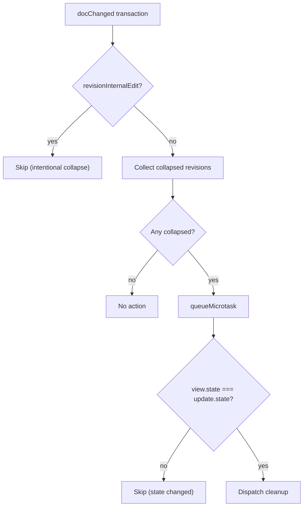

# ViewPlugins and Extensions

`index.ts` registers several `ViewPlugin`s and facet extensions that react to editor updates.

## annotationDecorations

Builds `DecorationSet`s for all annotation types on every `selectionSet`, `docChanged`, or annotation state change. Applies CSS classes:

| Class | State |
|-------|-------|
| `cm-comment` / `cm-comment-active` | Comment annotation |
| `cm-revision` / `cm-revision-active` | Revision annotation |
| `cm-suggestion` / `cm-suggestion-active` | Suggestion annotation |

Active state is determined by `getActiveAnnotation()` — the annotation whose range contains the cursor. If multiple ranges overlap, the narrowest one wins.

## revisionAtomicRanges

Registered via `EditorView.atomicRanges.of(...)` (a facet provider, not a `ViewPlugin`). Marks all **inactive** revision ranges as atomic. The cursor jumps over the entire span instead of entering it.

This does **not** block edits — `atomicRanges` only governs cursor placement.

## collapsedRevisionResolver

Monitors for revision ranges that collapsed to `from === to` in a `docChanged` transaction (not annotated `revisionInternalEdit`). Collects all collapsed revisions and, in a single `queueMicrotask`-deferred dispatch:

1. Removes all collapsed revisions via `removeAnnotation` effects
2. Tags `Transaction.addToHistory.of(false)` — no new history entry
3. Tags `_revisionCleanup.of(true)` — tells `invertedAnnotationFieldEffects` to skip



Undo is handled by `_restoreAnnotation` effects stored on the deletion transaction — Cmd+Z re-inserts deleted text and restores all revisions in one step.

The `queueMicrotask` defers past the current update cycle (required to avoid "dispatch inside update"). The stale-state guard prevents double-dispatch if Cmd+Z fires synchronously before the microtask.

## boundaryInsertNudge

Fires a `revision-boundary-nudge` UI event when text is inserted immediately at a revision's `from` or `to` boundary. This signals the revision card to show a brief hint pointing the user to the nested editor.

Skipped for transactions annotated `revisionInternalEdit` (programmatic insertions).

## Rich Markdown (richMarkdown.ts)

A ViewPlugin that renders markdown with live preview:

- Hides syntax markers (*, **, #) when cursor is not in the node
- Applies styling to heading lines, bold, italic text
- Maintains editability while showing formatted preview

Works with the Lezer markdown parser via `syntaxTree()`.

## Markdown Formatting (markdownFormatting.ts)

Keybindings for markdown formatting:

| Key | Action |
|-----|--------|
| `Mod-b` | Toggle bold (`**text**`) |
| `Mod-i` | Toggle italic (`*text*`) |
| `Mod-u` | Toggle underline (HTML `<u>`) |

Handles selection wrapping and cursor placement for empty selections.

## Harper Linter (harper/)

Grammar and style checking integration:

| File | Purpose |
|------|---------|
| `harperLinter.ts` | CM linter extension, harper.js integration |
| `lint.ts` | Issue severity mapping |
| `lintKindColor.ts` | Color coding by issue type |
| `HarperTooltip.svelte` | Hover tooltip UI |

## Extension Stack (extensions.ts)

The full extension stack registered in `Editor.svelte`:

```typescript
export const savedFields = { historyField, annotationField };

// Extension order matters for precedence
const extensions = [
    // Core
    basicSetup,
    markdown({ base: markdownLanguage }),
    
    // History
    historyCompartment.of(history({ newGroupDelay: 250 })),
    
    // Annotations (Prec.high for keymap priority)
    annotationField,
    annotationExtension,
    
    // Rich markdown
    richMarkdownPlugin,
    markdownFormattingKeymap,
    
    // Grammar
    harperLinter,
    
    // Dictionary
    dictionaryKeymap,
    
    // Collab (starts empty, hot-swapped)
    collabCompartment.of([]),
    
    // Theme
    editorTheme,
    
    // Listeners
    updateListener,
];
```

## Compartments

CodeMirror Compartments enable hot-swapping extensions:

| Compartment | Purpose |
|-------------|---------|
| `historyCompartment` | Swapped out during collab (Yjs has its own undo) |
| `collabCompartment` | Empty → Yjs binding + awareness when going live |
